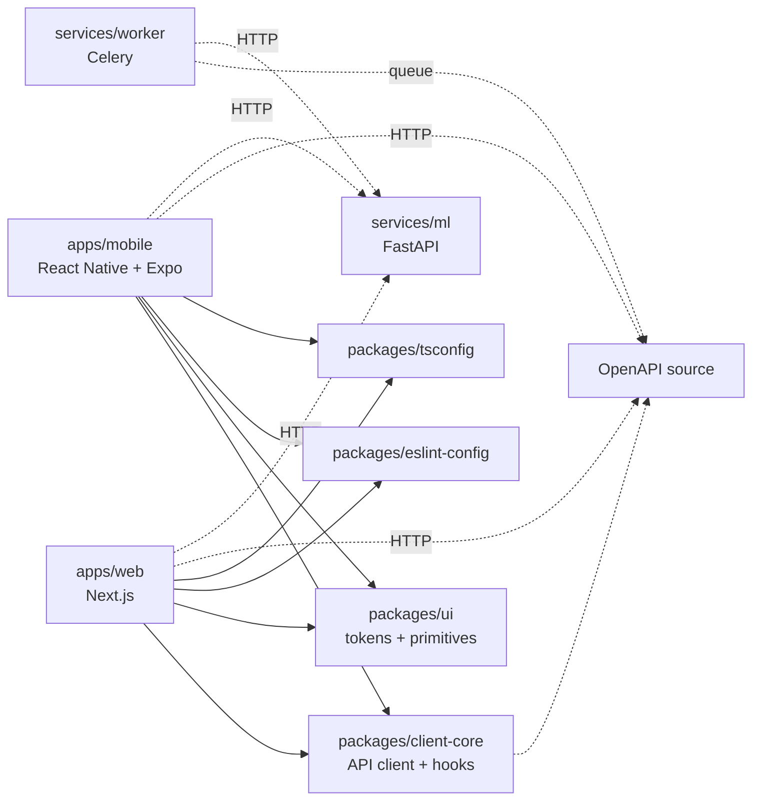

# Graft Spray — Whole-Codebase Plan (CODEBASE_PLAN.md)

**Status:** DRAFT v0.1 (skeleton). Pending human review by Benson Klein.
**Owner:** Claude Code (drafting), Benson Klein (approval gate).
**Branch:** `graft-spray/m0/codebase-plan`
**Source spec:** `docs/spec/Graft-Spray-App-Spec.pdf` — not yet generated; pending retrieval of the 5 outstanding 🔴 paywalled papers (see `docs/research/_planning/paywalled-download-plan.md`).
**Companion docs (also pending):** `docs/spec/CLAUDE_CODE_PLAN.md`.
**Generated:** 2026-04-29.
**Prior PR:** [M0-00a — Import research dossier](https://github.com/Graft-Systems/GraftWebsite/pull/2) (open).

This document is the mandatory whole-codebase plan required by the Graft Spray spec ("Whole-Codebase Plan" section). **No feature branch may merge until this plan PR is approved.** The plan is a living document and is updated at every milestone closeout to reflect what shipped vs. what was planned.

Sections marked **[FULL]** are populated from the existing repo audit + the spec markdown. Sections marked **[SKELETON]** carry a structural outline plus an explicit list of what they depend on; full content lands when the gating dependency clears.

---

## Section 1 — Repository Inventory [FULL]

Every existing file in the marketing site, classified, with a per-file decision (Keep / Modify / Move / Delete). Source: end-to-end audit of `Graft-Systems/GraftWebsite` at branch `graft-spray/main`.

### 1.1 Top-level files

| File | Type | Description | Decision |
|---|---|---|---|
| `.gitignore` | Config | Standard Node + Python gitignore | **Keep**, extend in M0-01 with monorepo-specific entries (`.turbo/`, `apps/*/dist/`, etc.) |
| `.gitmodules` | Config | Submodule config — **CURRENTLY BROKEN** (does not declare `backend/PredictionTool` even though parent index has the gitlink) | **Modify in M0-01.** Add proper submodule entry pointing to `https://github.com/Graft-Systems/GraftPredictionTool.git`. See R1. |
| `Makefile` | Build | Top-level make targets for dev orchestration | **Modify in M0-01** to delegate to `pnpm`/`turbo` for the new monorepo structure. |
| `README.md` | Doc | Marketing-site README | **Modify in M0-01**: split into root README (monorepo overview) + per-app READMEs in `apps/web/`, `apps/mobile/`, `services/api/`, `services/ml/`. |
| `render.yaml` | Deploy | Render Blueprint for backend (Pro tier, PostgreSQL, DINOv2 pre-cache step) | **Modify in M0-01** to use `services/api` rootDir; **extend in M0-03** with PostGIS extension; **extend in M1-10** to also pre-cache the Spray ML classifier weights. |

### 1.2 `frontend/` — Existing Marketing Site (Next.js 15.1 + App Router)

| Path | Description | Decision |
|---|---|---|
| `frontend/app/(marketing)/page.tsx` | Homepage | **Move** to `apps/web/app/(marketing)/page.tsx` |
| `frontend/app/(marketing)/about/page.tsx` | About page | **Move** to `apps/web/app/(marketing)/about/page.tsx` |
| `frontend/app/(marketing)/contact/page.tsx` | Contact form (POSTs to `/api/contact`) | **Move** to `apps/web/app/(marketing)/contact/page.tsx` |
| `frontend/app/(marketing)/tool/page.tsx` | Existing inference UI for `/tool` (grape-weight estimator) | **Move** to `apps/web/app/(marketing)/tool/page.tsx`. Open question Q6: does this remain on the marketing site post-Spray launch, or fold into the Spray app shell? |
| `frontend/components/ui/` | shadcn/ui primitives (Radix-based) | **Move** to `packages/ui/src/components/` (shared between web and mobile). |
| `frontend/components/common/` | Custom components | **Move** to `apps/web/components/` (web-only). |
| `frontend/next.config.mjs` | Next.js config (rewrites `/api/*` → `BACKEND_URL`/`NEXT_PUBLIC_BACKEND_URL`) | **Move** to `apps/web/next.config.mjs`. **Modify in M0-02a** to gate `/spray` routes on auth state (Clerk middleware). |
| `frontend/tailwind.config.ts` | Tailwind 3.4.17 config (custom palette: `burgundy`, `amber`, `sage`; custom font CSS vars) | **Refactor**: shared design tokens to `packages/ui/tokens/`; web-specific Tailwind config in `apps/web/tailwind.config.ts` extends shared base. |
| `frontend/tsconfig.json` | TS config | **Replace** with extension of `packages/tsconfig/nextjs.json`. |
| `frontend/eslint.config.mjs` | ESLint flat config | **Replace** with extension of `packages/eslint-config/nextjs.js`. |
| `frontend/package.json` | Web-app dependencies | **Move** to `apps/web/package.json`; deps shared with mobile (Tailwind, Radix primitives, design tokens) hoist to `packages/ui`. |
| `frontend/.env.local.example` | Env template (BACKEND_URL, NEXT_PUBLIC_BACKEND_URL) | **Move** to `apps/web/.env.local.example`; **extend in M0-02** (`CLERK_PUBLISHABLE_KEY`, `CLERK_SECRET_KEY`), **M0-04** (`NEXT_PUBLIC_DATA_LAKE_INGEST_URL`), **M1-10** (`NEXT_PUBLIC_ML_INFERENCE_URL`), **M1-15** (`GEMINI_API_KEY`). |

### 1.3 `frontend-cinematic/` — UNKNOWN (blocks M0-01)

| Path | Description | Decision |
|---|---|---|
| `frontend-cinematic/` | Alternative or experimental frontend implementation. Origin and intent **not documented**. Possibly tied to branches `add-animation-libs`, `cinematic-frontend`, `sync-cinematic-fixes`. | **OPEN QUESTION Q1.** Decision options: (a) keep as `apps/web-cinematic`, (b) merge into `apps/web` if it's the intended successor, (c) archive to `attic/` directory, (d) delete. **Blocks M0-01** until decided. See R9. |

### 1.4 `backend/` — Existing Django API

| Path | Description | Decision |
|---|---|---|
| `backend/manage.py` | Django CLI entrypoint | **Move** to `services/api/manage.py` |
| `backend/graft_api/settings.py` | Django settings (DEBUG, DB, CORS, CSRF, email, ML envs) | **Move** to `services/api/graft_api/settings.py`. **Modify in M0-03** to add Spray app to `INSTALLED_APPS` and enable PostGIS extension. **Modify in M0-02** to add Clerk auth middleware. |
| `backend/graft_api/urls.py` | Root URL config | **Move** to `services/api/graft_api/urls.py`. **Modify in M0-04** to add `path("api/spray/", include("spray.urls"))`. |
| `backend/graft_api/wsgi.py` | WSGI entry | **Move** unchanged to `services/api/graft_api/wsgi.py` |
| `backend/api/models.py` | `ContactSubmission`, `WaitlistEntry`, `PredictionBatch`, `PredictionResult` | **Move** to `services/api/api/models.py`. New Spray entities (Org, User, Membership, Vineyard, Block, Capture, MLPrediction, Recommendation, etc.) live in `services/api/spray/models.py` (M0-03). |
| `backend/api/views.py` | Existing REST endpoints (contact, estimate, waitlist) | **Move** to `services/api/api/views.py`. Spray endpoints in `services/api/spray/views.py` (M0-04+). |
| `backend/api/urls.py` | URL routing for `/api/` (contact, estimate, history, waitlist) | **Move** to `services/api/api/urls.py` |
| `backend/api/admin.py` | Django admin (readonly views) | **Move**; **extend in M0-02** with Org/User/Membership admin views. |
| `backend/api/prediction_tool_adapter.py` | Loader/dispatcher for v1 + v2 grape-weight inference; reads `PREDICTION_BACKBONE` env var | **Move** to `services/api/api/inference/grape_weight.py`. **Spray ML inference is a separate service** (`services/ml/`) introduced in M1-10. |
| `backend/requirements.txt` | Python deps (Django 5.2.13, PyTorch 2.11+cpu, scikit-learn 1.8, joblib 1.5.2, pandas 2.3.3, Resend 2.29, etc.) | **Move**; **extend in M0-03** with `psycopg[binary]>=3` for PostGIS, `django-postgres-extra`; **extend in M0-04** with `boto3`, `pyiceberg` (or Delta Lake equivalent); **extend in M0-02** with `clerk-backend-sdk` (or equivalent). |
| `backend/.env.example` | Env template | **Move**; **extend in subsequent milestones** (see Section 10). |
| `backend/PredictionTool/` | Git submodule pointing at `Graft-Systems/GraftPredictionTool`. Local HEAD at commit `e671959` ("Add multi-image upload flow"). Internal working tree has uncommitted changes (`src/grape_weight_tool/train.py` modified, plus untracked `data/`, `scripts/`, etc.). | **Keep submodule.** **Fix `.gitmodules` in M0-01** (R1). **Resolve internal dirty state per Benson's call** (R2, Open Question Q2). Long-term: publish `grape_weight_tool` as a PyPI package and remove submodule (M2 or later). |
| `backend/PredictionTool/src/grape_weight_tool/` | Submodule contents: `features.py` (hand features), `train.py` (RF + HGB), `batch.py`, `cli.py`, `data_io.py`, `depth_raw.py`, `depth_metric.py`, `evaluate.py` | Read by `prediction_tool_adapter.py` via dynamic `sys.path` injection. No changes required for Spray (Spray ML is independent). |
| `backend/models/v4/model.joblib` | v2 inference artifact (DINOv2 + HistGradientBoosting; ~tens of MB) | **Keep** at `services/api/models/v4/model.joblib` for now. **Long-term**: move all model artifacts to S3 + DVC (M1-10). |
| `backend/staticfiles/` | Django collectstatic output | Gitignored. No action. |
| `backend/media/` | User-uploaded media (DEBUG mode only) | Gitignored. Production media goes to S3 (M0-04). |

### 1.5 Branches (state per audit + uncommitted-work flags)

| Branch | Tip (relative) | Inferred state | Decision |
|---|---|---|---|
| `main` | `cf68b1b` ("chore: finalize prod CORS/CSRF origins") | Active production branch | Keep. Spray work merges in only at milestone closeouts. |
| `graft-spray/main` | `cf68b1b` (just forked from main) | New integration branch for Graft Spray | Keep. All Spray feature PRs target this. |
| `graft-spray/m0/research-import` | `76c0491` | Active. PR #2 open. | Merge into `graft-spray/main` after Benson approves. |
| `graft-spray/m0/codebase-plan` | (this branch) | Drafting (this PR). | Merge into `graft-spray/main` after Benson approves. |
| `add-animation-libs` | unknown | **Open Question Q12.** Likely tied to `frontend-cinematic`. | Decide before M0-01. |
| `cinematic-frontend` | unknown | **Open Question Q12.** | Decide before M0-01. |
| `sync-cinematic-fixes` | unknown | **Open Question Q12.** | Decide before M0-01. |

### 1.6 `docs/research/` (just imported via M0-00a, not on `main` yet)

| Path | Description | Decision |
|---|---|---|
| `docs/research/00_index.md` and `01_*.md`–`07_*.md` | Brain category files | **READ-ONLY.** Cite as `[Brain (category) / S#]` (open) or `[Brain (category) / P#]` (paywalled). |
| `docs/research/glossary.md`, `paywalled_queue.md`, `sources_master.csv` | Manifests | Read-only. |
| `docs/research/business/competitive-landscape.md` | Competitive landscape (NOT in chatbot RAG) | Read-only. |
| `docs/research/assets/<category>/paywalled/` | Paywalled PDFs (35 of 47 imported as of 76c0491) | Append-only via dedicated PRs. |
| `docs/research/assets/<category>/reference/` | Open-access reference materials (18 imported in M0-00a) | Append-only. |
| `docs/research/_planning/paywalled-download-plan.md` | Operational checklist | Updated as papers retrieved. |

---

## Section 2 — Target Tree (end of M1) [FULL]

The directory structure the repo will have at end of M1 (web MVP launch). Annotations: `[E]` = Existing (carried forward, possibly relocated), `[N]` = New (to be created).

```
/                                      # ← repo root (Graft-Systems/GraftWebsite)
├── apps/                              [N] M0-01
│   ├── web/                           # Next.js 15 + App Router + TypeScript
│   │   ├── app/
│   │   │   ├── (marketing)/           [E from frontend/app/(marketing)/]  M0-01 move
│   │   │   │   ├── page.tsx           # Home (existing)
│   │   │   │   ├── about/             # (existing)
│   │   │   │   ├── contact/           # (existing)
│   │   │   │   ├── tool/              # Existing grape-weight inference UI
│   │   │   │   └── spray/             [N] M0-02a — Spray marketing landing
│   │   │   │       └── page.tsx       # Hero, value prop, "Log in / Sign up" CTA
│   │   │   └── (spray)/               [N] M0-02a — Authenticated Spray app (route group)
│   │   │       ├── layout.tsx         # App shell (sidebar + topbar; NO marketing chrome)
│   │   │       ├── dashboard/         [N] M1-12
│   │   │       ├── vineyards/         [N] M0-05
│   │   │       ├── map/               [N] M0-05
│   │   │       ├── captures/          [N] M1-09
│   │   │       ├── recommendations/   [N] M1-12
│   │   │       ├── spray-log/         [N] M1-14
│   │   │       ├── integrations/      [N] M1-14
│   │   │       ├── chatbot/           [N] M1-15
│   │   │       ├── settings/          [N] M0-02
│   │   │       └── onboarding/        [N] M0-02
│   │   ├── components/
│   │   │   ├── marketing/             # Marketing-only components
│   │   │   ├── spray/                 # Spray-only components
│   │   │   └── shared/                # Used in both
│   │   ├── lib/
│   │   ├── public/
│   │   ├── next.config.mjs            [E]
│   │   ├── tailwind.config.ts         [E refactored to extend packages/ui]
│   │   ├── tsconfig.json              [E refactored to extend packages/tsconfig]
│   │   ├── package.json               [E refactored]
│   │   └── .env.local.example         [E extended]
│   └── mobile/                        [N] M2 — React Native + Expo
│       ├── app/                       # Expo Router
│       ├── components/
│       ├── lib/
│       ├── app.config.ts
│       ├── tsconfig.json              # Extends packages/tsconfig/react-native.json
│       └── package.json
│
├── services/                          [N] M0-01
│   ├── api/                           [E from backend/]
│   │   ├── graft_api/                 # Django project (settings, wsgi, urls)
│   │   ├── api/                       # Existing app: contact, estimate, waitlist
│   │   │   ├── inference/
│   │   │   │   └── grape_weight.py    [E from backend/api/prediction_tool_adapter.py]
│   │   │   └── ...
│   │   ├── spray/                     [N] M0-03 — Spray Django app
│   │   │   ├── models.py              # Org, User, Membership, Vineyard, Block, Capture, MLPrediction, Recommendation, Notification, ConsentRecord, AuthEvent, DataLakeEvent
│   │   │   ├── views.py
│   │   │   ├── urls.py
│   │   │   ├── admin.py
│   │   │   ├── permissions.py         # RBAC: Owner, Admin, Member, Viewer
│   │   │   └── migrations/
│   │   ├── PredictionTool/            [E submodule]
│   │   ├── models/                    [E ML artifacts; long-term move to S3+DVC]
│   │   ├── manage.py
│   │   ├── requirements.txt           [E extended]
│   │   ├── pyproject.toml             [N] for ruff/black/mypy config
│   │   └── .env.example               [E extended]
│   ├── ml/                            [N] M1-10 — Spray disease classifier
│   │   ├── app/
│   │   │   ├── main.py                # FastAPI app entry
│   │   │   ├── routers/
│   │   │   │   └── inference.py       # POST /predict { image } → { powdery_prob, downy_prob, severity_1_to_10, confidence }
│   │   │   └── inference/
│   │   │       └── disease_classifier.py
│   │   ├── models/                    # Disease classifier weights (S3 in prod)
│   │   ├── pyproject.toml
│   │   └── Dockerfile
│   └── worker/                        [N] M0-06 — Celery workers
│       ├── tasks/
│       │   ├── weather_pull.py        # M0-06
│       │   ├── risk_index.py          # M1-07, M1-08
│       │   ├── notification_dispatch.py  # M1-16
│       │   └── data_lake_etl.py       # M0-04
│       ├── celery_app.py
│       └── pyproject.toml
│
├── packages/                          [N] M0-01
│   ├── client-core/                   # OpenAPI-generated TS API client + domain types + React hooks
│   │   ├── src/
│   │   │   ├── api/                   # Generated from services/api OpenAPI spec
│   │   │   ├── types/
│   │   │   └── hooks/                 # Reused by apps/web AND apps/mobile
│   │   ├── package.json
│   │   └── tsconfig.json
│   ├── ui/                            # Shared design tokens + primitive components
│   │   ├── src/
│   │   │   ├── components/            [E from frontend/components/ui/]  shadcn/ui primitives
│   │   │   └── tokens/                # Brand colors, typography, spacing, fonts
│   │   ├── tailwind.config.ts         # Shared base config
│   │   └── package.json
│   ├── eslint-config/                 # Shared ESLint flat configs (nextjs.js, react-native.js, node.js)
│   └── tsconfig/                      # base.json, nextjs.json, react-native.json, node.json
│
├── infra/                             [N] M0-01 (terraform/docker), M2 (eas)
│   ├── terraform/                     # AWS/GCP IaC (S3, RDS, KMS, ML service)
│   ├── docker/
│   │   ├── docker-compose.dev.yml     # Local dev: Postgres, Redis, MinIO (S3-compatible)
│   │   └── ...
│   └── eas/                           # M2 — Expo Application Services profiles
│
├── docs/
│   ├── spec/
│   │   ├── Graft-Spray-App-Spec.pdf   [N] M0/M1 — generated from spec markdown after 🔴 papers in
│   │   ├── CLAUDE_CODE_PLAN.md        [N] M0 — task list (markdown export of spec PDF section)
│   │   └── CODEBASE_PLAN.md           [N] THIS FILE
│   └── research/                      [E from M0-00a — read-only context]
│
├── .github/                           [N] M0-01
│   └── workflows/
│       ├── ci.yml                     # Lint, test, type-check, build
│       ├── deploy-web.yml             # Vercel deploy
│       ├── deploy-api.yml             # Render deploy hook
│       ├── deploy-ml.yml              # AWS/GCP deploy (M1-10)
│       └── deploy-mobile.yml          # EAS Build/Submit (M2)
│
├── pnpm-workspace.yaml                [N] M0-01
├── turbo.json                         [N] M0-01
├── package.json                       [E refactored to monorepo root]
├── render.yaml                        [E updated paths]
├── Makefile                           [E updated to delegate to pnpm/turbo]
├── .gitattributes                     [N] M0-01 — `* text=auto eol=lf` (R10)
├── .gitignore                         [E extended for monorepo]
├── .gitmodules                        [E fixed in M0-01 (R1)]
└── README.md                          [E rewritten for monorepo]
```

---

## Section 3 — Per-File Responsibility Map [SKELETON]

**Depends on:** Sections 1 + 2 are sufficient to derive most entries; the rest land per-PR. This section will be appended to as each milestone PR introduces files.

**Initial entries** (shared modules, called out for clarity):

| Path | One-line responsibility | Public exports |
|---|---|---|
| `packages/client-core/src/api/index.ts` | OpenAPI-generated TS client; entrypoint for all backend calls from web + mobile. | `apiClient`, generated request/response types per endpoint |
| `packages/client-core/src/types/index.ts` | Domain types (`Vineyard`, `Block`, `Capture`, `Recommendation`, etc.) | Per-entity type, plus shared enums |
| `packages/client-core/src/hooks/index.ts` | React hooks wrapping the API client (`useVineyards()`, `useRecommendations(blockId)`, etc.) | One hook per entity / collection |
| `packages/ui/src/tokens/index.ts` | Brand design tokens (colors, typography, spacing, font CSS vars) shared by web + mobile | Token objects |
| `packages/ui/src/components/index.ts` | shadcn/ui primitives | `Button`, `Input`, `Dialog`, `Sheet`, `Tabs`, ... |
| `services/api/spray/models.py` | All Spray-app Django models (M0-03) | One class per entity in §"Data Model" |
| `services/api/spray/permissions.py` | RBAC (Owner / Admin / Member / Viewer) enforced at view level | `IsOrgOwner`, `IsOrgAdmin`, `IsOrgMember`, `IsOrgViewer` |

Per-file entries for application code are added per-PR. The plan will be regenerated at each milestone closeout to reflect what shipped.

---

## Section 4 — Per-Package Dependency Graph [SKELETON]

**Depends on:** packages skeleton landing in M0-01 (`pnpm-workspace.yaml`).



**Rule:** No cycles. `packages/*` never depends on `apps/*` or `services/*`. `apps/*` never depends on other `apps/*`.

---

## Section 5 — Module-by-Module Milestone Allocation [FULL]

Every directory in the target tree mapped to the milestone (M0 / M1 / M2…) it lands in.

| Module | Milestone | Branch |
|---|---|---|
| `apps/web/app/(marketing)/*` (existing pages relocated) | M0-01 | `graft-spray/m0/repo-bootstrap` |
| `apps/web/app/(marketing)/spray/page.tsx` (new landing) | M0-02a | `graft-spray/m0/website-integration` |
| `apps/web/app/(spray)/layout.tsx` (app shell) | M0-02a | `graft-spray/m0/website-integration` |
| `apps/web/app/(spray)/onboarding/` | M0-02 | `graft-spray/m0/auth-identity` |
| `apps/web/app/(spray)/settings/` | M0-02 | `graft-spray/m0/auth-identity` |
| `apps/web/app/(spray)/vineyards/`, `map/` | M0-05 | `graft-spray/m0/maps-polygon-draw` |
| `apps/web/app/(spray)/captures/` | M1-09 | `graft-spray/m1/capture-upload-web` |
| `apps/web/app/(spray)/recommendations/`, `dashboard/` | M1-12 | `graft-spray/m1/recommendation-engine-v1` |
| `apps/web/app/(spray)/spray-log/`, `integrations/` | M1-14 | `graft-spray/m1/integrations-panel` |
| `apps/web/app/(spray)/chatbot/` | M1-15 | `graft-spray/m1/chatbot-rag` |
| `apps/mobile/*` | M2 | `graft-spray/m2/*` |
| `services/api/api/*` (existing) | M0-01 (relocated) | `graft-spray/m0/repo-bootstrap` |
| `services/api/spray/models.py` + migrations | M0-03 | `graft-spray/m0/postgis-schema` |
| `services/api/spray/views.py` (capture endpoint) | M1-09 | `graft-spray/m1/capture-upload-web` |
| `services/ml/*` | M1-10 | `graft-spray/m1/ml-inference-cloud` |
| `services/worker/tasks/weather_pull.py` | M0-06 | `graft-spray/m0/weather-adapter-napa` |
| `services/worker/tasks/external_risk_index.py` | M0-06b | `graft-spray/m0/external-risk-index-feeds` |
| `services/worker/tasks/risk_index.py` | M1-07 + M1-08 | `graft-spray/m1/risk-engine-*` |
| `services/worker/tasks/notification_dispatch.py` | M1-16 | `graft-spray/m1/notifications-web-push` |
| `services/worker/tasks/data_lake_etl.py` | M0-04 | `graft-spray/m0/data-lake-ingest` |
| `packages/client-core/*` | M0-01 (skeleton) + per PR | rolling |
| `packages/ui/*` | M0-01 | `graft-spray/m0/repo-bootstrap` |
| `packages/eslint-config/*`, `packages/tsconfig/*` | M0-01 | `graft-spray/m0/repo-bootstrap` |
| `infra/terraform/*` | M0-04 (S3/KMS) + M1-10 (ML service) | rolling |
| `infra/docker/docker-compose.dev.yml` | M0-01 | `graft-spray/m0/repo-bootstrap` |
| `infra/eas/*` | M2 | `graft-spray/m2/expo-build` |
| `.github/workflows/ci.yml` | M0-01 | `graft-spray/m0/repo-bootstrap` |
| `.github/workflows/deploy-*.yml` | per service rolling | rolling |

---

## Section 6 — Branch and PR Plan [FULL]

The ordered list of PRs against `graft-spray/main`, with estimated diff size and dependencies. Merge order is strict: each PR waits for the previous to merge (or for explicit Benson approval to land out of order).

| # | Branch | PR Title | Base | Status | Spec Section | Estimated diff | Depends on |
|---|---|---|---|---|---|---|---|
| - | `graft-spray/main` | (integration branch) | `main` | Live (`cf68b1b`) | Repo § | — | — |
| 0a | `graft-spray/m0/research-import` | M0-00a: Import research dossier | `graft-spray/main` | **PR #2 open** (`76c0491`) | Benson addendum | ~76k LoC (mostly PDFs) | none |
| 0 | `graft-spray/m0/codebase-plan` | M0-00: Whole-Codebase Plan | `graft-spray/main` | **THIS DRAFT** | Whole-Codebase Plan § | ~700 LoC (this file) | none |
| 1 | `graft-spray/m0/repo-bootstrap` | M0-01: Monorepo bootstrap (pnpm + Turborepo) | `graft-spray/main` | Pending | Repo Layout § | Large (file moves) | M0-00 + Q1, Q9, Q12 |
| 2 | `graft-spray/m0/auth-identity` | M0-02: Account & identity (Clerk) | `graft-spray/main` | **PR #6 ready for merge** | §20 | Medium-Large | M0-01 + Q8 |
| 2a | `graft-spray/m0/website-integration` | M0-02a: Website integration (`/spray` nav, app shell) | `graft-spray/main` | **PR #9 ready for merge** | §21 | Medium | M0-02 + Q5, Q6 |
| 3 | `graft-spray/m0/postgis-schema` | M0-03: Postgres + PostGIS schema | `graft-spray/main` | **PR #10 ready for merge** | Data Model § | Medium-Large | M0-02 + Q3 |
| 4 | `graft-spray/m0/data-lake-ingest` | M0-04: Data-lake ingest service | `graft-spray/main` | Pending | §19 | Large (new service) | M0-03 |
| 5 | `graft-spray/m0/maps-polygon-draw` | M0-05: Satellite map + polygon draw | `graft-spray/main` | Pending | §8.12 | Medium | M0-03 + Q4 |
| 6 | `graft-spray/m0/weather-adapter-napa` | M0-06: Weather adapter (Napa/Sonoma) | `graft-spray/main` | Pending | Weather Layer § | Medium | M0-03 |
| 6b | `graft-spray/m0/external-risk-index-feeds` | M0-06b: External risk-index aggregator (UC IPM, uspest.org) | `graft-spray/main` | Pending | Weather Layer § + Appendix A SA-1 | Medium | M0-06 |
| 7 | `graft-spray/m1/risk-engine-gubler-thomas` | M1-07: Gubler-Thomas risk engine | `graft-spray/main` | Pending | Forecasting Engine § | Small-Medium | M0-06 + 🔴 papers (06 P1, P2) |
| 8 | `graft-spray/m1/risk-engine-dmcast` | M1-08: DMCast risk engine | `graft-spray/main` | Pending | Forecasting Engine § | Small-Medium | M0-06 + 🔴 papers (03 P3, 06 P5) |
| 9 | `graft-spray/m1/capture-upload-web` | M1-09: Photo/video capture (web) | `graft-spray/main` | Pending | §8.5 | Medium | M0-04 |
| 10 | `graft-spray/m1/ml-inference-cloud` | M1-10: Cloud ML inference (FastAPI) | `graft-spray/main` | Pending | ML Pipeline § | Large (new service) | M1-09 |
| 11 | `graft-spray/m1/ml-correction-loop` | M1-11: ML correction loop | `graft-spray/main` | Pending | ML Pipeline § | Small-Medium | M1-10 |
| 12 | `graft-spray/m1/recommendation-engine-v1` | M1-12: Recommendation engine v1 | `graft-spray/main` | Pending | §8.7-8 | Medium-Large | M1-07, M1-08, M1-10 |
| 13 | `graft-spray/m1/savings-tracker` | M1-13: Savings tracker | `graft-spray/main` | Pending | §8.13 | Small-Medium | M1-12 |
| 14 | `graft-spray/m1/integrations-panel` | M1-14: Integrations panel + spray history import | `graft-spray/main` | Pending | §8.6 | Medium | M0-03 |
| 15 | `graft-spray/m1/chatbot-rag` | M1-15: Gemini chatbot (RAG over `docs/research/`) | `graft-spray/main` | Pending | §8.11 | Medium | M0-04 |
| 16 | `graft-spray/m1/notifications-web-push` | M1-16: Web push notifications | `graft-spray/main` | Pending | Notification System § | Medium | M1-12 |
| 17 | `graft-spray/m1/data-export-and-deletion` | M1-17: Data export + account deletion | `graft-spray/main` | Pending | §19 + §20 | Medium | M0-04 |
| 18 | `graft-spray/m1/i18n-foundation` | M1-18: i18n foundation (English baseline + locale switcher) | `graft-spray/main` | Pending | i18n § | Small-Medium | M0-01 |
| 19 | `graft-spray/m1/observability` | M1-19: Sentry + OpenTelemetry + audit logs | `graft-spray/main` | Pending | Observability § | Small-Medium | M0-01 |
| 20 | `graft-spray/m1/security-hardening` | M1-20: Rate limits, CSP, dep scanning, tenant-isolation tests | `graft-spray/main` | Pending | Security § | Medium | All others |
| 21 | `graft-spray/m1/qa-and-launch-checklist` | M1-21: A11y audit, perf budget, security scan, web MVP launch | `graft-spray/main` | Pending | Web MVP Compliance § | Small | All others |

**Milestone closeout:** After M0-21 lands, fast-forward `graft-spray/main` → `main` in a dedicated PR ("M1 closeout: Graft Spray web MVP launch").

---

## Section 7 — Migration Plan for the Existing Marketing Site [FULL]

How `Graft-Systems/GraftWebsite` becomes a pnpm-workspaces + Turborepo monorepo without breaking deploys. Done in **M0-01** as a single PR.

### 7.1 Pre-flight (before M0-01 lands)

1. **Resolve `frontend-cinematic/`** (Q1).
2. **Resolve submodule dirty state** (Q2).
3. **Inspect orphan branches** `add-animation-libs`, `cinematic-frontend`, `sync-cinematic-fixes` (Q12).
4. **Tag `pre-monorepo`** on `graft-spray/main` for rollback.

### 7.2 Migration steps (single atomic PR)

1. Create `pnpm-workspace.yaml`, `turbo.json`, root `package.json` with workspace scripts.
2. Move `frontend/` → `apps/web/` (preserve git history via `git mv`).
3. Move `backend/` → `services/api/` (preserve git history via `git mv`).
4. Extract `frontend/components/ui/*` → `packages/ui/src/components/`.
5. Extract `frontend/tailwind.config.ts` shared tokens → `packages/ui/tokens/`.
6. Create `packages/eslint-config/`, `packages/tsconfig/`, `packages/client-core/` as empty scaffolds.
7. Update `apps/web/next.config.mjs` rewrites to `services/api`.
8. Update `render.yaml`: `rootDir: services/api`, `buildCommand` paths.
9. Update Vercel project settings (root: `apps/web`, build: `pnpm --filter @graft/web build`). **Manual step on Vercel dashboard** — flag in PR description.
10. Add `.gitattributes`: `* text=auto eol=lf` (R10).
11. Fix `.gitmodules` to declare `backend/PredictionTool` → `services/api/PredictionTool` properly (R1).
12. Run `pnpm install` and `pnpm build` to verify green.
13. Push to a Vercel preview deploy and verify marketing pages still render unchanged.

### 7.3 Rollback plan

If anything breaks in production:

1. Revert the M0-01 merge commit on `graft-spray/main` (and on `main` if it was already promoted).
2. Reset Vercel project settings (root: `frontend`).
3. Reset Render settings (rootDir: `backend`) — captured pre-flight in the PR description.
4. Tag `pre-monorepo` is the immediate fallback ref.

### 7.4 Post-migration

1. Delete `frontend/` and `backend/` directories (now empty after `git mv`).
2. Update README.md to monorepo overview.
3. Update CONTRIBUTING.md (M0-01 also adds this).
4. Smoke test all production endpoints and existing marketing pages.

---

## Section 8 — Database & Data-Lake Schema Plan [RESOLVED 2026-04-30]

**Resolved by:** Spec PDF §9 (Data Model and Schema) at `docs/spec/Graft-Spray-App-Spec.pdf` (and its markdown source `Graft-Spray-App-Spec.md`). The full 27-entity table (with `ExternalRiskIndex` per SA-1) is enumerated there with field-level definitions, indexes, RLS notes, and the migration sequence. The summary below is preserved as a quick-reference.

### 8.1 Operational store (Postgres + PostGIS)

Entities per spec source markdown §"Data Model":
`Org`, `User`, `Membership` (role-bearing), `Session`, `AuthEvent`, `ConsentRecord`, `Vineyard`, `Block` (PostGIS polygon), `WeatherStation`, `WeatherObservation`, `RiskIndexRun`, `SprayRecord`, `Product` (FRAC group, PHI, REI, organic flag), `UserProductPreference`, `Capture` (photo/video), `MLPrediction`, `MLCorrection`, `Recommendation`, `RecommendationOutcome`, `Notification`, `NotificationEvent`, `IntegrationConnection`, `ResearchDocument`, `ChatSession`, `ChatMessage`, `DataLakeEvent`.

Indexes: spatial GIST on `Block.geom`; tenant-scoped indexes by `org_id`; created_at on heavy tables.

Row-level security: all tenant-bound rows tagged with `org_id`; PostgreSQL RLS policies enforce isolation.

[FULL ER diagram lands in M0-03 PR with the actual migration files.]

### 8.2 Data lake (S3 + Apache Iceberg or Delta Lake)

Append-only, partitioned by `org_id / category / date`. Every event from §19 captures lands here in Parquet with strict schema.

Event categories per spec §19 ("Capture Inventory"): imagery, ml_predictions, ml_corrections, vineyard_geometry, weather_pulls, sensor_readings, spray_records, recommendations, recommendation_outcomes, risk_index_runs, chatbot_interactions, notifications, user_integrations, app_telemetry.

Schema registry: every event type versioned. Breaking changes require migration plan. CI check blocks unregistered event types.

[Per-event JSON schemas land in M0-04 PR.]

### 8.3 Migration sequence

1. M0-02: auth tables (Org, User, Membership, Session, AuthEvent, ConsentRecord)
2. M0-03: spatial tables (Vineyard, Block) + supporting
3. M0-04: data-lake event schemas registered
4. M0-06: WeatherStation, WeatherObservation
5. M1-07/08: RiskIndexRun
6. M1-09: Capture
7. M1-10: MLPrediction
8. M1-11: MLCorrection
9. M1-12: Recommendation, RecommendationOutcome
10. M1-14: SprayRecord, Product, UserProductPreference, IntegrationConnection
11. M1-15: ChatSession, ChatMessage
12. M1-16: Notification, NotificationEvent

---

## Section 9 — API Surface Plan [RESOLVED 2026-04-30]

**Resolved by:** Spec PDF §8 (Feature Specification, with API contracts per feature) and §9 (Data Model). For each must-have feature, the spec lists the API endpoints under "API contracts." The full OpenAPI spec is generated at `services/api/openapi.yaml` per PR per feature. The route-group summary below is preserved as a quick-reference index into the spec.

| Route group | Base path | Milestone | Notes |
|---|---|---|---|
| **auth** | `/api/auth/*` | M0-02 | Mostly handled by Clerk middleware; custom org routes here |
| **orgs** | `/api/orgs/*` | M0-02 | Org CRUD, membership management |
| **vineyards** | `/api/vineyards/*` | M0-05 | Vineyard CRUD, list by org |
| **blocks** | `/api/blocks/*` | M0-05 | Block CRUD + PostGIS polygon serialization |
| **captures** | `/api/captures/*` | M1-09 | POST upload, GET list, GET single |
| **predictions** | `/api/predictions/*` | M1-10 | GET prediction by capture, POST manual recompute |
| **recommendations** | `/api/recommendations/*` | M1-12 | GET per-block, POST mark acted_on |
| **weather** | `/api/weather/*` | M0-06 | GET observations + forecasts per block |
| **sprays** | `/api/sprays/*` | M1-14 | CRUD spray records, CSV import |
| **products** | `/api/products/*` | M1-14 | GET catalog, user prefs |
| **integrations** | `/api/integrations/*` | M1-14 | Connect/disconnect external sources |
| **notifications** | `/api/notifications/*` | M1-16 | Subscribe, mark read, configure thresholds |
| **chat** | `/api/chat/*` | M1-15 | POST message, GET history (RAG over docs/research/) |
| **exports** | `/api/exports/*` | M1-17 | POST export request, GET status, GET download URL |
| **admin** | `/api/admin/*` | M0-02 | Org owner-only; staff-only for break-glass |

[Full OpenAPI spec lands in M0-04 (auth + core entities) and is extended per-PR. Generated TS client published to `packages/client-core` on every change.]

Auth: Clerk session token in `Authorization: Bearer ...` header, validated by Django middleware.
Rate limits: per-org and per-user, configured per route group.
Lake events: every write emits at least one `DataLakeEvent` row per spec §19.

---

## Section 10 — Environment & Secrets Plan [FULL]

| Variable | Used by | Source | Rotation |
|---|---|---|---|
| `DJANGO_SECRET_KEY` | services/api | Render generated | At incident |
| `DJANGO_DEBUG` | services/api | Render env | Static |
| `DJANGO_ALLOWED_HOSTS` | services/api | Render env | Per domain change |
| `DATABASE_URL` | services/api, services/worker | Render-linked Postgres | Render-managed |
| `CSRF_TRUSTED_ORIGINS` | services/api | Render env (comma-sep) | Per domain change (R4) |
| `CORS_ALLOWED_ORIGINS` | services/api | Render env (comma-sep) | Per domain change (R4) |
| `CORS_ALLOWED_ORIGIN_REGEXES` | services/api | Render env | Static (`https://.*\.vercel\.app`) |
| `RESEND_API_KEY` | services/api | Render secret | Quarterly |
| `CONTACT_TO_EMAIL`, `CONTACT_FROM_EMAIL` | services/api | Render env | Per identity change |
| `SPRAY_FROM_EMAIL` (NEW) | services/api | Render env | M1-16 (R5) |
| `BACKEND_URL`, `NEXT_PUBLIC_BACKEND_URL` | apps/web | Vercel env | Per domain change |
| `CLERK_PUBLISHABLE_KEY` (NEW) | apps/web, apps/mobile | Vercel/EAS | At rotation |
| `CLERK_SECRET_KEY` (NEW) | services/api | Render secret | At rotation |
| `S3_BUCKET`, `S3_REGION`, `AWS_ACCESS_KEY_ID`, `AWS_SECRET_ACCESS_KEY` (NEW) | services/api, services/worker, services/ml | AWS SSM Parameter Store via Render env | Quarterly |
| `KMS_KEY_ID` (NEW) | services/api, services/worker | AWS SSM → Render env | Annually |
| `ML_INFERENCE_URL`, `NEXT_PUBLIC_ML_INFERENCE_URL` (NEW) | apps/web, services/api | Render env / Vercel env | Per deploy |
| `GEMINI_API_KEY` (NEW) | services/api (chatbot) | Render secret | Quarterly |
| `WEATHER_PROVIDER` (NEW) | services/worker | Render env (e.g., `visual_crossing`) | At provider change |
| `WEATHER_PROVIDER_API_KEY` (NEW) | services/worker | Render secret | Per provider |
| `SENTRY_DSN` (NEW) | apps/web, apps/mobile, services/api, services/ml | Sentry-issued | Static |
| `OTEL_EXPORTER_OTLP_ENDPOINT` (NEW) | services/api, services/ml | Datadog or Grafana Cloud | Static |
| `EAS_BUILD_TOKEN` (NEW, M2) | infra/eas | Expo dashboard | Per rotation |
| `APPLE_TEAM_ID`, `APPLE_APP_SPECIFIC_PASSWORD` (NEW, M2) | infra/eas | Apple Developer | Annually |
| `PREDICTION_BACKBONE`, `PREDICTION_MODEL_PATH`, `PREDICTION_TOOL_ROOT`, `PREDICTION_USE_RAW_DEPTH` | services/api | Render env (existing) | Per artifact change |

**Storage policy:** Render env for non-secret config; Render secrets for app-level keys; AWS SSM Parameter Store for AWS credentials (referenced via env). No secrets in git, ever.

---

## Section 11 — CI/CD Plan [SKELETON]

**Depends on:** M0-01 monorepo bootstrap.

### 11.1 GitHub Actions workflows

| Workflow | Trigger | Steps |
|---|---|---|
| `ci.yml` | every PR + push to `graft-spray/main` | Install (pnpm + uv), lint (ruff, eslint), type-check (mypy strict, tsc), test (pytest, vitest, playwright headless), build (turbo run build) |
| `deploy-web.yml` | merge to `graft-spray/main` | Vercel production deploy via Vercel CLI |
| `deploy-api.yml` | merge to `graft-spray/main` | Render webhook (auto-deploy already enabled) |
| `deploy-ml.yml` | merge to `graft-spray/main` (M1-10+) | Build Docker image, push to ECR, deploy to AWS/GCP |
| `deploy-mobile.yml` | manual + tag (M2+) | EAS Build + EAS Submit |
| `schema-registry-check.yml` | every PR (M0-04+) | Block PRs that introduce unregistered event types |

### 11.2 Branch protection

| Branch | Required checks | Require PR | Required reviewers |
|---|---|---|---|
| `main` | `ci.yml`, `deploy-web.yml`, `deploy-api.yml` (all green) | Yes | Benson |
| `graft-spray/main` | `ci.yml` green | Yes | Benson |
| `graft-spray/m0/*`, `graft-spray/m1/*` | `ci.yml` green | Yes | Benson |

Force pushes blocked on `main` and `graft-spray/main`.

---

## Section 12 — Testing-Strategy Mapping [RESOLVED 2026-04-30]

**Resolved by:** Spec PDF §22 (Testing Strategy) at `docs/spec/Graft-Spray-App-Spec.pdf`. §22.3 in the spec contains the full per-spec-section test mapping. The summary below is preserved as a quick-reference index.

| Spec § | Feature | Unit | Integration | E2E |
|---|---|---|---|---|
| §8.1 | Easy to use (≤2 taps) | n/a | n/a | Playwright (web) + Maestro (mobile, M2): "spray decision in 2 taps from home" |
| §8.5 | Capture upload + ML interpretation | pytest (capture validators) + vitest (component) | pytest+httpx (POST /api/captures end-to-end through ML stub) | Playwright: upload photo → see severity 1-10 result |
| §8.7-8 | Recommendation engine | pytest (FRAC rotation logic, PHI/REI checks) | pytest+httpx (GET /api/recommendations) | Playwright: seed weather + capture → see recommendation |
| §8.9 | Severity heatmap | vitest (color scale) | n/a | Playwright: see heatmap render on map |
| §8.11 | Chatbot RAG | pytest (RAG retrieval) | pytest (Gemini stub) | Playwright: ask question, see grounded answer |
| §8.12 | Map polygon draw | vitest (geom utils) | pytest (POST /api/blocks with PostGIS) | Playwright: draw polygon, save, see in list |
| §11 | Forecasting engine (Gubler-Thomas, DMCast) | pytest (against published reference cases) | pytest (Celery beat schedule) | n/a |
| §19 | Data lake events | pytest (schema validation) | pytest (event lands in lake) | n/a |
| §20 | Account & identity | pytest (RBAC) + vitest (forms) | pytest (Clerk webhook) | Playwright: signup → verify → onboard |

Coverage targets: pytest ≥80% on `services/*`, vitest ≥70% on `apps/web` (excluding generated client).

---

## Section 13 — Risk Register [FULL]

| ID | Risk | Severity | Likelihood | Owner | Mitigation |
|---|---|---|---|---|---|
| R1 | **Submodule fragility (`backend/PredictionTool`).** `.gitmodules` is missing the mapping; fresh `git clone --recursive` won't fetch the submodule. | High | Realized | Builder | M0-01: add proper `.gitmodules` entry. M0-01: document submodule init in README. Long-term: publish `grape_weight_tool` as PyPI package and remove submodule (M2+). |
| R2 | **Submodule local dirty state.** Local checkout has uncommitted changes (`src/grape_weight_tool/train.py`) plus untracked `data/`, `scripts/`, etc. Risk of pushing the dirty pointer (`-dirty` suffix) without committing internal changes. | Medium | Realized | Benson | Benson decides per Q2: commit + push internal changes first, OR revert to `d0018a2`. |
| R3 | **Route namespace conflict.** Existing routes: `/`, `/about`, `/contact`, `/tool`. Spray adds `/spray` (marketing) and `(spray)/*` (auth). | Low | Possible | Builder | Use Next.js parallel route groups: `(marketing)` and `(spray)`. Verify in M0-02a. |
| R4 | **Hardcoded CORS/CSRF origins** in `render.yaml`: `graftsystems.com`, `www.graftsystems.com`, `graft-website-two.vercel.app`. Spray may add new domains. | Medium | Likely | Builder | Parameterize via env. Existing regex `https://.*\.vercel\.app` covers preview deploys. |
| R5 | **Email identity coupling.** `CONTACT_FROM_EMAIL` hardcoded as "Graft Systems Site <onboarding@resend.dev>". Spray notifications may need separate identity. | Low | Possible | Builder | Add `SPRAY_FROM_EMAIL` env var; separate templates by product (M1-16). |
| R6 | **Inference cache invalidation.** Per-process module-level globals for v1/v2 model caches. Spray ML adds a third cache; no cross-worker invalidation. | Medium | Possible | Builder | M1-10: cache versioning by artifact mtime; consider Redis-backed cache for multi-worker production. |
| R7 | **Database growth.** `PredictionResult` will grow heavily under Spray. No archival strategy; Render free-tier Postgres has size limits. | Medium | Likely | Strategist | M0-03: indexes on `batch_id`, `created_at`. M1-09: tiered retention per §19. M1+: lake archival. |
| R8 | **DINOv2 weights pre-cache** in render.yaml build step (~85MB) currently only used by v1/v2 grape weight model. Spray ML may use different backbone. | Low | Possible | Builder | M1-10: extend build step to also pre-cache Spray classifier weights. |
| R9 | **`frontend-cinematic/` purpose unclear.** Audit found this directory but origin/intent not documented. May contain experimental work that conflicts with monorepo restructure. | Medium | Possible | Benson | Q1. Decide before M0-01 lands. |
| R10 | **LF/CRLF on Windows.** Git auto-converting line endings; produces noisy diffs for non-Windows collaborators. | Low | Realized | Builder | M0-01: add `.gitattributes` with `* text=auto eol=lf`. |
| R11 | **Inference latency SLA.** v2 grape weight model: ~650ms/image on CPU. Spray ML latency unknown; sustained load could saturate the 1-worker Gunicorn (120s timeout). | Medium | Likely | Builder | M1-10: profile Spray inference; if >2s/image, route via Celery; scale Render Pro tier workers. |
| R12 | **Spec PDF not yet generated.** CODEBASE_PLAN sections 8/9/12 depend on the spec for full content. Spec generation paused on retrieval of 5 outstanding 🔴 paywalled papers. | High | Realized | Benson + Scribe | Benson retrieves the 5 missing 🔴 papers (or marks 06 P4 / 02 P11 as ILL/skip). Then PDF generation unblocks. Until then, sections 8/9/12 carry placeholders. |
| R13 | **Mapbox vs MapLibre.** Existing site uses Mapbox GL 2.15.0 (paid tier). Spec recommends MapLibre or Mapbox; MapLibre is free. | Low | Possible | Builder | M0-05: prototype with MapLibre + open satellite tiles (Esri World Imagery, Sentinel-2). Fall back to Mapbox if quality insufficient. |
| R14 | **PostGIS not installed.** Render free-tier Postgres may not support PostGIS extension. | Medium | Possible | Builder | M0-03: confirm PostGIS available on Render (or upgrade tier; or migrate to Supabase / AWS RDS). |
| R15 | **No existing test infrastructure.** Audit found no test files in either frontend or backend. | Medium | Realized | Builder | M0-01: scaffold Vitest (web), pytest (api), Playwright (E2E). Coverage minimums per §"Coding Standards". |
| R16 | **`.gitmodules` parent-pointer pushed without internal commit.** If Benson commits the dirty submodule pointer (`e671959`) and pushes the parent, but doesn't push the submodule's internal commits, anyone else cloning will see a missing-commit error. | High | Possible | Benson | Always push the submodule first, then bump the parent. Or revert per Q2. |
| R17 | **Vercel root directory change** in M0-01 is a manual setting, not in repo. If forgotten, the post-monorepo deploy will fail. | High | Possible | Builder | Pre-flight checklist in the M0-01 PR description. Capture pre-existing settings before changes. Use `vercel.json` to make it explicit if possible. |
| R18 | **External risk-index scraping etiquette** (M0-06b, Appendix A SA-1). UC IPM and uspest.org are public extension service sites; aggressive scraping could trigger rate limits or a block. | Medium | Possible | Builder | M0-06b: identifying user-agent (`Graft Spray External-Feeds Bot, contact: ...`), respect `robots.txt`, throttle to once per region per hour. Reach out to UC IPM (UC ANR) and OSU IPPC for an official API or partnership; cite per their TOS. |
| R19 | **Source HTML changes break the parser** (M0-06b). UC IPM and uspest.org may redesign and break our scraper without notice. | Medium | Likely | Builder | M0-06b: parser-regression tests against captured HTML fixtures. Sentry alert on parse failure. Stale-flag fallback: serve last cached value for up to 24h before degrading the recommendation; after 24h, recommendation engine flags external feeds as unavailable. |
| R20 | **TOS compliance for external sources** (M0-06b). Each source's terms must be reviewed: UC IPM (UC Cooperative Extension), OSU IPPC (OSU Extension). Both are public-funded extension services; data is generally permissive but verify. | Low | Possible | Strategist | M0-06b: explicit TOS review per source; document attribution language in app footer ("Live PM risk indices courtesy of UC IPM and OSU IPPC"); contact source maintainers proactively. |

---

## Section 14 — Open Questions for Benson [FULL]

Numbered questions that block specific milestones. Each must be answered before its referenced milestone can land.

**Resolved 2026-04-30 by Benson (first batch, structural):** Q1, Q2, Q9, Q12.
**Resolved 2026-04-30 by Benson (second batch, technical):** Q3, Q4, Q5, Q6, Q8, Q10, Q11, Q14.
**Partially resolved 2026-04-30 by Benson:** Q13 (app name confirmed as "Graft Systems"; bundle ID, Apple Developer team ID, and App Store primary category remain TBD before M2).
**Q7 confirmed 2026-04-30 by Benson:** keep `/api/waitlist` live per the Head Chef recommendation. All 14 questions now resolved or partially resolved (Q13 partial only).
**All M0 and M1 milestones are now unblocked.** M2 awaits Q13 completion. Resolutions inline below.

1. **Q1 — `frontend-cinematic/`: what is it?** (R9) Decision options: (a) keep as separate Next.js app under `apps/web-cinematic`, (b) merge into `apps/web` if intended successor, (c) archive to `attic/`, (d) delete. Likely connected to branches `add-animation-libs`, `cinematic-frontend`, `sync-cinematic-fixes`. **Blocks:** M0-01.
   - **RESOLVED 2026-04-30 by Benson:** Old work, unrelated to Spray. Keep in place at repo root, untouched. M0-01 restructure does NOT move it into `apps/`. Do not delete (no reason to).
2. **Q2 — Submodule mid-flight work.** (R2) `backend/PredictionTool` has uncommitted internal changes. Options: (a) commit + push internal changes, then bump parent pointer; (b) revert submodule to `d0018a2` and discard local work; (c) leave dirty in working tree (carries to all branches but never committed). **Blocks:** M0-01.
   - **RESOLVED 2026-04-30 by Benson:** Lay off and let it rest. Do not commit the parent pointer move, do not revert, do not touch the submodule for Spray work. Dirty state stays in the working tree, never enters a Spray commit.
3. **Q3 — Render PostGIS support.** (R14) Need to confirm whether Render Postgres Pro tier supports PostGIS, or whether we migrate (Supabase / AWS RDS). **Blocks:** M0-03.
   - **RESOLVED 2026-04-30 by Benson:** Render Postgres Pro tier (and other paid tiers) fully supports PostGIS. M0-03 stays on Render. R14 closed.
4. **Q4 — Mapbox vs MapLibre.** (R13) Default to MapLibre (free) per spec, or stay on Mapbox to leverage existing token? **Blocks:** M0-05.
   - **RESOLVED 2026-04-30 by Benson:** MapLibre at launch. Design the map-tile provider abstraction so that swapping to Mapbox at scale is a configuration change, not a refactor: a `services/api/spray/providers/map_tile_*` adapter on the server side and a thin `apps/web/components/spray/Map.tsx` that reads the provider from env. R13 mitigation locked in.
5. **Q5 — Spray routing option.** (Spec §21) Three routing options: (a) subpath `graftsystems.com/spray/*` (recommended), (b) subdomain `spray.graftsystems.com`, (c) hybrid. Confirm before M0-02a. **Blocks:** M0-02a.
   - **RESOLVED 2026-04-30 by Benson:** Option (a), subpath `graftsystems.com/spray/*`. M0-02a implements via Next.js parallel route groups: `(marketing)` and `(spray)` inside `apps/web/app/`.
6. **Q6 — `/tool` page future.** Existing `/tool` page is the grape-weight inference UI. Once Spray launches, does it stay on the marketing site, or fold into the Spray app? **Blocks:** M0-02a.
   - **RESOLVED 2026-04-30 by Benson:** `/tool` stays on the marketing site under `(marketing)/tool/`. Graft Spray is a distinct product; no fold-in.
7. **Q7 — Existing `WaitlistEntry` collection.** Keep collecting waitlist entries on `main` while Spray develops? If yes, `/api/waitlist` stays live during M0-M1. **Blocks:** nothing (clarification only).
   - **HEAD CHEF RECOMMENDATION 2026-04-30:** Keep `/api/waitlist` live. Rationale: (1) zero engineering cost; the endpoint is already deployed and tested. (2) It captures real demand signal during M0-M1 development, which helps prioritize beta-invite ordering at M1 launch. (3) It gives Graft Spray a warm soft-launch list of self-identified interested users to email when M1 ships, which beats cold outreach. **CONFIRMED 2026-04-30 by Benson:** Keep `/api/waitlist` live during M0-M1 per the Head Chef recommendation above.
8. **Q8 — Auth provider.** Clerk vs Auth0 (per spec §20). Spec recommends Clerk; confirm. **Blocks:** M0-02.
   - **RESOLVED 2026-04-30 by Benson:** Clerk. M0-02 implements per spec §20.
9. **Q9 — `.gitattributes` policy.** (R10) Add `* text=auto eol=lf`? Affects all Windows-based contributors and existing diffs. **Blocks:** M0-01.
   - **RESOLVED 2026-04-30 by Benson:** Yes, add `* text=auto eol=lf` in `.gitattributes`. Lands as part of M0-01.
10. **Q10 — Spec PDF retrieval blockers.** (R12) Of the 5 missing 🔴 papers, 2 are likely ILL-only (06 P4 Strizyk 1983, 02 P11 Oh 2000). Mark as "best-effort, may not retrieve" and proceed with spec PDF using available sources? **Blocks:** spec PDF generation.
   - **RESOLVED 2026-04-30 by Benson:** Mark 06 P4 Strizyk 1983 and 02 P11 Oh 2000 as "best-effort, may not retrieve." Spec PDF proceeds with available sources. (Spec PDF v1.0 DRAFT generated in PR #4 commit `4a39365`; both ILL papers backfill into citations whenever U-M ILL fulfills.)
11. **Q11 — Dataset folders not imported in M0-00a (this PR's predecessor).** Six dataset/research collections in `UMICH LOGIN/` not imported: `Grapes Disease Dataset`, `j4xs3kh3fd-2`, `Research on Identifying Powdery Mildew`, `Burgundy Documents`, `Treatment Research`, `Predicting Mildew Outbreaks`. Decision: include via Git LFS, keep external (referenced by path), or DVC? **Blocks:** M1-10 ML training data sourcing.
   - **RESOLVED 2026-04-30 by Benson:** Include via Git LFS. M0-01 sets up Git LFS in the monorepo bootstrap with `.gitattributes` tracking patterns for `*.pdf`, `*.zip`, `*.h5`, `*.npz`, `*.parquet`, plus image directories under `docs/research/assets/*/datasets/**`. The 6 dataset folders land in a follow-up dedicated PR (`graft-spray/m0/dataset-import`) once LFS is operational and the bandwidth quota is provisioned. M1-10 then has full training-data access.
12. **Q12 — Orphan branches.** `add-animation-libs`, `cinematic-frontend`, `sync-cinematic-fixes` exist alongside `main`. Are they live work, abandoned, or merged? Inspect required. **Blocks:** M0-01.
   - **RESOLVED 2026-04-30 by Benson:** Abandon. Do not preserve, do not merge. M0-01 leaves them untouched on origin; they remain as historical record only.
13. **Q13 — App identity for Apple App Store.** What's the bundle ID, team ID, app name, primary category? Needed for EAS / App Store Connect setup in M2. **Blocks:** M2.
   - **PARTIALLY RESOLVED 2026-04-30 by Benson:** App name = "Graft Systems" (per Benson; note: the product is referred to as "Graft Spray" throughout the spec, so confirm before App Store submission whether the App Store-facing name should be "Graft Systems" or "Graft Spray"). Bundle ID, Apple Developer team ID, and App Store primary category remain TBD before M2 (suggested category at minimum: Business, with Productivity as alternate; Benson's call).
14. **Q14 — Default region pricing tiers.** Spec says "API budget undetermined; for every external API list pricing tiers." Confirm preferred default tier per provider (weather, satellite tiles, Gemini, Sentry, Datadog) or keep all on free tiers until traffic warrants. **Blocks:** M0-06 (weather provider choice).
   - **RESOLVED 2026-04-30 by Benson:** Free tier across the board until traffic warrants an upgrade. Per provider at launch: Visual Crossing free dev tier (1,000 calls per day), Tomorrow.io free tier as alternate, MapLibre with free Esri or Sentinel-2 tiles, Gemini API free tier, Sentry free or developer plan, Datadog skipped at launch (Sentry-only for observability), Render free Postgres for dev and Pro tier for prod (already paying). Each integration prints a usage warning when approaching its free-tier limit so an upgrade decision arrives ahead of an outage.

---

## Appendix A — Spec Amendments

Amendments Benson has requested to the spec markdown after this plan was first drafted. These get folded into the spec PDF when it is regenerated.

| ID | Date | Spec section affected | Change |
|---|---|---|---|
| **SA-1** | 2026-04-30 | §11 Disease Forecasting Engine + §12 Weather & External Data Integration Layer | **Live external-risk-index aggregator.** Periodically fetch authoritative grape powdery mildew risk indices from public extension services and feed them into the recommendation engine alongside the local Gubler-Thomas / DMCast computations. **Sources at launch:** UC IPM Grape PM Risk Assessment Index (https://ipm.ucanr.edu/weather/grape-powdery-mildew-risk-assessment-index/) and Oregon State USPest grape PM tool (https://uspest.org/risk/grape_powdery_app). **Architecture:** new Celery task `services/worker/tasks/external_risk_index.py` (M0-06b) scrapes hourly per region, writes to a new `ExternalRiskIndex` model in `services/api/spray/models.py`, lands in §19 data lake as an `external_risk_index.pulled` event. Recommendation engine cross-references local-vs-external on every block compute; flags divergence > threshold (e.g., 2 risk levels) for human review. Mobile chatbot can answer "what is UC IPM saying about my region?" by querying this table. **Risks:** R18 (rate limits / scraping etiquette), R19 (source HTML changes), R20 (TOS compliance). |

---

## Approval gate

This plan PR (M0-00) cannot merge until:

1. **All 14 Open Questions are answered** (or explicitly deferred with deadline).
2. **Sections 8, 9, 12 are filled in** from the generated spec PDF (depends on Q10 + 🔴 paper retrieval).
3. **Benson sign-off** on the target tree (Section 2), branch/PR plan (Section 6), and risk register (Section 13).

Once merged, every subsequent feature branch's first commit message references the section of this plan it implements.

The plan itself is **updated at every milestone closeout** to reflect what was actually built. The diff between planned and actual is summarized in the milestone closeout issue.
