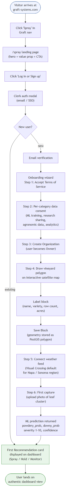
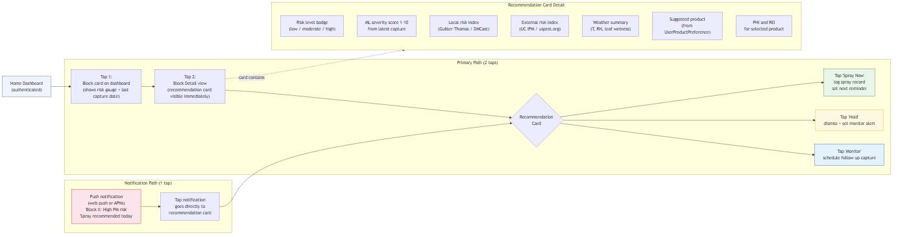
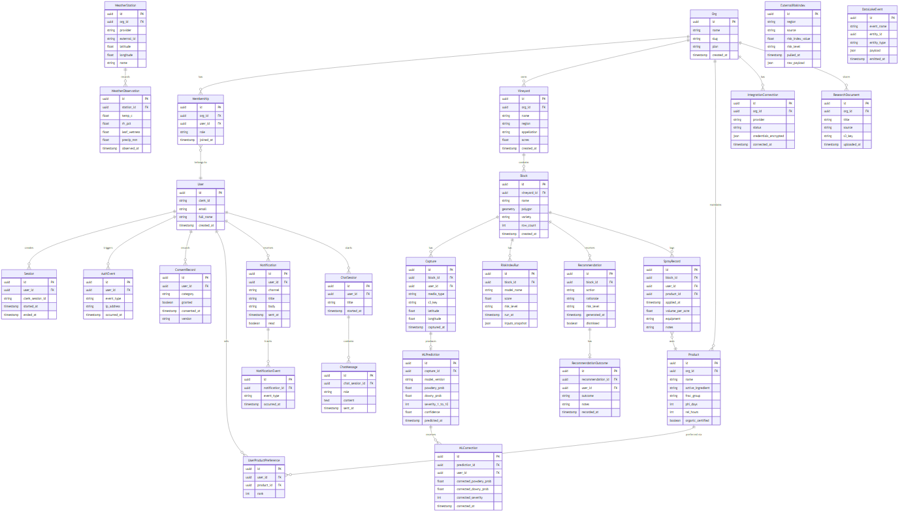
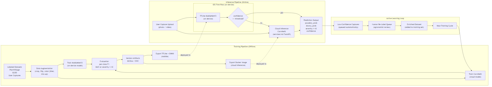
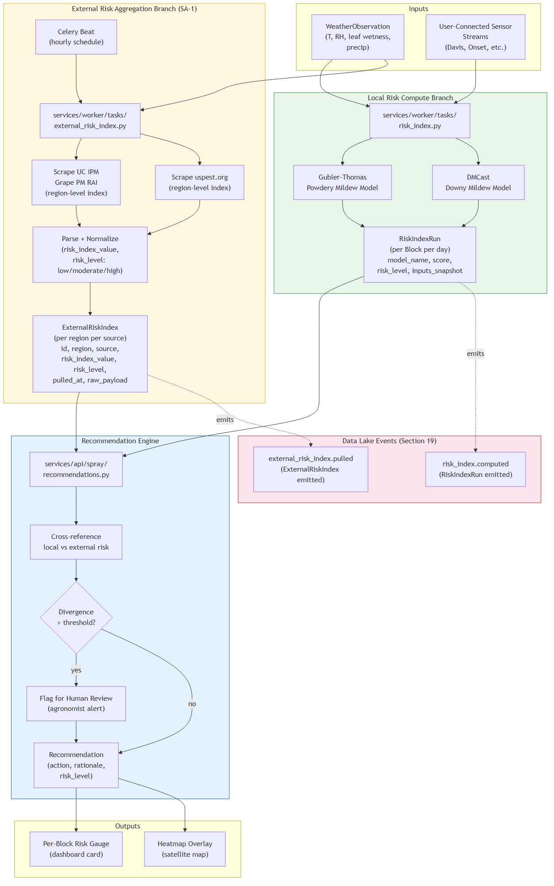
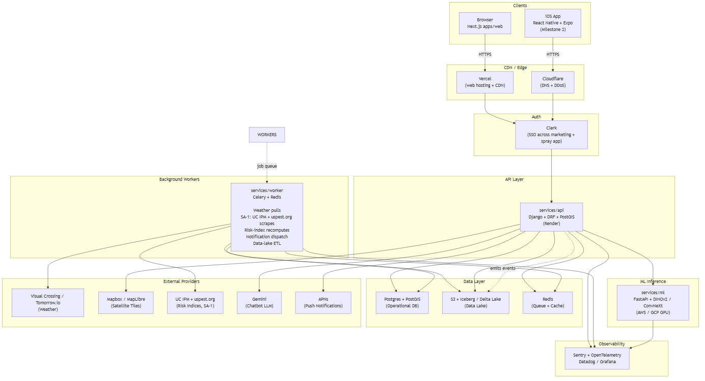
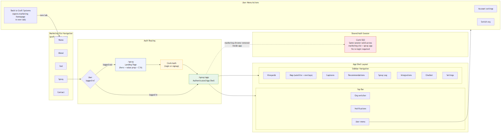

# Graft Spray — Application Specification

**Version:** 1.0 DRAFT
**Date:** 2026-04-30
**Status:** Draft. Sections 1 through 5 complete; sections 6 through 25 pending across subsequent commits on `graft-spray/m0/spec-pdf`.
**Companion documents:** [CODEBASE_PLAN.md](CODEBASE_PLAN.md), [CLAUDE_CODE_PLAN.md](CLAUDE_CODE_PLAN.md) (pending generation).
**Source brief:** [_source/original-spec-brief.md](_source/original-spec-brief.md).
**Research dossier:** [../research/](../research/) (read-only context).

---

## Table of Contents

1. Executive Summary
2. Umbrella Project Goal
3. User Personas and Jobs-to-Be-Done
4. Geographic and Language Rollout Plan
5. Platform Strategy
6. Core User Flows
7. Screen Inventory and Information Architecture
8. Feature Specification
9. Data Model and Schema
10. ML / Computer Vision Pipeline
11. Disease Forecasting Engine
12. Weather and External Data Integration Layer
13. Notification System
14. Tech Stack and Architecture
15. App Store Compliance Checklist (Apple)
16. Web MVP Compliance and Accessibility
17. Security, Privacy, and Liability
18. Analytics and Telemetry
19. Data Capture and Learning Pipeline
20. Account and Identity System
21. Graft Website Integration
22. Testing Strategy
23. Roadmap and Milestones
24. Open Questions and Risks
25. Appendix: Glossary, References, Source Map

---

## 1. Executive Summary

> **Pivot note (SA-2, 2026-05-07):** the executive summary below is rewritten for the per-vineyard decision-intelligence aggregation hub framing. CV moves to a Phase 3 scouting module. The umbrella goal in §2 stays verbatim. See Appendix A SA-2 + new sections §11A, §12A, §12B, §12C, §13A, §13B for the full pivot. The original CV-centric exec summary lives in git history at commit `73a5371` if needed.

Graft Spray is a **per-vineyard mildew decision-intelligence hub**. It pulls every credible signal — mechanistic risk models (Gubler-Thomas, Caffi Primary/Secondary, DMCast, Mills, EPI, PLASMO, Magarey), public weather networks, satellite vegetation indices, on-vineyard sensors (Davis, Pessl, METER), and government advisories (UC IPM, BSV, INRAE, INTA, EPPO) — and emits a **daily spray verdict** (`spray` / `hold` / `scout`) with severity 1–10 for both powdery and downy mildew, a 7-day forecast, and **inline citations** to the model that fired, the data that triggered it, and the paper that underwrites the threshold. Optional Phase 3 module: in-field computer vision for outbreak localization once an outbreak is suspected.

The umbrella project goal sets a strict commercial bar: tell winegrowers when to spray their vineyards and when not to, to prevent the spread of powdery and downy mildew and save money compared to indiscriminate spraying. Every feature in this specification supports that goal.

Graft Spray launches as a web application embedded inside the existing Graft Systems marketing site at `graftsystems.com/spray`. An iOS native app, built on React Native with Expo, follows in milestone M2 and is architected to extend to Android with no model rework when expansion is approved. The same Django plus Postgres plus PostGIS backend serves both surfaces through a shared OpenAPI-generated TypeScript client published as the `packages/client-core` workspace package.

Geographic rollout proceeds Napa and Sonoma first, then Burgundy, then Bordeaux, then Mendoza, then global. Languages: English at launch, French at milestone M3 alongside Burgundy launch and GDPR readiness, Spanish at M5 alongside Mendoza. The application is architected for internationalization from day one via ICU message format, locale files, and right-to-left-safe layouts.

Distribution and identity are unified through Clerk for single sign-on across the marketing site and the authenticated Spray application. Every user-generated artifact (photo, video, polygon, spray record, recommendation accepted or rejected, chatbot interaction, weather observation, sensor reading, notification response) is captured into an append-only data lake on S3 partitioned by org, category, and date, with strict tenant isolation, KMS-managed encryption at rest, TLS 1.3 in transit, granular per-category consent toggles, and full per-user export and deletion paths to satisfy GDPR Article 6, CCPA, and Apple App Store Guideline 5.1.1(v) requirements.

This document specifies the application end-to-end so it can be implemented by Claude Code with no further design decisions required. Section 6 onward elaborates each pillar.

---

## 2. Umbrella Project Goal

> Tell winegrowers when to spray their vineyards and when not to, to prevent the spread of powdery and downy mildew and save money compared to indiscriminate spraying.

This goal is fixed and is reproduced verbatim in this section, on the cover page, in the executive summary, and in the application's own onboarding copy. It is not paraphrased anywhere in this specification.

Three observations follow from the goal.

First, "when to spray and when not to" is symmetric. The application is as accountable for telling a manager to **hold** as it is for telling them to **spray**. A recommendation engine that only says "spray more" trains user distrust the moment the season's first dry streak rolls past without mildew pressure. The dashboard surfaces both the current risk window and the explicit holding window, both with the underlying weather and risk-index drivers cited in plain language.

Second, "prevent the spread of powdery and downy mildew" defines the disease scope at launch. Other grapevine diseases (Botrytis, Esca complex, leafroll, Pierce's disease, erineum mite) are not classified by the ML pipeline at launch and are not addressed by the disease-forecasting engine, although the data lake captures all imagery for future expansion. The reference dataset described in section 10 includes images of these other conditions to allow the cloud classifier to recognize and explicitly defer when an image is out-of-scope.

Third, "save money compared to indiscriminate spraying" is the commercial bar. Section 8.13 specifies a savings tracker that compares each block's recommended spray schedule and product mix to a calendar-spray baseline for the same region, and surfaces the dollar savings, fungicide volume saved, and FRAC-rotation diversity score [Brain 05_treatment-methods / P4, P6, P7, P8]. The savings figure is the product's primary growth metric: every dashboard load shows the year-to-date savings, and every successful spray-skip event raises it.

---

## 3. User Personas and Jobs-to-Be-Done

Four personas are addressed at launch. Each persona's primary jobs-to-be-done shape the screen inventory in section 7 and the role-based access model in section 20.

### 3.1 Owner-operator winegrower (small to medium vineyard)

Operates a single vineyard between roughly 5 and 50 acres. Hands-on with viticulture decisions; performs or directly supervises spraying. Highly cost-sensitive, often organic-only or transitioning. Mobile-first; the iPhone is in their pocket, the laptop is in the farmhouse office.

Jobs-to-be-done:
- Decide whether to spray today, given the forecast and the last spray's PHI and REI windows.
- Compare recommended spray cost vs. the calendar-spray baseline at season's end for tax filing and budgeting.
- Photograph a leaf or cluster suspicion and get an immediate second opinion on whether it is powdery or downy mildew or healthy.
- Hold a copy of every spray record for state regulatory compliance (California Pesticide Use Reports, the Burgundy *Cahier de phytosanitaire*, and so on).

### 3.2 Vineyard manager (larger commercial operation)

Manages 50 to 500 plus acres across multiple blocks for a wine producer or vineyard-management company. Coordinates a crew of applicators. Reports to a winery owner or general manager. Desktop-first for planning, mobile-first for field decisions. May manage multiple distinct vineyards under a single org.

Jobs-to-be-done:
- Plan the next 3 to 7 days of spray operations across all blocks, sequenced by risk and crew availability.
- Track FRAC-group rotation across all blocks to maintain resistance management [Brain 05_treatment-methods / P7, P8].
- Pull weekly cost and volume rollups by block and by product.
- Receive high-confidence push notifications when any block crosses into a moderate or high risk window.
- Delegate per-block read-write access to crew leads without granting org-wide admin rights.

### 3.3 Crew lead and sprayer applicator

Drives the sprayer rig, mixes products, executes the spray. May or may not be the same person as the vineyard manager. In the field, with gloves, frequently in low-light or high-glare conditions. Phone or tablet only.

Jobs-to-be-done:
- See today's spray plan at a glance, sorted by block and by product.
- Log a spray as completed in two or three taps, including product, rate, equipment, conditions at the time, and applicator identity.
- Photograph the leaf canopy mid-spray for quality-of-coverage records.
- Receive a real-time alert if conditions during the spray window drift out of label requirements (wind speed, temperature, relative humidity) [Brain 02_weather-impacts / P1].

### 3.4 Consultant and advisor (read-only)

University-extension advisor, independent crop consultant, or insurance loss adjuster. Does not own the vineyard but is granted scoped access to advise the owner. Heterogeneous device usage.

Jobs-to-be-done:
- Read every block's recommendation, risk-index history, capture history, and spray history.
- Add free-text annotations or "advisor notes" on captures and recommendations without modifying the operational records.
- Export a per-vineyard PDF report for the advisor's own files.

These four personas map to the four roles in the role-based access model defined in section 20: Owner, Admin, Member, and Viewer.

---

## 4. Geographic and Language Rollout Plan

The application launches region by region. Each region has its own gated bundle of data sources, regulatory compliance posture, and language coverage.

### 4.1 Region sequence

| Phase | Milestone | Region | Languages | Driver |
|---|---|---|---|---|
| 1 | M0–M1 | Napa County and Sonoma County, California | English | Primary launch market; UC IPM is the canonical regional risk index; CCPA applies; existing Graft network. |
| 2 | M3 | Burgundy, France | English + French | First international expansion; INRAE and Chambre d'agriculture data sources; GDPR applies; EU data residency required. |
| 3 | M4 | Bordeaux, France | English + French | Second French region; reuses Burgundy infrastructure; broadens language and compliance coverage. |
| 4 | M5 | Mendoza, Argentina | English + French + Spanish | Southern hemisphere expansion; INTA data sources; first Spanish-speaking region; first Latin American compliance posture. |
| 5 | M6+ | Global expansion | + per region | Region-by-region rollout based on demand and partner channels. |

### 4.2 Language strategy

English is the launch language. French follows at M3 (Burgundy) and Spanish at M5 (Mendoza). All UI strings flow through ICU message format from day one. Right-to-left layout safety is enforced by Tailwind CSS logical properties even though no RTL language is in the M0–M5 plan. Locale files live in `apps/web/locales/<lang>/<namespace>.json` for the web app and in `apps/mobile/locales/<lang>/<namespace>.json` for the iOS app, with a shared schema validated by a CI check.

Translation workflow: the development team writes English strings; a per-region partner (UC Extension contact for Napa, INRAE liaison for Burgundy, INTA Mendoza contact for Argentina) reviews region-specific terminology before launch. Machine translation is used as a baseline for non-English strings, then post-edited by the partner. Strings that include disease names, product names, regulatory terms, and units are flagged for partner review.

### 4.3 Region-aware data sources

Each region has its own canonical authority for weather data, risk indices, and pesticide registration. The Weather and External Data Integration Layer in section 12 abstracts provider selection so the same client code works regardless of region. The default provider for a vineyard's region is selected automatically when the vineyard is created and can be overridden by the org admin.

| Region | Default weather provider | Default risk-index source | Pesticide registry |
|---|---|---|---|
| Napa, Sonoma | Visual Crossing or Tomorrow.io | UC IPM Grape PM Risk Assessment Index (SA-1) [Brain 06_outbreak-prediction / P1, P2] | CDPR PUR via CalAgPermits |
| Burgundy, Bordeaux | Météo-France ICOS or Visual Crossing EU | INRAE Optidose / Mildiumagro [Brain 04_industry-publications / P1, P2, P3] | E-Phy registry (ANSES) |
| Mendoza | INTA Pampa or Tomorrow.io | INTA Mendoza models | SENASA registry |

### 4.4 Regional content service

Section 8.4 specifies a regional content service that scopes recommendations to the active vineyard's region. The service draws from two sources: the research dossier at `docs/research/` for canonical published guidance, and live feeds for region-specific bulletins (UC IPM news, INRAE alerts, INTA boletines). Feature gating uses the region of the active vineyard, not the region of the user, so a Bordeaux-based consultant advising a Mendoza grower sees Mendoza data.

---

## 5. Platform Strategy

Graft Spray ships on the web first (M0–M1) and on iOS second (M2). Android is explicitly out of scope at launch but the architecture preserves the option of activating it without model rework.

### 5.1 Web MVP (M0–M1)

The web application is the first surface. It launches as a route group inside the existing graftsystems.com Next.js 15 application using the App Router. Marketing pages live under `apps/web/app/(marketing)/` and the authenticated Spray application lives under `apps/web/app/(spray)/`. Section 21 specifies the integration in detail, including the new "Spray" entry in the marketing navigation, the `/spray` marketing landing page that gates login, and the `(spray)` route group that hosts the dedicated app shell.

The web MVP supports the full feature set in section 8 except where on-device ML inference is required. Cloud inference handles all severity grading from the web. Map polygon drawing uses MapLibre GL with open satellite imagery (Esri World Imagery or Sentinel-2) by default with Mapbox GL as a paid fallback if quality demands it; this decision is captured as Open Question Q4 in section 24.

### 5.2 iOS launch (M2)

Phase 2 is a native iOS application built on React Native and Expo. The choice of React Native is deliberate: a substantial fraction of the client code is shared with the web through `packages/client-core` (the OpenAPI-generated TypeScript client and React hooks) and `packages/ui` (design tokens and primitive components mapped through NativeWind or Tamagui). The same Postgres schema, Django REST API, FastAPI ML inference service, and Celery worker tier serve both surfaces.

iOS capabilities not present on web:
- On-device first-pass severity classifier using TensorFlow Lite or ONNX Runtime (`react-native-fast-tflite` is the preferred runtime; `onnxruntime-react-native` is the alternative). The model is the same lightweight backbone exported in two formats.
- Apple Sign In via `expo-apple-authentication` (per Apple Guideline 4.8 if any third-party SSO is offered).
- APNs push notifications via `expo-notifications`.
- Camera and gallery integration via `expo-camera` and `expo-image-picker`, with video support via `expo-av`.
- Offline buffering of captures and spray records via `expo-sqlite` plus `expo-secure-store` for token storage in the iOS Keychain.

Build and distribution: EAS Build (Expo Application Services) for iOS builds, EAS Submit for App Store delivery, EAS Update for over-the-air JavaScript updates within the constraints of App Store Guideline 4.7 (no behavior changes; bug fixes, content, and styling only).

### 5.3 Android (out of scope at launch)

Android is explicitly out of scope until further notice. The React Native codebase is kept Android-clean throughout: no iOS-only Expo modules without an Android equivalent, all platform-specific code in `.ios.ts` and `.android.ts` files where required, the New Architecture (Fabric and TurboModules) enabled from day one. The same TFLite or ONNX model shipped to iOS will run on Android with no model rework when the team decides to expand. Activating Android consists of enabling the Android target in EAS Build, configuring the Android signing keys, and adding Android-specific app store listings; no architecture work is required.

### 5.4 Backend platform-agnosticism

The backend (Django REST API, FastAPI ML inference, Celery workers, Postgres, PostGIS, S3, Iceberg or Delta Lake) is the same across all client surfaces. No backend code is web-specific or iOS-specific. The single OpenAPI specification at `services/api/openapi.yaml` generates the TypeScript client used by both `apps/web` and `apps/mobile`. Per spec amendment SA-1, the Celery worker tier hosts the new `external_risk_index.py` task that periodically aggregates UC IPM and uspest.org risk indices.

### 5.5 Model-runner orchestration (rewritten — SA-2)

> **Pivot note (SA-2, 2026-05-07):** the original "hybrid CV inference" framing has been replaced by mechanistic-model orchestration. The original CV-centric content lives in git history at commit `73a5371`.

Every disease forecasting model — Gubler-Thomas, Caffi Primary, Caffi Secondary, DMCast, Mills, PLASMO, Magarey, Snyder-Sall — runs as a **containerized per-model runner** under `services/api/spray/aggregation/runners/<slug>/`. Each runner emits the canonical `RiskRecord` schema (see §11A.1) per block per day per pathogen.

An **ensemble layer** at `services/api/spray/aggregation/ensemble.py` fuses runner outputs into a `BlockVerdict` (see §11A.2) — the daily spray verdict surfaced to growers.

The optional **CV scouting runner** is one input among many, not the central one. CV is described in §10 (now retitled "Optional CV Scouting Module — Phase 3"). For Phase-1 / Phase-2 (M0–M2) Graft Spray runs entirely without CV. See §11A for the ensemble contract and §11A.3 for the year-by-year progression (Year 0 equal-weight soft vote → Year 1 weighted Brier-tuned → Year 2 stacked meta-learner).

---

## 6. Core User Flows

The application's two most important flows are reachable in two taps from the home screen. Both flows assume the user is already authenticated and has at least one block.

### 6.1 Onboarding to first recommendation



The full first-time-user journey from clicking "Spray" in the Graft marketing nav to seeing the first recommendation card on the dashboard. Target completion time: under 5 minutes.

Steps:
1. Visitor clicks "Spray" in the Graft Systems marketing navigation. Routes to `/spray` marketing landing page (per section 21).
2. Visitor clicks "Log in or Sign up" CTA. Clerk-hosted auth flow opens (signup with email + password, or Sign in with Apple, or Google OAuth).
3. Visitor verifies email (and phone if used for SMS notifications later).
4. Visitor accepts terms of service and privacy policy. Granular consent toggles are presented per category (per section 19): "use my photos for model training," "use my spray records for benchmarks," "share anonymized aggregate insights." Each can be off while the app still works.
5. Visitor creates an Org. The first user becomes the Owner. Owner role requires MFA (TOTP or passkey/WebAuthn) before the Org is fully provisioned.
6. Visitor enters the onboarding wizard:
   - Step A: search for the vineyard's address. Map zooms to satellite view.
   - Step B: draw the vineyard outline polygon. The app snaps to existing parcel boundaries where Esri or Sentinel-2 imagery offers them.
   - Step C: subdivide into one or more Blocks. Label each (e.g., "North Block, Cab Sauv 2018").
   - Step D: enter planted variety, training system, row spacing per Block (optional but recommended; affects severity calibration).
   - Step E: connect a weather data source. Default selection is region-aware (Visual Crossing for Napa/Sonoma; Météo-France for Burgundy). The user can override.
7. Visitor takes the first capture: photo of a leaf or cluster from any Block. Web users use the file picker or drag-drop; iOS users use `expo-camera`. Cloud inference returns severity 1 to 10 with disease class probabilities and confidence within roughly 2 to 4 seconds.
8. The dashboard renders the first recommendation card for that Block, derived from the active risk index, the just-uploaded capture's severity, and the user's preferred-product list (which defaults to a region-appropriate starter set).

### 6.2 Two-tap spray decision from home



The home screen lists Blocks as cards. Each card shows the current risk level (low / moderate / high), the most recent capture severity if any, and a "Recommendation" pill ("Spray now" / "Hold" / "Spray within 2 days").

Tap 1: home, tap a Block card, route to the Block detail screen.

Tap 2: visible at the top of the Block detail is the Recommendation card. Tap "Spray now" to log a planned spray (opens the spray-log entry form pre-filled). Tap "Hold" to acknowledge the recommendation.

A secondary single-tap path exists via push notifications: when a Block crosses into moderate or high risk, the device receives a push notification; tapping the notification opens directly to the Block's Recommendation card.

### 6.3 Capture upload and severity grading (Phase 3 — post-M1.5)

> **Pivot note (SA-2, 2026-05-07):** this flow is part of the optional Phase 3 CV scouting module. Not in the M0–M2 critical path. The capture upload pipeline (M1-09) ships to support this, but the CV inference + severity grading lands at M3+. The prose below describes the eventual end state.

The capture flow is reachable from any Block detail screen via a prominent "Capture" button.

Steps:
1. User taps "Capture." Web: file picker opens. iOS: camera opens with `expo-camera`.
2. User takes one or more photos (or videos, M2+). Multi-photo upload aggregates per cluster: averaging predictions across N images of the same cluster yields a calibrated single-cluster severity. The aggregation policy is documented in section 10.
3. Upload progresses with a queue indicator. Offline iOS captures buffer in `expo-sqlite`.
4. iOS only: on-device first-pass returns severity 1 to 10 immediately.
5. Cloud inference returns the authoritative result within seconds (online) or after reconnection (offline iOS).
6. The Capture detail screen shows the photo(s), the prediction, and a "Confirm or Correct" UI. The user can override the disease class and severity; corrections persist as `MLCorrection` records and feed the active-learning loop in section 10.

### 6.4 Spray log entry

Reachable from the Block detail screen ("Log spray") or from any Recommendation card ("Spray now").

Steps:
1. Form pre-fills with the recommended product, rate, and target disease.
2. User confirms or edits product (drop-down sourced from the user's preferred-product list with a search-everything fallback).
3. User confirms or edits rate, equipment, applicator identity, weather conditions at the time (optional auto-fill from the active weather source).
4. User taps "Log." Spray record persists to `SprayRecord`. PHI and REI countdowns start. Push notifications and dashboard banners suppress for the affected block during the REI window.

### 6.5 Recommendation acceptance and outcome tracking

Each recommendation served carries a unique `Recommendation.id`. When the user logs a spray that the recommendation flagged, the recommendation is auto-linked. Otherwise the recommendation expires after its validity window (typically 48 to 72 hours). The application tracks `RecommendationOutcome`: was the recommendation followed; was a disease event observed within the next 7 days; what was the savings vs. the calendar baseline. This data feeds the recommendation engine's per-region calibration.

---

## 7. Screen Inventory and Information Architecture

The authenticated app is organized into a persistent left sidebar with eight top-level destinations and a top bar with org switcher, notifications, and user menu. The unauthenticated marketing site is unchanged except for the added "Spray" entry. Section 21 details the boundary.

### 7.1 Authenticated app shell

| Sidebar item | Path | Primary content |
|---|---|---|
| Dashboard | `/spray/dashboard` | At-a-glance: today's recommendations, year-to-date savings, active risk windows, recent captures, FRAC-rotation status. |
| Vineyards | `/spray/vineyards` | List of vineyards in the active org. CRUD, archival. |
| Map | `/spray/map` | Full-screen satellite map; polygon drawing; risk heatmap overlay; per-block details panel. |
| Captures | `/spray/captures` | Photo and video library. Filter by block, by date, by disease class, by severity, by ML-correction status. |
| Recommendations | `/spray/recommendations` | Active and historical recommendations. Filters by block and outcome. |
| Spray log | `/spray/spray-log` | Spray records. CSV import for legacy records. PHI / REI tracking. Per-block and per-product rollups. |
| Integrations | `/spray/integrations` | Connect external weather feeds, sensor streams, lab data. Manage preferred-product list. |
| Chatbot | `/spray/chatbot` | Gemini-backed assistant. RAG-grounded over the research dossier and the user's own data. |
| Settings | `/spray/settings` | Org settings, members, billing, notification preferences, consent toggles, data export, account deletion. |

### 7.2 Top bar

- Org switcher (left): for users who belong to multiple orgs.
- Notifications bell (center-right): unread count; dropdown lists recent alerts.
- User menu (right): profile, log out, log out from all devices, switch org, "Back to Graft Systems" link (opens marketing homepage in a new tab per section 21).

### 7.3 Marketing surface (unchanged behavior)

The existing marketing navigation gains a single new item, "Spray." All other marketing pages (Home, About, Tool, Contact) are untouched. The marketing footer remains. Inside the authenticated `(spray)` route group, the marketing chrome (top nav, footer, marketing-style hero sections) is replaced by the app shell. Section 21 specifies the boundary in detail.

### 7.4 Outdoor-readability requirements

All authenticated screens must meet outdoor-readability minimums [Brain 07_miscellaneous / P2, P4]:
- Minimum text contrast ratio 7:1 (AAA).
- Minimum tap target 44x44 points (Apple HIG; matches the spec's MIT Touch Lab fingertip-width reference).
- Sticky primary actions stay within thumb reach in portrait orientation.
- High-contrast mode automatically engaged when ambient light sensor (iOS) reports above a threshold or when the user explicitly toggles the "field mode" switch (web).

---

## 8. Feature Specification

The 13 must-have features below are carried forward verbatim in intent from the source brief. For each feature: description, user story, acceptance criteria, screens involved, data dependencies, API contracts, edge cases, dossier reference, and the data lake events emitted (per section 19).

### 8.1 Super easy to use

**Description.** Core spray decision reachable in 2 taps from home. Onboarding completes in 5 minutes. Outdoor-readable UI with high contrast and large tap targets.

**User story.** As a vineyard manager standing in the field with gloves on, I can decide whether to spray Block 3 today within 5 seconds of unlocking my phone.

**Acceptance criteria.**
- From a cold home-screen load (logged in, at least one block defined), the user can tap one Block and see "Spray now / Hold" within 2 taps.
- Onboarding flow (per section 6.1) median time is under 5 minutes for users with their vineyard address ready.
- All primary action buttons render at minimum 44x44 points.
- Color contrast meets WCAG 2.2 AA minimum (4.5:1) for normal text and AAA (7:1) for "field mode."

**Screens involved.** Dashboard, Block detail.

**Data dependencies.** `Block`, `Recommendation` (latest active per block).

**API contracts.** `GET /api/spray/dashboard` returns the home-screen card data.

**Edge cases.** No active recommendation for a block: card shows "No active risk; next index recompute at HH:MM." No blocks at all: dashboard shows the onboarding CTA.

**Dossier reference.** Outdoor readability and tap-target sizing [Brain 07_miscellaneous / P2, P4].

**Data lake events emitted.** `dashboard.viewed`, `block.tapped`, `recommendation.viewed`.

### 8.2 Not complex

**Description.** Advanced settings hidden behind progressive disclosure. Defaults sensible per region.

**User story.** As a first-time user, I do not see FRAC group toggles, leaf-wetness sensor calibration, or risk-index threshold sliders during onboarding. They live under Settings, Advanced.

**Acceptance criteria.**
- Onboarding shows only the fields required to draw a block, label it, and connect a weather source.
- All risk-index thresholds default to region-appropriate published values [Brain 06_outbreak-prediction / P1, P2, P5] and are surfaced only under Settings, Advanced, Risk thresholds.
- Power users can override defaults; the override is persisted and surfaced in the per-block recommendation explanation.

**Screens involved.** Onboarding flow, Settings.

**Data dependencies.** `Org.settings`, `Block.settings`.

**API contracts.** `PATCH /api/spray/orgs/:id/settings`, `PATCH /api/spray/blocks/:id/settings`.

**Edge cases.** Org-level setting vs. block-level override: block-level wins.

**Data lake events emitted.** `settings.changed` with `level=org|block` and the diff.

### 8.3 Apple App Store listing readiness

**Description.** Full Apple compliance per section 15.

**Acceptance criteria.** Section 15's checklist passes in full.

(Cross-reference to section 15.)

### 8.4 Live regional documentation

**Description.** Region-aware content service (per section 4.4) pulls from the research dossier and live regional feeds; recommendations are scoped to the active vineyard's region.

**User story.** As a Burgundy grower, my spray recommendations cite INRAE Optidose sources and obey French E-Phy registry constraints, even if my advisor is in California.

**Acceptance criteria.**
- Recommendations cite at least one canonical source per region.
- Region detection follows the active vineyard's geocoded centroid, not the user's IP.
- Live feeds (UC IPM news, INRAE alerts, INTA boletines) refresh hourly; stale-flag if older than 24 hours.

**Screens involved.** Block detail (citation footer), Recommendation detail.

**Data dependencies.** `Vineyard.region`, `ResearchDocument`, regional feed adapters in `services/worker/tasks/`.

**API contracts.** `GET /api/spray/regions/:region/sources`, `GET /api/spray/regions/:region/bulletins`.

**Edge cases.** Region not yet supported: app shows "your region is on the roadmap" with a link to the rollout plan in section 4.

**Dossier reference.** Per region: [Brain 04_industry-publications], [Brain 06_outbreak-prediction], [Brain 03_live-weather-feeds].

**Data lake events emitted.** `regional_source.served`, `regional_bulletin.fetched`.

### 8.5 Capture and interpretation (Phase 3 — post-M1.5)

> **Pivot note (SA-2, 2026-05-07):** part of the optional Phase 3 CV scouting module. The upload pipeline ships at M1-09; severity grading via CV moves to M3+.

**Description.** Photo and video capture, cloud upload (with offline iOS buffering), severity grading on a 1 to 10 scale aligned to EPPO PP 1/004 [Brain 01_visual-detection / P1].

**User story.** As a crew lead, I take a photo of a suspicious leaf, and within seconds I see "Powdery mildew, severity 4/10, confidence 87%."

**Acceptance criteria.**
- Capture supports JPEG and HEIC photos; MP4 video at 720p.
- Web upload limit 25 MB per file; iOS upload chunks files larger than 5 MB.
- Cloud inference returns within 4 seconds at p95 for a single 1080p photo.
- iOS on-device inference returns within 1 second at p95.
- Severity scale: integer 1 to 10. Mapping to EPPO PP 1/004 reference photos is documented in section 10.
- Multi-photo cluster aggregation: when N photos of the same cluster are uploaded together, the average prediction is the calibrated single-cluster severity.

**Screens involved.** Capture, Capture detail, Block detail.

**Data dependencies.** `Capture`, `MLPrediction`, `MLCorrection`.

**API contracts.** `POST /api/spray/captures` (multipart, up to 10 files), `GET /api/spray/captures/:id`, `POST /api/spray/captures/:id/correct`.

**Edge cases.** Out-of-scope image (e.g., Botrytis, Esca, leafroll, soil): cloud model emits `disease_class=other` and the UI explains "this image is outside Graft Spray's launch scope; we logged it for future model expansion." Network failure on iOS: capture queues locally; retries on reconnect.

**Dossier reference.** EPPO PP 1/004 [Brain 01_visual-detection / P1]. GLDD dataset and ResNet-50 baselines [Brain 01_visual-detection / P3]. Hyperspectral severity calibration [Brain 01_visual-detection / P2].

**Data lake events emitted.** `capture.uploaded`, `ml.prediction.created`, `ml.correction.created` (when user overrides).

### 8.6 User-supplied resources and integrations

**Description.** Connect paid weather feeds, lab data, sensor streams. Upload legacy spray history (CSV or PDF). Curate preferred-products list.

**User story.** As a vineyard manager already paying for a Davis weather station and Sencrop sensor data, I connect both, and Graft Spray's risk index now uses my higher-resolution local data instead of the regional default.

**Acceptance criteria.**
- Integration types at launch: Davis WeatherLink, METER ATMOS-41, Sencrop, Pessl iMETOS, generic CSV import.
- CSV spray-history import: column mapping wizard, validation, preview, batch import. Supported source formats: state PUR exports, Vinpro CSV, generic Excel.
- Preferred-products list: search by FRAC group, by product, by mode of action; add or remove; mark organic-only [Brain 05_treatment-methods / P1, P6, P7].
- Connections are surfaced in the per-block recommendation explanation: "this recommendation uses your Davis WeatherLink station data, last refreshed 12 minutes ago."

**Screens involved.** Integrations, Spray log (for CSV import).

**Data dependencies.** `IntegrationConnection`, `WeatherStation`, `SprayRecord`, `Product`, `UserProductPreference`.

**API contracts.** `POST /api/spray/integrations`, `GET /api/spray/integrations/:id/test`, `POST /api/spray/spray-records/import`.

**Edge cases.** Failed CSV row: surfaced inline, user can edit and retry without re-uploading the whole file.

**Dossier reference.** [Brain 03_live-weather-feeds], [Brain 05_treatment-methods].

**Data lake events emitted.** `integration.connected`, `integration.disconnected`, `spray_history.imported`, `product_preference.updated`.

### 8.7 Targeted product suggestions

**Description.** Recommend specific products and rates per block, respecting preferred-products list, FRAC rotation, PHI, REI, and organic-only flags.

**User story.** As an organic grower in Sonoma, when my Block 2 crosses into moderate risk, I receive a recommendation for sulfur (FRAC M02) at the rate published in the UC IPM Grape Pest Management Guidelines, knowing it complies with my organic certification.

**Acceptance criteria.**
- Recommendations always cite the underlying weather and risk-index drivers in plain language.
- FRAC rotation enforced over a configurable window (default 14 days): no two consecutive recommendations use the same FRAC group.
- PHI and REI checks against the user's harvest target date and crew schedule.
- Organic-only flag filters product universe at recommendation time.

**Screens involved.** Recommendation detail, Block detail.

**Data dependencies.** `Recommendation`, `Product`, `UserProductPreference`, `RiskIndexRun`, `ExternalRiskIndex` (per SA-1).

**API contracts.** `GET /api/spray/recommendations?block_id=:id&active=true`, `POST /api/spray/recommendations/:id/acted_on`.

**Edge cases.** All preferred products in current FRAC rotation window: surface "no compliant product in your preferred list; here are 3 alternatives outside it" with one-tap add-to-preferred.

**Dossier reference.** FRAC rotation and resistance management [Brain 05_treatment-methods / P7, P8]. Copper and sulfur use in European viticulture [Brain 05_treatment-methods / P1].

**Data lake events emitted.** `recommendation.served`, `recommendation.acted_on`.

### 8.8 Spray schedule with explanations

**Description.** Per-block spray schedule for the next 7 days, ordered by block region and crew availability, with per-recommendation drivers explained.

**User story.** As a vineyard manager, on Monday morning I see this week's plan: Block 1 sprayed Tuesday with Product A (FRAC group 7) because Gubler-Thomas crossed 60 yesterday and the forecast shows a stormy Wednesday, Block 2 held until Friday because risk is currently low and the forecast is dry.

**Acceptance criteria.**
- Schedule view (table) shows Block, Day, Product, Rate, Reason.
- Each row links to the full recommendation explanation.
- Schedule re-computes when weather updates, when a capture lands, when external risk feeds (SA-1) update, or when a spray is logged.

**Screens involved.** Dashboard, Recommendations, Spray log.

**Data dependencies.** `Recommendation`, `Block`, `WeatherObservation`, `RiskIndexRun`, `ExternalRiskIndex`, `SprayRecord`.

**API contracts.** `GET /api/spray/schedule?org_id=:id&from=:date&to=:date`.

**Edge cases.** Crew availability not configured: schedule defaults to "any day in window." Conflicting recommendations across blocks (same crew, same hour): the schedule view flags conflicts.

**Dossier reference.** Decision-support systems [Brain 04_industry-publications / P1, P2].

**Data lake events emitted.** `schedule.computed`, `schedule.served`.

### 8.9 Risk heatmap (rewritten — SA-2)

> **Pivot note (SA-2, 2026-05-07):** rewritten from "Severity heatmap" (CV-driven) to "Risk heatmap" (ensemble-driven per §11A). Optional CV severity overlay returns in Phase 3.

**Description.** Heatmap overlay on the satellite map showing per-block **risk verdict** from the ensemble engine (§11A) plus inputs from on-vineyard sensors (§12A) and satellite vegetation indices (§12B). "What to watch" widget for upcoming weather drivers + scheduled advisory feed updates (§12C).

Phase 3 sub-feature: optional CV severity overlay layered on top of the risk heatmap once a grower confirms a suspected outbreak — used as a localization aid for crews, not as a prevention signal.

**User story.** As an owner-operator scrolling the map, I see a red overlay on Block 3 and an amber on Block 5; tapping Block 3 shows the recommendation card.

**Acceptance criteria.**
- Heatmap colors derive from a single canonical risk-level scheme: green (low), amber (moderate), red (high).
- Color scale documented in the legend; same scale used in dashboard cards.
- "What to watch" widget surfaces the next 72 hours' weather drivers most likely to flip a block's risk level.

**Screens involved.** Map, Dashboard.

**Data dependencies.** `Block.geom`, `RiskIndexRun.risk_level`, `WeatherObservation` forecast.

**API contracts.** `GET /api/spray/map/heatmap?org_id=:id`.

**Edge cases.** Block missing recent risk-index run: rendered grey ("computing") with a recompute trigger button.

**Data lake events emitted.** `heatmap.rendered`.

### 8.10 Risk-window notifications

**Description.** Push and web push notifications when a block crosses into moderate or high risk. Per-block subscriptions, quiet hours, digest mode.

**User story.** As an owner-operator on a quiet Sunday, I receive a single 7am digest "3 of your blocks crossed into moderate risk overnight; recommended spray windows: Tuesday for Block 1, Wednesday for Blocks 2 and 5."

**Acceptance criteria.**
- Permission flow asks before enabling notifications; defaults to off.
- Per-block subscription (subscribe / unsubscribe / digest-only).
- Quiet hours respected per user (default 9pm to 6am local).
- Digest mode: bundle multiple block-level alerts into one notification per quiet-hours window or per configured cadence.
- Test harness for simulating high-risk events (admin only).

**Screens involved.** Settings, Notifications, Dashboard banner, Block detail.

**Data dependencies.** `Notification`, `NotificationEvent`, `Block.subscriptions`.

**API contracts.** `POST /api/spray/notifications/subscriptions`, `GET /api/spray/notifications`, `POST /api/spray/notifications/:id/acked`.

**Edge cases.** User has not granted browser push permission: app falls back to email alerts (off by default; opt-in).

**Dossier reference.** [Brain 06_outbreak-prediction / P2].

**Data lake events emitted.** `notification.sent`, `notification.opened`, `notification.acted_on`.

### 8.11 Gemini chatbot

**Description.** Gemini-backed assistant grounded by RAG over the research dossier and the user's own data. Safety guardrail for pesticide-recommendation queries.

**User story.** As a vineyard manager, I ask "what is UC IPM saying about my region this week?" and get a grounded answer with citations.

**Acceptance criteria.**
- RAG corpus: research dossier (`docs/research/` excluding `business/competitive-landscape.md`) plus the user's own captures, spray records, recommendations, and weather observations.
- Pesticide-recommendation queries route through a safety guardrail: "I cannot recommend a specific pesticide; please consult your local extension service for the legal product list in your region. Here is what the research dossier says about products in your region's general practice..."
- Responses always carry citations to the underlying source (Brain category, paywalled-vs-open source ID, or user's own record ID).
- Thumbs-up and thumbs-down feedback per response; feedback feeds RAG quality improvement.

**Screens involved.** Chatbot.

**Data dependencies.** Read-only access to the user's own data scoped by `org_id`; read-only access to `ResearchDocument`.

**API contracts.** `POST /api/spray/chat/sessions`, `POST /api/spray/chat/sessions/:id/messages`, `POST /api/spray/chat/messages/:id/feedback`.

**Edge cases.** Out-of-scope query (e.g., "what is the best wine to pair with sushi?"): the assistant declines politely and redirects to in-scope help.

**Dossier reference.** General [Brain 00_index].

**Data lake events emitted.** `chat.message.exchanged`, `chat.feedback.given`.

### 8.12 Satellite map and polygon save

**Description.** Highly detailed satellite map for drawing vineyard outlines. Save as distinct vineyards and blocks, GeoJSON, GPS-anchored. Each block has its own spray timeline.

**User story.** As an owner-operator, I draw three blocks on the satellite view, label them, and from then on each block has its own risk index, captures, recommendations, and spray log.

**Acceptance criteria.**
- Map default: MapLibre GL with Esri World Imagery or Sentinel-2; Mapbox GL fallback if quality demands (Open Question Q4 in section 24).
- Polygon drawing with snapping to existing parcel boundaries where available.
- Polygons saved as PostGIS `geometry(Polygon, 4326)` on the `Block` model.
- Per-block tools: rename, re-draw, archive, export GeoJSON.
- Edit history retained as immutable revisions for advisor and audit use.

**Screens involved.** Map, Vineyards, Block detail.

**Data dependencies.** `Vineyard`, `Block` (PostGIS), `ResearchDocument` (region-specific guidance).

**API contracts.** `POST /api/spray/blocks`, `PATCH /api/spray/blocks/:id`, `DELETE /api/spray/blocks/:id`, `GET /api/spray/blocks/:id/geom.geojson`.

**Edge cases.** User draws over open water or non-vineyard polygon: warning surfaces but does not block save.

**Dossier reference.** RTK GNSS accuracy for parcel-boundary work [Brain 07_miscellaneous / P1].

**Data lake events emitted.** `block.created`, `block.updated`, `block.deleted`, `vineyard.created`.

### 8.13 Savings tracker

**Description.** Compare recommended sprays vs. a calendar-spray baseline; surface dollar savings, fungicide volume saved, FRAC-rotation diversity score.

**User story.** As an owner-operator at season's end, I export a one-page PDF showing I sprayed 7 times instead of the regional 12-spray calendar baseline, saved $2,840 in product cost, and used three different FRAC groups.

**Acceptance criteria.**
- Calendar baseline per region defined and documented (e.g., 12 sprays per season for Napa per UC IPM Grape Pest Management Guidelines).
- Dashboard widget: year-to-date savings vs. baseline.
- Per-block and org-wide rollups.
- PDF export at season end.

**Screens involved.** Dashboard, Settings, Reports.

**Data dependencies.** `SprayRecord`, `Product` (for cost), region-specific calendar baselines (in `ResearchDocument` or hardcoded constants by region).

**API contracts.** `GET /api/spray/savings?org_id=:id&season=:year`, `GET /api/spray/savings/:org_id/export.pdf`.

**Edge cases.** First season (no baseline yet): savings tracker shows "estimated savings vs. regional baseline."

**Dossier reference.** PM and DM cost analyses [Brain business / P3, P4].

**Data lake events emitted.** `savings.computed`, `savings.exported`.

---

## 9. Data Model and Schema



### 9.1 Operational store (Postgres + PostGIS)

The full entity list is enumerated below. Field-level definitions land in `services/api/spray/models.py` (M0-03 PR). Indexes are called out where they materially affect performance.

| Entity | Purpose | Key fields | Indexes |
|---|---|---|---|
| `Org` | Tenant boundary | id, name, region, created_at, plan, settings (jsonb) | (id) primary, (name) |
| `User` | Authentication identity (mirrors Clerk) | id, clerk_user_id, email, phone, name, locale, created_at | (clerk_user_id) unique, (email) |
| `Membership` | Org-User-Role bridge | id, org_id (FK), user_id (FK), role (Owner/Admin/Member/Viewer), created_at | (org_id, user_id) unique |
| `Session` | Active session record | id, user_id, jwt_jti, device, ip, created_at, last_seen, revoked_at | (user_id, revoked_at) |
| `AuthEvent` | Immutable auth audit trail | id, user_id, type (login/logout/mfa_enable/...), ip, ua, outcome, created_at | (user_id, created_at) |
| `ConsentRecord` | Per-category consent toggle | id, user_id, category, granted (bool), granted_at, withdrawn_at | (user_id, category) |
| `Vineyard` | Vineyard property | id, org_id, name, region, address, centroid (geometry), created_at, archived_at | (org_id), GIST on centroid |
| `Block` | Sub-vineyard block | id, vineyard_id, name, geom (geometry(Polygon,4326)), variety, training_system, row_spacing, settings (jsonb) | (vineyard_id), GIST on geom |
| `WeatherStation` | Connected or virtual weather station | id, org_id (nullable for regional default), provider, station_id, lat, lon | (org_id), (provider, station_id) |
| `WeatherObservation` | Time-series observation | id, station_id, ts, temp, rh, leaf_wetness, wind_speed, precip, raw (jsonb) | (station_id, ts) |
| `ExternalRiskIndex` (SA-1) | Live risk index from public extension services | id, region, source (UC_IPM/USPEST/...), risk_index_value, risk_level, pulled_at, raw_payload (jsonb) | (region, source, pulled_at) |
| `RiskIndexRun` | Local computation per block per day | id, block_id, model (GUBLER_THOMAS/DMCAST/...), risk_index_value, risk_level, inputs (jsonb), computed_at | (block_id, model, computed_at) |
| `SprayRecord` | Logged spray | id, block_id, product_id, rate, equipment, applicator_id, target_disease, conditions (jsonb), sprayed_at, recommendation_id (nullable FK) | (block_id, sprayed_at) |
| `Product` | Fungicide catalog entry | id, name, manufacturer, frac_group, mode_of_action, phi_days, rei_hours, organic, registration_jurisdictions (jsonb) | (name), (frac_group) |
| `UserProductPreference` | Per-user curated product list | id, org_id, product_id, preferred (bool), notes | (org_id, product_id) unique |
| `Capture` | Photo or video upload | id, block_id, uploader_id, kind (photo/video), s3_key, size_bytes, taken_at, uploaded_at | (block_id, uploaded_at) |
| `MLPrediction` | Cloud or on-device prediction | id, capture_id (FK), model (BACKBONE/VERSION), powdery_prob, downy_prob, severity_1_to_10, confidence, created_at | (capture_id) |
| `MLCorrection` | User override of prediction | id, prediction_id, correcting_user_id, disease_class, severity_1_to_10, note, created_at | (prediction_id) |
| `Recommendation` | Per-block spray recommendation | id, block_id, target_disease, suggested_product_id, suggested_rate, valid_from, valid_until, drivers (jsonb), explanation_text, served_at | (block_id, served_at) |
| `RecommendationOutcome` | Did the user act, did disease ensue | id, recommendation_id, acted_on (bool), acted_at, observed_disease (nullable enum), savings_estimated | (recommendation_id) |
| `Notification` | Push or web push or email | id, user_id, channel, payload (jsonb), scheduled_for, sent_at | (user_id, scheduled_for) |
| `NotificationEvent` | sent / opened / acted_on | id, notification_id, type, occurred_at | (notification_id, type) |
| `IntegrationConnection` | External integration record | id, org_id, kind, config (jsonb encrypted), connected_at, last_pull_at, status | (org_id, kind) |
| `ResearchDocument` | Brain-dossier reference (manifest mirror) | id, category, ref_id, title, doi, file_path, ingested_at | (category, ref_id) unique |
| `ChatSession` | Chatbot session | id, user_id, org_id, created_at | (user_id, created_at) |
| `ChatMessage` | Individual exchange | id, session_id, role (user/assistant), content, citations (jsonb), feedback (1/-1/null), created_at | (session_id, created_at) |
| `DataLakeEvent` | Envelope for §19 capture | id, org_id (nullable), user_id (nullable), category, schema_version, payload (jsonb), created_at | (org_id, category, created_at) |

### 9.2 Tenant isolation

Every tenant-scoped row carries `org_id`. PostgreSQL row-level security (RLS) enforces tenant isolation at the DB layer. The Django ORM uses a custom manager that applies `org_id` filtering by default; tests verify no cross-tenant leak under any read path.

### 9.3 Indexing strategy

- Spatial: GIST index on `Block.geom` and `Vineyard.centroid`.
- Tenant-scoped composite indexes on `(org_id, created_at)` for high-volume tables (`Capture`, `MLPrediction`, `WeatherObservation`, `DataLakeEvent`).
- Unique constraints: `(org_id, kind)` on `IntegrationConnection`; `(category, ref_id)` on `ResearchDocument`.

### 9.4 Migration sequence

Per CODEBASE_PLAN section 8.3:

1. M0-02: auth tables (Org, User, Membership, Session, AuthEvent, ConsentRecord).
2. M0-03: spatial tables (Vineyard, Block).
3. M0-04: data-lake event schemas registered.
4. M0-06: WeatherStation, WeatherObservation.
5. M0-06b (SA-1): `ExternalRiskIndex`.
6. M1-07/08: RiskIndexRun.
7. M1-09: Capture.
8. M1-10: MLPrediction.
9. M1-11: MLCorrection.
10. M1-12: Recommendation, RecommendationOutcome.
11. M1-14: SprayRecord, Product, UserProductPreference, IntegrationConnection.
12. M1-15: ChatSession, ChatMessage.
13. M1-16: Notification, NotificationEvent.

### 9.5 Data lake (S3 + Apache Iceberg or Delta Lake)

Append-only, partitioned by `org_id / category / date`. Every event from section 19 captures lands here in Parquet with a strict schema. Section 19 details the schema-registry CI check.

---

## 10. Optional CV Scouting Module (Phase 3)

> **Phase 3 module — not in MVP.** Once a grower confirms a suspected outbreak (via advisory, model, or scout report), this module helps locate the affected zone in the field. It is a localization aid for crews, not a prevention signal — by the time mildew is visible, prevention has already failed.

> **Pivot note (SA-2, 2026-05-07):** retitled from "ML / Computer Vision Pipeline". §10.1–§10.8 content below stays intact under the new framing. The CV pipeline still ships per the original spec; it just slots into Phase 3 (post-M1.5) rather than the M0–M2 critical path.

### 10.0 Original section header (preserved for reference)

The following content is the original §10 ML / Computer Vision Pipeline body, retained verbatim under the Phase 3 framing above.



### 10.1 Datasets

| Dataset | Size | License | Use |
|---|---|---|---|
| GLDD (Tang et al. 2020) | 4,449 grape leaf images, 6 classes | Research-permissive [Brain 01_visual-detection / P3] | Pre-training and validation |
| PlantVillage (subset, grape) | ~4,000 images | CC0 | Pre-training |
| User captures (with consent) | Growing | Per-user consent | Active-learning fine-tuning per region |
| Internal test set (Napa, Sonoma) | ~500 images, ground-truth labeled by domain experts | Internal | Holdout evaluation |
| Hyperspectral PM severity dataset (Knauer 2017) | Smaller, hyperspectral [Brain 01_visual-detection / P2] | Research | Severity calibration reference |

### 10.2 Labeling protocol

Severity scale: integer 1 to 10 mapped to EPPO Standard PP 1/004 reference photos [Brain 01_visual-detection / P1]. The mapping table is fixed at launch and revised only with formal review.

| EPPO PP 1/004 level | Approximate disease coverage | Graft Spray severity |
|---|---|---|
| 0 | 0% (healthy) | 0 (out-of-band; reported separately) |
| 1 | 1 to 5% | 1 to 2 |
| 2 | 6 to 15% | 3 to 4 |
| 3 | 16 to 30% | 5 to 6 |
| 4 | 31 to 50% | 7 to 8 |
| 5 | 51 to 100% | 9 to 10 |

Three labelers per image at launch; majority vote for the final label. Inter-rater reliability tracked; labelers below 80% agreement are flagged.

### 10.3 Augmentation strategy

Field photo realism:
- Variable lighting (CLAHE, gamma jitter).
- Angle and rotation (up to ±30°).
- Partial occlusion (cutout, mixup).
- Dust, water droplet, and smudge synthesis to mirror harvest-season conditions.
- Color jitter constrained to plausible foliage chromaticity.

### 10.4 Model architectures

**On-device (iOS).** MobileNetV3-Small or EfficientNet-Lite0. Target 5 to 10 MB exported (TFLite int8 or ONNX int8). Latency target: under 1 second p95 on iPhone 12 or newer.

**Cloud (web + iOS second-opinion).** ConvNeXt-Tiny or EfficientNetV2-S as the launch choice, with Vision Transformer (ViT-S/16) as an evaluation alternative. Target 50 to 200 MB. Latency target: under 4 seconds p95 on AWS g5.xlarge or similar GPU instance, under 8 seconds p95 on CPU fallback.

The cloud model also serves as the per-region active-learning teacher for the on-device student.

### 10.5 Training, validation, hold-out

Stratified by region and dataset. Splits: 70/15/15 train/val/test. The internal Napa/Sonoma test set is held out completely from training.

### 10.6 Evaluation metrics

- Per-class F1 across {healthy, powdery, downy, other}.
- MAE on severity 1 to 10 (continuous evaluation; predictions rounded to integer for reporting).
- Region-stratified evaluation: report metrics per region.
- Confusion matrix surfaced in the model card per release.

### 10.7 Versioning, rollout, active-learning loop

- Models versioned via MLflow or DVC. Every promoted model has a model card documenting datasets, augmentation, metrics, region coverage, and intended use.
- Rollout: canary in one region for 7 days, then global. Cloud and on-device promoted in lockstep.
- Active-learning loop: low-confidence captures (confidence below threshold per region) auto-queue for human re-labeling; corrections feed the next training cycle.

### 10.8 Output schema

Returned to clients on every prediction:

```json
{
  "prediction_id": "uuid",
  "capture_id": "uuid",
  "model": "convnext_tiny_v0.3",
  "powdery_prob": 0.84,
  "downy_prob": 0.08,
  "other_prob": 0.05,
  "healthy_prob": 0.03,
  "severity_1_to_10": 4,
  "confidence": 0.87,
  "latency_ms": 1240,
  "device": "cloud"
}
```

When the cloud model and on-device model disagree by more than the configured tolerance, both predictions are returned with `disagreement: true` and the cloud value supersedes.

---

## 11. Disease Forecasting Engine

> **Pivot note (SA-2, 2026-05-07):** §11.1–§11.9 below are unchanged. See §11A for how these models are aggregated, calibrated, and surfaced as a single daily verdict.



The forecasting engine runs three published peer-reviewed disease models locally, per block, on a daily schedule via Celery beat. Spec amendment SA-1 augments these local computations with hourly aggregation of two authoritative public extension service indices: the UC IPM Grape Powdery Mildew Risk Assessment Index and the Oregon State USPest grape powdery mildew forecasting tool. Cross-referencing local-vs-external is the heart of recommendation confidence.

### 11.1 Gubler-Thomas powdery mildew risk index

The canonical UC Davis index for *Erysiphe necator*. Original model paper Thomas, Gubler, Leavitt 1994 (now archived; the citable APSnet feature is Gubler et al. 1999) [Brain 06_outbreak-prediction / P1]. Revised high-temperature thresholds per Gubler 2013 [Brain 06_outbreak-prediction / P2].

**Algorithm (summary).**
- Index range 0 to 100.
- Each consecutive 6-hour window of temperature in the 70 to 85 °F (21 to 29 °C) optimum raises the index by 20 points (clipped to 100).
- Each consecutive 6-hour window with temperature continuously below 50 °F (10 °C) or above 95 °F (35 °C; revised 2013 threshold) drops the index by 10 points (floored at 0).
- All other 6-hour windows leave the index unchanged.
- Risk levels (default): low (0 to 30), moderate (40 to 50), high (60 and above).

**Inputs.** Hourly air temperature from the active weather station for the block.

**Outputs.** `RiskIndexRun.risk_index_value` (integer 0 to 100), `risk_level` (enum low / moderate / high), `inputs.window_breakdown` (jsonb showing the per-6-hour window contributions for the explanation pane).

### 11.2 DMCast downy mildew prediction

Park, Seem, Gadoury, Pearson 1997 [Brain 06_outbreak-prediction / P5]. Predicts primary downy mildew (*Plasmopara viticola*) infection events.

**Algorithm (summary).** Combines the 10:10:24 rule for primary infection (minimum 10 °C, minimum 10 mm rain, minimum 24 hours leaf wetness) with secondary-infection windows derived from temperature and leaf wetness duration.

**Inputs.** Hourly temperature, relative humidity, leaf wetness, precipitation.

**Outputs.** Same shape as Gubler-Thomas. Risk levels: low / moderate / high keyed to predicted infection event likelihood within the next 7 days.

### 11.3 Mechanistic primary infection model

Caffi, Rossi, Legler, Bugiani 2011 [Brain 06_outbreak-prediction / P3]. A more recent mechanistic alternative to DMCast, used for cross-checking and as a candidate to replace DMCast in M2+ if validation supports it.

**Inputs.** Same as DMCast plus oospore germination state estimated from autumn-winter weather history per Rossi & Caffi 2007 [Brain 02_weather-impacts / P2].

**Outputs.** Same shape; surfaced as a parallel `RiskIndexRun` row with `model=CAFFI_2011_MECHANISTIC` for backtesting comparison.

### 11.4 Leaf wetness infection events

Mills-table-derived infection-event lookup for both diseases [Brain 06_outbreak-prediction / P1, P9; Brain 02_weather-impacts / P2, P5]. Used as a bottom-up validator for DMCast and Caffi 2011 outputs.

### 11.5 Inputs and recompute cadence

Inputs come from the Weather and External Data Integration Layer (section 12): hourly temperature, relative humidity, leaf wetness, precipitation, wind speed. The Celery beat schedule recomputes per-block risk indices once daily by default; a per-block "recompute now" admin trigger and an automatic recompute on weather-update or capture-upload event are also supported.

### 11.6 Fallback when leaf-wetness sensors are unavailable

When a vineyard has no connected leaf-wetness sensor (most M0/M1 users), the engine estimates leaf wetness from RH and temperature using the Gleason CART model [Brain 03_live-weather-feeds / P1]. Estimated values are tagged in `RiskIndexRun.inputs.leaf_wetness_source = "estimated_gleason_cart"` so explanations can disclose the estimation.

### 11.7 SA-1 live external aggregation

Per CODEBASE_PLAN Appendix A, the engine is augmented by a separate hourly Celery task at `services/worker/tasks/external_risk_index.py` that fetches authoritative regional indices and writes `ExternalRiskIndex` rows.

**Sources at launch.**
- UC IPM Grape Powdery Mildew Risk Assessment Index (https://ipm.ucanr.edu/weather/grape-powdery-mildew-risk-assessment-index/). Region: California.
- Oregon State USPest grape PM tool (https://uspest.org/risk/grape_powdery_app). Region: Pacific Northwest.

**Scrape policy.** Identifying user-agent (`Graft Spray External-Feeds Bot, contact: ...`); respect `robots.txt`; throttle to once per region per hour. Reach out to UC IPM (UC ANR) and OSU IPPC for an official API or partnership at the earliest opportunity (per risks R18, R19, R20 in section 24).

**Cross-reference logic.** For each per-block recommendation compute, the engine compares the local Gubler-Thomas (or DMCast) risk level against the most recent ExternalRiskIndex risk level for the block's region. If the divergence exceeds a configurable threshold (default 2 levels, e.g., local=low while external=high), the discrepancy is logged, flagged in the recommendation explanation, and routed to a human-review queue. Until calibration completes, the recommendation engine prefers the authoritative external value.

**Resilience.** Source HTML changes that break the parser are caught by parser-regression tests against captured fixtures. On parse failure, the system serves the last cached value with a stale-flag for up to 24 hours, then degrades the recommendation by marking external feeds as unavailable until the parser is fixed.

### 11.8 Risk level and color scheme

A single canonical risk-level enumeration is used everywhere in the application (dashboard cards, map heatmap, notifications, exports):

| Risk level | Local index range (Gubler-Thomas) | Color (default) | Color ("field mode") |
|---|---|---|---|
| Low | 0 to 30 | Green | High-saturation green |
| Moderate | 40 to 50 | Amber | High-saturation amber |
| High | 60 and above | Red | High-saturation red |
| Unknown | n/a | Grey | Grey |

The color scheme is colorblind-safe (Okabe-Ito-derived) and is documented in `packages/ui/src/tokens/risk-colors.ts`.

### 11.9 Output schema

Each `RiskIndexRun` returns:

```json
{
  "id": "uuid",
  "block_id": "uuid",
  "model": "GUBLER_THOMAS | DMCAST | CAFFI_2011_MECHANISTIC",
  "risk_index_value": 65,
  "risk_level": "high",
  "computed_at": "2026-04-30T12:00:00Z",
  "inputs": {
    "window_breakdown": [...],
    "leaf_wetness_source": "estimated_gleason_cart"
  },
  "external_cross_reference": {
    "uc_ipm_index": "high",
    "uspest_index": "high",
    "agreement": true,
    "divergence_levels": 0
  }
}
```

---

## 11A. Model Aggregation & Ensembling (SA-2)

**Source:** [`docs/research/08_model-aggregation.md`](../research/08_model-aggregation.md)

### 11A.1 Output contract

Every model runner emits a `RiskRecord`:

```json
{
  "model_id": "gubler_thomas_2013",
  "model_version": "1.0.0",
  "block_id": "uuid",
  "valid_from": "2026-05-07T00:00:00Z",
  "valid_to": "2026-05-07T23:59:59Z",
  "pathogen": "powdery|downy",
  "severity_1_10": 6.4,
  "raw_score": { "ri": 80 },
  "thresholds_fired": [{ "name": "RI≥60", "citation_id": "06-S2" }],
  "input_snapshot_id": "sha256:…",
  "confidence": 0.78,
  "citation_id": "06-S1"
}
```

### 11A.2 Ensemble layer

Fuses RiskRecords per block per day into a `BlockVerdict`:

```json
{
  "block_id": "uuid",
  "date": "2026-05-07",
  "powdery_severity_1_10": 6.5,
  "downy_severity_1_10": 4.2,
  "powdery_confidence": 0.74,
  "downy_confidence": 0.81,
  "action": "spray|hold|scout",
  "urgency": "now|24h|72h|none",
  "drivers": [
    { "model": "gubler_thomas_2013", "value": 80, "threshold": 60,
      "citation_id": "06-S1", "weight": 0.35 }
  ],
  "split_summary": "3 of 4 powdery models agree (high). Downy models split — Caffi flags 5.1, DMCast 3.0.",
  "forecast_7d": [ /* 7 daily verdicts */ ],
  "advisory_events": ["adv-uuid-…"],
  "model_versions": { "gubler_thomas": "1.0.0" },
  "generated_at": "2026-05-07T03:00:00Z",
  "audit_hash": "sha256:…"
}
```

### 11A.3 Progression

Year 0: equal-weight soft vote. Year 1: weighted average tuned on labelled outcomes via Brier score minimization. Year 2+: stacked meta-learner (penalised logistic) with conformal prediction intervals on severity. Source: `08_model-aggregation.md` §1, S1–S12.

### 11A.4 Severity 1–10 anchors

Powdery: GT RI 0–9 → 1, 10–19 → 2, …, 60+ → 7+, with adjustments for biofix and lethal-day rollback. Downy: Brischetto SEV thresholds banded into 1–10 with Mills Table corroboration. Anchor tables in `08_model-aggregation.md` §4 and `12_recommendation-engine-patterns.md` §6.

### 11A.5 Calibration

On-vineyard leaf-wetness, canopy temp, on-site rainfall override nearest weather station via additive offset (Year 0) → Magarey energy-balance correction (Year 1) → Bayesian sequential update (Year 2). `08_model-aggregation.md` §3.

### 11A.6 Confidence surfacing

Three layers: API number (standard deviation of model severities), traffic-light glyph (green/yellow/red on ensemble agreement), plain-English push notification. UI never shows a single severity without its confidence band when conformal intervals are live.

### 11A.7 Acceptance criteria

- Adding a new model runner is a 1-file addition + a registry entry.
- `BlockVerdict.audit_hash` is reproducible from the input snapshot + model versions + ensemble version.
- Disagreement (`split_summary`) is exposed to the grower verbatim, not hidden.

---

## 12. Weather and External Data Integration Layer

> **Pivot note (SA-2, 2026-05-07):** §12.1–§12.6 below are unchanged. See §12A (sensors), §12B (satellite remote sensing), §12C (advisory feeds) for the new sub-layers added by the pivot.

### 12.1 Provider abstraction

Every external data source flows through a single provider abstraction defined in `services/api/spray/providers/base.py`. One adapter class per provider; each implements:

```python
class WeatherProvider(Protocol):
    def fetch_observations(self, station: WeatherStation, since: datetime) -> list[WeatherObservation]: ...
    def fetch_forecast(self, station: WeatherStation, days: int) -> list[WeatherObservation]: ...
    def health(self) -> ProviderHealth: ...
```

User-supplied integrations (Davis, METER, Sencrop, Pessl) plug in via the same interface.

### 12.2 Region-aware default provider selection

When a vineyard is created, its region is geocoded from the centroid and a default weather provider is chosen automatically (per the table in section 4.3). Org admins can override the default per vineyard or per block.

### 12.3 Provider catalog at launch

| Provider | Regions | Tier | Cost note | Adapter file |
|---|---|---|---|---|
| Visual Crossing | Global | Paid (free dev tier) | Default for Napa, Sonoma, Mendoza | `visual_crossing.py` |
| Tomorrow.io | Global | Paid (free dev tier) | Alternate to Visual Crossing | `tomorrow_io.py` |
| Météo-France ICOS | France | Free with registration | Default for Burgundy, Bordeaux | `meteo_france_icos.py` |
| INTA Pampa | Argentina | Free | Default for Mendoza | `inta_pampa.py` |
| Davis WeatherLink | Per station | Per-user paid | User-supplied integration | `davis_weatherlink.py` |
| METER Group ATMOS-41 | Per station | Per-user paid | User-supplied integration | `meter_atmos41.py` |
| Sencrop | Per station | Per-user paid | User-supplied integration | `sencrop.py` |
| Pessl iMETOS | Per station | Per-user paid | User-supplied integration | `pessl_imetos.py` |
| Generic CSV import | Any | Free | One-shot or scheduled | `generic_csv.py` |

### 12.4 Rate-limit handling, caching, historical backfill

- Cache: provider responses cached at `(station_id, ts_bucket)` for 15 minutes; longer for forecasts (1 hour).
- Rate limits: per-provider quota tracked; exponential backoff on 429.
- Backfill: when a new vineyard is created, the engine backfills the last 14 days of weather observations to give Gubler-Thomas an initial baseline.

### 12.5 SA-1 external risk-index providers (new sub-layer)

A parallel sub-layer alongside weather providers, defined in `services/api/spray/providers/external_risk_base.py`:

```python
class ExternalRiskIndexProvider(Protocol):
    def fetch_index(self, region: str) -> ExternalRiskIndex: ...
    def health(self) -> ProviderHealth: ...
```

**Adapters at launch.**

| Provider | URL | Adapter file | Region |
|---|---|---|---|
| UC IPM Grape PM RAI | https://ipm.ucanr.edu/weather/grape-powdery-mildew-risk-assessment-index/ | `uc_ipm_grape_pm.py` | California |
| Oregon State USPest grape PM | https://uspest.org/risk/grape_powdery_app | `uspest_grape_pm.py` | Pacific Northwest |

**Scheduling.** A Celery beat task runs each adapter once per hour per region. Output writes to `ExternalRiskIndex` and emits the `external_risk_index.pulled` event into the data lake.

**Failure modes and mitigations.** R18 (rate limits / scraping etiquette), R19 (HTML structure drift), R20 (TOS compliance) are all addressed in section 24's risk register.

### 12.6 Pesticide registry adapters

Per region, the application reads from the canonical pesticide registry to validate that recommended products are legally registered in the active vineyard's region:

| Region | Registry | Adapter |
|---|---|---|
| California | CDPR PUR via CalAgPermits | `cdpr_calagpermits.py` |
| France | E-Phy (ANSES) | `ephy_anses.py` |
| Argentina | SENASA | `senasa.py` |

Recommended products that fail the registry check are filtered out at recommendation time and surfaced in the explanation pane as "this product is not registered for use in your region per [registry name] as of [date]."

---

## 12A. Sensor Platform Integrations (SA-2)

**Source:** [`docs/research/09_sensor-integrations.md`](../research/09_sensor-integrations.md)

### 12A.1 MVP partners (confirmed)

- **Davis Instruments WeatherLink v2** — two-key auth (API Key + `X-Api-Secret`); polling only (no webhook); 1,000 calls/hr; multi-tenant via station-share to a central account; Pro/Pro+ subscriptions required for ≤5-min resolution and historical access; LW reported 0–15 needs normalization to minutes.
- **Pessl Instruments FieldClimate v2** — OAuth 2.0 partner app (right MVP path) or HMAC-SHA256 single-account; polling only; tiered limits 48/500/1500 req/station/day (Tier 2+ required for real-time); LW directly reported in **minutes** (model-ready).
- **METER Group ZENTRA Cloud v4 → v5 (2026)** — bearer token, organization-scoped; **native Push API** (HTTPS POST formdata), the only platform with webhook support; ATMOS-41 lacks native LW electrode (PHYTOS-31 add-on required); 60 calls/min total, 1 call/min/device (v4).

### 12A.2 Phase 2 partner

- **Sencrop** — OAuth 2.0 module-activation flow (best multi-tenant elegance); LW in minutes; JS SDK.

### 12A.3 Canonical sensor schema

Every connector normalizes to:

```json
{
  "block_id": "uuid",
  "ts": "2026-05-07T03:00:00Z",
  "leaf_wetness_min": 14,
  "air_temp_c": 18.2,
  "rh_pct": 88,
  "precip_mm": 0.0,
  "wind_speed_ms": 1.4,
  "source": "davis|pessl|meter|sencrop",
  "device_id": "string",
  "quality_flag": "ok|estimated|gap_filled|stale|bad"
}
```

### 12A.4 Ingestion pattern

Webhook-first for METER ZENTRA. 15-minute polling for Davis and Pessl. **Gap-fill rules:** if a station goes offline >4 h, fall back to NWS / ERA5-Land for the affected variables and mark `quality_flag = "gap_filled"`. The ensemble layer (§11A) reads `quality_flag` and reduces confidence accordingly.

### 12A.5 Onboarding UX

Three first-class flows:
1. Pessl → OAuth handoff (cleanest)
2. Sencrop → OAuth handoff (Phase 2)
3. Davis + METER → API key + secret paste with copy-friendly error states; in-app validation against a smoke endpoint before saving.

### 12A.6 Acceptance criteria

- Each connector is its own package under `services/api/spray/connectors/sensors/<vendor>/` with a uniform interface.
- A station offline >4 h triggers a UI banner *and* lowers verdict confidence — never silently substitutes.
- Multi-tenant credentials are stored encrypted at rest + scoped per `org_id` per spec §17.1 + §20.4.

---

## 12B. Satellite & Remote Sensing (SA-2)

**Source:** [`docs/research/10_satellite-remote-sensing.md`](../research/10_satellite-remote-sensing.md)

### 12B.1 Honest scope

Per Kanaley et al. 2024 [10-S8] no satellite VI reliably detects pre-symptomatic mildew. Satellite contributes **canopy vigor context, soil-moisture pre-conditioning, and post-symptomatic damage extent** — not prevention. UI must not imply otherwise.

### 12B.2 Phase-1 stack (free/low-cost)

- **Sentinel-2 L2A** via **Copernicus Data Space Ecosystem (CDSE)** Statistical API
- **s2cloudless** for cloud masking
- **NDRE + NDWI** zonal statistics per block (median, P10, P90, CV)
- **ERA5-Land** for hourly weather back-fill
- **SMAP L4** for regional drought flag

### 12B.3 Per-block analytics pipeline

GeoJSON parcel ingestion → daily zonal-stat job → time-series store → anomaly detection (Z-score, CUSUM, phenological trajectory matching) → ensemble engine (§11A) reads `vigor_anomaly_z` as a feature; advisory module reads `damage_extent_pct` post-outbreak.

### 12B.4 Scaling options

Sentinel Hub Process API (paid, lower-latency tiles), Planet PlanetScope (3 m daily, paid; Cornell GDM study showed late-season-only detection [10-S8]), Sentinel-1 SAR (all-weather soil moisture), Google Earth Engine (compute-only, no commercial use without separate license).

---

## 12C. Advisory Feeds (Public & Government) (SA-2)

**Source:** [`docs/research/13_advisory-feeds.md`](../research/13_advisory-feeds.md)

### 12C.1 Region inventory

- **California:** UC IPM PM Risk Index (live weekly RAI), CIMIS REST, UCCE Napa & Sonoma newsletters, CDPR CalPIP PUR, NPDN/WPDN listserv. (F01–F09)
- **Burgundy/Bordeaux:** BSV Vigne BFC weekly PDF, BSV Vigne Nouvelle-Aquitaine weekly PDF (file pattern `_YYYYMMDD.pdf`), IFV resistance note, ANSES e-Phy product registry, Météo-France AROME, Vigicultures. (F10–F17)
- **Mendoza:** INTA EEA Mendoza, SENASA registry (xlsx), SMN open data + REST, INV statistics. (F18–F21)
- **Global:** EPPO Reporting Service monthly, EPPO Global Database + PP1 standards, OIV technical docs, CABI Compendium (CC BY-NC-ND 4.0). (F22–F25)

### 12C.2 Unified advisory_event schema

```json
{
  "advisory_id": "uuid",
  "source": "uc_ipm|bsv_bfc|inrae|inta|eppo|oiv|…",
  "region": "ISO3166-2",
  "issued_at": "2026-05-07T08:00:00Z",
  "valid_through": "2026-05-14T23:59:59Z",
  "hazard_type": "powdery|downy|other",
  "severity": "low|moderate|high|extreme",
  "recommended_action": "string|null",
  "raw_url": "https://…",
  "license": "string",
  "language": "en|fr|es",
  "translated_text_en": "string",
  "ingested_at": "2026-05-07T09:00:00Z"
}
```

### 12C.3 Translation pipeline

FR/ES → EN with terminology placeholder tokens (e.g. `__OIDIUM__` ↔ `powdery_mildew`) preserved through LLM translation, then re-substituted using the glossary. Glossary at [`docs/research/glossary.md`](../research/glossary.md) is the canonical mapping.

### 12C.4 License compliance

CABI Compendium portions are CC BY-NC-ND 4.0 — derivative works prohibited; we surface excerpts with attribution and a deep-link, never redistribute. EPPO PP1 standards are paid for full text — abstracts only.

---

## 13. Notification System

### 13.1 Channels

| Channel | Surface | Library |
|---|---|---|
| Apple Push Notification service (APNs) | iOS app (M2+) | `expo-notifications` |
| Web push | Web app | Service worker + Push API |
| Email | Web + iOS, opt-in fallback | Resend (already in the existing backend) |
| In-app banner | Both surfaces | App shell topbar |

### 13.2 Permission flow

Per Apple App Review Guideline 5.1.1(iv) and per WCAG 2.2, the application asks for notification permission only after the user has completed onboarding and seen the first recommendation card. The permission ask is contextual ("Block 3 just crossed into moderate risk; want push alerts when this happens?") and includes a "not now" path that defaults to in-app banner only.

### 13.3 Per-block subscription model

Each user subscribes to notifications per block:

| Subscription mode | Behavior |
|---|---|
| Off | No notifications for this block |
| Real-time | Push immediately when risk-level transitions occur |
| Digest | Bundle into the next quiet-hours window or per the user's configured cadence |

Org admins can set org-wide defaults that members override per their preference.

### 13.4 Quiet hours

Default quiet hours: 9pm to 6am local. Notifications generated during quiet hours bundle into the next morning's digest. The user can override quiet hours per channel or disable them entirely.

### 13.5 Threshold configuration

Per block, advanced users can set:
- Minimum risk level to trigger notification (default: moderate).
- Minimum risk-level transition delta (default: 1 level; e.g., low to moderate triggers, low to low does not).
- Maximum daily notification count (default: 3) before automatic digest fallback.

### 13.6 Test harness

An admin-only "send test notification" button on the Settings, Notifications screen lets the user verify push, email, and web-push delivery. Backed by `POST /api/spray/notifications/test`.

### 13.7 Delivery reliability and tracking

Every `Notification` row spawns one or more `NotificationEvent` rows tracking sent / opened / acted_on. Open and acted-on events feed both the analytics in section 18 and the data lake (per section 19) for notification-timing optimization.

---

## 13A. Per-Tenant Agent Architecture (SA-2)

**Source:** [`docs/research/11_agent-architecture.md`](../research/11_agent-architecture.md)

### 13A.1 Rejected: AgentMail-only

AgentMail is real and works as imagined — millisecond inbox provisioning, SPF/DKIM/DMARC, webhooks. **But it is email plumbing only.** No LLM, no memory, no GDPR tooling. Pricing $100/mo (50 inboxes) → $500/mo (300 inboxes) → custom above 300.

### 13A.2 Recommended path (phased)

| Phase | Orchestration | Memory | Email I/O | Notes |
|---|---|---|---|---|
| **Sprint 1 (≤10 farms)** | None — pure API | Postgres rows | None — in-app + push only | Get value loop working before frameworks. |
| **MVP (≤100 farms)** | LangGraph self-hosted | Postgres checkpoints | AgentMail | Email per farm = optional add-on. |
| **Growth (≤300 farms)** | LangGraph + Postgres RLS | Letta API ($0.10/active agent/mo) | AgentMail | Per-farm long-term memory becomes worth it. |
| **Scale (>300 farms)** | LangGraph on Kubernetes | Letta self-hosted (Apache 2.0) | Custom AWS SES | AgentMail pricing forces migration around 300 inbox threshold. |

### 13A.3 Tenant isolation

Postgres Row-Level Security keyed on `org_id`; one agent context per `org_id`; agent system prompt receives only that org's data; data lake reads pass through the same RLS. Aligned with §17.4, §19, §20.4.

### 13A.4 Email-as-IO controls

If AgentMail is enabled per tenant: per-org SPF/DKIM/DMARC managed by AgentMail; reply threading by `In-Reply-To` / `References`; spam classification monitored; legal disclaimer footer per §17.4 appended automatically; `email_inbound` and `email_outbound` events written to the audit log per §20.8.

### 13A.5 Acceptance criteria

- Agent code path is gated on `org.features.agent_enabled` — sprint-1 builds don't ship the agent runtime to disabled orgs.
- Switching memory backend (Postgres → Letta) is a config change, not a refactor.
- Switching orchestration framework is constrained to one package: `services/api/spray/agents/orchestrator/<framework>/`.

---

## 13B. Recommendation Engine: Patterns & Daily Card (SA-2)

**Source:** [`docs/research/12_recommendation-engine-patterns.md`](../research/12_recommendation-engine-patterns.md)

### 13B.1 Daily verdict card schema

See §11A.2 `BlockVerdict` — `BlockVerdict` *is* the daily card. UI consumes it; LLM may *render* it but never *originates* the numbers.

### 13B.2 Provenance

Every `drivers[].citation_id` resolves to a row in `sources_master.csv` (or `advisory_events`) with full metadata. Every `BlockVerdict` is hashed (`audit_hash`) for tamper-evident audit log [12-S1].

### 13B.3 LLM-authored daily brief

- LLM produces only the *prose narrative*, never the numbers.
- Prompt is constrained: it sees `BlockVerdict` JSON and is told to render it verbatim, citing each numeric claim by `driver.citation_id`.
- Function-call-only output schema validates that every numeric claim appears in `drivers[]`.
- Post-hoc citation verifier (P-Cite per [12-S23]) re-checks every `[citation_id]` mention against the JSON before delivery.
- Hallucination guard: if any unsourced numeric claim is detected, fall back to a deterministic template.

### 13B.4 Liability framing (clinical-decision-support borrow)

- Footer disclaimer on every recommendation surface (per §17.4).
- Signed onboarding acknowledgement that Graft Spray is *decision support, not decision making* — final call is the grower's PCA-licensed adviser where required.
- Audit log PDF exportable per session for grower's own records (per §20.8).
- FDA SaMD Criterion 4 framing — by always *showing the basis of a recommendation* (drivers + citations), Graft Spray operates as a non-device CDS, not a regulated medical-device analogue.

### 13B.5 Severity 1–10 stability

Anchor tables (§11A.4) are versioned. When models update, `model_version` bumps but the 1–10 mapping function ships a backward-compatible mode for 90 days so grower mental models don't break overnight.

---

## 14. Tech Stack and Architecture



The full target tree is enumerated in CODEBASE_PLAN section 2. This section describes the runtime architecture, the choice of each component, and the interfaces between them.

### 14.1 Frontend

- **Web (`apps/web`).** Next.js 15 App Router, TypeScript, React 18.3, Tailwind CSS 3.4, shadcn/ui (Radix-based primitives, hoisted to `packages/ui`), MapLibre GL or Mapbox GL JS for the satellite map (Q4), GSAP and Framer Motion for marketing-page animations only (not used inside the authenticated `(spray)` route group).
- **iOS (`apps/mobile`, M2+).** React Native plus Expo SDK 51+, TypeScript, NativeWind or Tamagui for design-token sharing, React Navigation, `react-native-maps` (Apple Maps satellite layer) or `@rnmapbox/maps`, `expo-camera`, `expo-av`, `expo-notifications`, `expo-apple-authentication`, `expo-sqlite`, `expo-secure-store`, `react-native-fast-tflite` (or `onnxruntime-react-native`).

### 14.2 Shared client code

`packages/client-core` is a workspace package with three exports:

- `api/`: TypeScript client generated from `services/api/openapi.yaml` on every API change.
- `types/`: Domain types per entity in section 9.
- `hooks/`: React hooks per entity (`useVineyards`, `useRecommendations`, `useCaptures`, etc.) used identically in `apps/web` and `apps/mobile`.

### 14.3 Backend

- **API service (`services/api`).** Django 5.2 plus Django REST Framework, Python 3.13. Auth via Clerk (custom DRF authentication class). PostGIS spatial extension for `Block.geom` and `Vineyard.centroid`. Hosted on Render (existing graft-api service, Pro tier).
- **ML inference service (`services/ml`).** FastAPI (Python), GPU-backed. Hosts the cloud disease classifier. Models versioned via MLflow or DVC. Hosted on AWS or GCP GPU instance. Introduced in M1-10.
- **Worker tier (`services/worker`).** Celery plus Redis. Hosts: weather pulls (`weather_pull.py`), SA-1 external risk-index aggregation (`external_risk_index.py`), local risk-index recomputes (`risk_index.py`), notification dispatch (`notification_dispatch.py`), data-lake ETL (`data_lake_etl.py`).

### 14.4 Data layer

- **Operational store.** Postgres 16 plus PostGIS 3.4 (Render-managed Postgres). Row-level security enforces tenant isolation.
- **Object storage.** S3 (or Cloudflare R2 if cost demands). Server-side encryption with KMS. Private bucket; signed URLs only. Per-org prefix isolation: `s3://graft-spray/<env>/<org_id>/<resource>/...`.
- **Data lake.** S3 plus Apache Iceberg or Delta Lake (decision in M0-04). Partitioned by `org_id / category / date`. Append-only; schema-registry enforced via CI.
- **Feature store.** Feast or equivalent for ML training and online inference features. Introduced in M1-10.

### 14.5 Auth and identity

Clerk handles the signup, login, MFA, password reset, and Sign in with Apple flows. Same Clerk org powers the marketing site nav state and the authenticated Spray app for unified SSO. Section 20 details the lifecycle.

### 14.6 Chatbot

Gemini API behind an internal abstraction at `services/api/spray/chat/`. The abstraction is provider-agnostic so the model can be swapped (Claude, OpenAI, local) without changing call sites. RAG over `docs/research/` plus the user's own data; pesticide-recommendation safety guardrail per section 8.11.

### 14.7 Observability

- Sentry: web (`@sentry/nextjs`), iOS (`@sentry/react-native`), API (`sentry-sdk` Python), ML (`sentry-sdk` Python).
- OpenTelemetry on the API and ML services with OTLP export to Datadog or Grafana Cloud.
- Audit log: every auth, RLS-bypass, and consent-change event recorded immutably in `AuthEvent` and a parallel append-only S3 audit bucket.

### 14.8 Hosting and deploy

- **Frontend (web).** Vercel; deploys from `graft-spray/main` automatically; preview deploys per PR on `*.vercel.app`.
- **Backend (API).** Render Pro tier; `services/api` rootDir; auto-deploy on `graft-spray/main`.
- **ML service.** AWS or GCP GPU instance; introduced in M1-10; deployment via Docker image pushed to ECR or Artifact Registry; rolling deploys.
- **Worker tier.** Render Background Worker plan (or AWS ECS) plus Render Redis. Auto-deploy.
- **Mobile (iOS).** EAS Build for binaries; EAS Submit for App Store; EAS Update for OTA JavaScript-only updates. M2+.

### 14.9 Repository layout (mirrors CODEBASE_PLAN section 2)

The repository is a pnpm + Turborepo monorepo:

```
apps/
  web/          # Next.js 15
  mobile/       # React Native + Expo (M2+)
services/
  api/          # Django + DRF
  ml/           # FastAPI inference
  worker/       # Celery
packages/
  client-core/  # OpenAPI client + hooks
  ui/           # Design tokens + primitives
  eslint-config/
  tsconfig/
infra/
  terraform/
  docker/
  eas/          # M2+
docs/
  spec/
  research/
.github/
  workflows/
```

---

## 15. App Store Compliance Checklist (Apple)

This section enumerates every relevant App Review Guideline and the corresponding pass condition or action item.

### 15.1 Privacy and data handling

| Guideline | Requirement | Graft Spray status | Action item |
|---|---|---|---|
| 5.1.1 Data Collection and Storage | Privacy policy required; describe data collected and use | Privacy policy at `/legal/privacy`; per-category consent toggles (section 19) | Drafted in M0-02; reviewed by counsel before App Store submission |
| 5.1.1(i) Data Minimization | Collect only data needed for the disclosed feature | Each capture, spray record, location is feature-relevant | Privacy review per release |
| 5.1.1(iv) Permissions | Ask permission contextually, explain purpose | Camera, location, notifications, photo library each use Info.plist usage strings | Strings drafted in M2-app-shell; reviewed before submission |
| 5.1.1(v) Account Sign-in | If account creation, must allow account deletion in-app | Account Deletion flow per section 20.1, two-step confirmation | M0-02 includes the in-app deletion path |
| 5.1.1(vii) Apple Push Notification service | Don't use APNs to send marketing or advertising | Risk-window alerts only; no marketing pushes | Enforced by code review of every notification template |
| 5.1.2 Developer Data | Don't sell or share data with third parties without consent | No third-party data sharing at launch | Re-review at every M-closeout |

### 15.2 App Tracking Transparency

Graft Spray does not track users across other apps and websites. The App Tracking Transparency (ATT) prompt is therefore not required at launch. This determination is documented in the App Privacy questionnaire submitted to App Store Connect.

### 15.3 In-app purchases

No in-app purchases at launch. Subscription billing (if introduced post-launch) routes through Apple's IAP system per Guideline 3.1.1; this is out of scope for M0-M2.

### 15.4 Permissions and Info.plist usage strings

Required keys with their default copy:

```
NSCameraUsageDescription = "Graft Spray uses the camera to photograph leaves and clusters for disease severity grading."
NSLocationWhenInUseUsageDescription = "Graft Spray uses your location to identify the active vineyard block when you take a photo."
NSLocationAlwaysAndWhenInUseUsageDescription = "(Optional, M3+) Graft Spray uses background location to log applicator-only entry to blocks during the REI window."
NSPhotoLibraryUsageDescription = "Graft Spray needs access to your photo library so you can attach existing photos to a capture."
NSPhotoLibraryAddUsageDescription = "Graft Spray saves disease-graded photos back to your library on request."
NSUserTrackingUsageDescription = "(Reserved; not used at launch.)"
```

### 15.5 Pesticide-advice disclaimer (Guideline 1.4.1, Safety, Medical apps)

The application surfaces a disclaimer on every recommendation card and at signup:

> Graft Spray's recommendations are decision-support tools based on published peer-reviewed models and live regional risk indices. They do not replace consultation with your local extension service or a licensed pest control adviser. Always read and follow the product label, and consult your local pesticide regulatory authority for the current registered product list in your region.

The disclaimer is also present in the privacy policy and terms of service.

### 15.6 Sign in with Apple (Guideline 4.8)

Sign in with Apple is offered alongside Clerk-managed email/password and Google OAuth. Implementation via `expo-apple-authentication` in M2-mobile-shell. The web app does not require Sign in with Apple at the App Store level (it is a separate distribution surface).

### 15.7 Design (Guidelines 4.0, 4.2)

- Uses standard iOS UI components via React Native and Expo where possible.
- Custom components in `packages/ui` follow Apple Human Interface Guidelines (44x44 minimum tap targets per section 7.4).
- The app does not duplicate Apple-system functionality (no custom keyboard, no system-replacement tools).

### 15.8 Apple privacy nutrition label

The App Store Connect privacy questionnaire declares:

| Category | Data type | Purpose | Linked to user | Tracking |
|---|---|---|---|---|
| Account | Email, name | Authentication | Yes | No |
| Contact info | Phone (optional) | SMS notifications | Yes | No |
| Identifiers | User ID | Authentication | Yes | No |
| User content | Photos, videos | Disease severity grading; ML training (with consent) | Yes | No |
| Usage data | Product interaction | Product personalization, analytics | Yes | No |
| Diagnostics | Crash data, performance | App functionality | No | No |

### 15.9 Submission checklist

| Step | Owner | Milestone |
|---|---|---|
| App Store Connect listing prepared (name, subtitle, description, keywords, support URL, marketing URL, privacy policy URL) | Builder | M2-app-store-prep |
| App icon, screenshots (6.7", 6.5", 5.5"; iPad 12.9" if iPad supported), preview video | Creator | M2-app-store-prep |
| Privacy questionnaire completed | Builder | M2-app-store-prep |
| TestFlight beta with internal testers | Builder | M2-test-flight |
| TestFlight beta with external testers (regional partners) | Liaison | M2-external-beta |
| App Review submission | Builder | M2-launch |
| Backup escalation contact at Apple Developer | Builder | M2-launch |

---

## 16. Web MVP Compliance and Accessibility

### 16.1 WCAG 2.2 AA

The web application targets WCAG 2.2 Level AA at launch and Level AAA on field-mode-critical surfaces (Block detail, Recommendation card, Capture). Verification per release:

- Automated checks via `axe-core` integrated into the Playwright E2E suite; CI fails on any new AA violation.
- Manual audit by an accessibility specialist before each milestone closeout.
- Keyboard navigation: every interactive element reachable via Tab; focus indicators meet 3:1 contrast minimum.
- Screen reader: tested against VoiceOver (Safari macOS, Safari iOS) and NVDA (Firefox Windows).
- Color contrast: 4.5:1 minimum for normal text, 7:1 for field mode (AAA).
- Reduced motion: `prefers-reduced-motion` honored on all animated transitions.
- Form errors: associated programmatically via `aria-describedby`; never conveyed by color alone.

### 16.2 GDPR readiness (Burgundy and Bordeaux phase, M3 onwards)

Activated in M3 alongside the Burgundy regional rollout. Requirements:

- **Legal bases.** Article 6(1)(b) for service delivery (the user's contract with Graft Spray). Article 6(1)(a) explicit consent for ML training use of imagery and spray records. The consent is granular per category and recorded in `ConsentRecord` (per section 19).
- **Data subject rights.** Per-user export (JSON plus photo zip) within 30 days of request via the in-app data export flow. Per-user deletion within 30 days; operational data immediately, lake data within the 30-day window (or anonymized irreversibly if used in trained models, with the trade-off documented to the user).
- **Data residency.** EU users' personal data stored in an EU region (Frankfurt or Ireland) at the API and operational store layer. The data lake is partitioned to keep EU users' raw imagery and PII in EU regions; pseudonymized training-derived datasets are co-located globally. M3 introduces the EU partition.
- **Cookie banner.** Required when serving EU visitors. Implementation via Vercel Edge middleware; defaults to declining all non-essential cookies (per section 21 and CODEBASE_PLAN privacy-first defaults).
- **DPA (Data Processing Agreement).** Available on request; template drafted in M3-readiness.
- **DPO (Data Protection Officer).** Per Article 37, required given large-scale processing; appointed at M3.
- **Breach notification.** Procedure documented; 72-hour breach-disclosure path defined.

### 16.3 CCPA readiness (Napa and Sonoma phase, M0 onwards)

Activated in M0 alongside California rollout. Requirements:

- **Notice at collection.** Privacy policy includes the categories of personal information collected and the purposes per CCPA section 1798.100.
- **Right to know, delete, correct.** All exposed via the in-app data export and account deletion flows.
- **Right to opt-out of sale or share.** Graft Spray does not sell or share personal data. The privacy policy declares this explicitly. No "Do Not Sell or Share My Personal Information" link is required because there is nothing to opt out of.
- **Sensitive personal information.** Imagery and vineyard polygons are not "sensitive PI" per CCPA's enumerated categories; nonetheless they are treated with the same encryption and access controls.
- **Non-discrimination.** Service quality does not depend on consent toggles for ML training or analytics.

### 16.4 Cookie policy

The web application uses only first-party cookies for authentication (Clerk session) and CSRF protection. No third-party advertising cookies. No analytics cookies that survive a single session (analytics is privacy-preserving per section 18). The cookie banner appears for EU visitors only and is dismissible without consent for non-essential categories.

### 16.5 Browser support matrix

| Browser | Minimum version | Notes |
|---|---|---|
| Safari (macOS, iOS) | 16+ | Primary mobile-web target; iOS Safari is the default on iPhone before the M2 native app |
| Chrome (desktop, Android) | 110+ | |
| Firefox (desktop) | 110+ | |
| Edge (desktop) | 110+ | |
| Older browsers | n/a | Graceful degradation: marketing pages remain readable; the app shell shows an "upgrade your browser" notice |

### 16.6 Performance budget

| Metric | Target | Measured |
|---|---|---|
| Largest Contentful Paint (marketing pages) | under 2.5s p75 | Vercel Speed Insights |
| Largest Contentful Paint (Spray app shell, post-login) | under 3.5s p75 | Vercel Speed Insights |
| First Input Delay (replaced by INP in 2024) | under 200ms p75 | Vercel Speed Insights |
| Cumulative Layout Shift | under 0.1 | Vercel Speed Insights |
| Lighthouse Performance score | 90+ on marketing pages, 80+ on app shell | CI Lighthouse run per PR |

The Spray bundle is code-split from the marketing bundle so that Lighthouse scores on the marketing pages are unaffected by Spray-app code (per CODEBASE_PLAN section 21 acceptance criteria).

---

## 17. Security, Privacy, and Liability

### 17.1 Encryption

- **In transit.** TLS 1.3 minimum on every public endpoint. HSTS with `max-age=31536000; includeSubDomains; preload` on `graftsystems.com`. Internal service-to-service traffic on private networks (VPC) where possible.
- **At rest.** AES-256-GCM. KMS-managed keys with quarterly rotation. Postgres encrypted at the volume level via Render's managed encryption. S3 SSE-KMS with a dedicated CMK per environment.
- **Application-level encryption.** `IntegrationConnection.config` (which holds API keys and tokens for user-supplied integrations) is encrypted at the application layer with a KMS data key envelope before persisting to Postgres.
- **Signed upload URLs.** Capture uploads use S3 pre-signed PUT URLs scoped to the user's org prefix and expiring after 5 minutes. Signed download URLs (5-minute expiry) for serving captures back to the client.

### 17.2 Authentication and authorization

Section 20 details the Clerk-backed identity layer. Authorization at the API layer enforces the four roles (Owner, Admin, Member, Viewer) on every read and write path. Tests verify no cross-tenant leak under any read path.

### 17.3 Confidentiality of business data

Photos, videos, vineyard polygons, spray records, and product preferences are treated as confidential business data of the org. The application does not surface any user's data to any other org. Internal staff cannot read user imagery without an audited, time-limited grant per section 17.6.

### 17.4 Liability disclaimer for spray recommendations

The application surfaces a prominent disclaimer at:
- Account creation, on the Terms of Service screen.
- The Settings, Notifications screen.
- Every Recommendation card (collapsed by default; expandable with one tap).
- The bottom of every exported PDF report.

Disclaimer copy (drafted by counsel before launch):

> Graft Spray's recommendations are decision-support tools based on published peer-reviewed disease models and live regional risk indices. They are not a substitute for consultation with your local extension service or a licensed pest control adviser. Always read and follow the product label, and consult your local pesticide regulatory authority for the current registered product list, application rates, and use restrictions in your region. Graft Spray and Graft Systems disclaim liability for any crop loss, regulatory violation, or harm arising from reliance on the recommendations herein.

### 17.5 FRAC rotation enforcement (resistance management)

Section 8.7 specifies that every recommendation respects FRAC rotation rules to mitigate resistance development [Brain 05_treatment-methods / P7, P8]. Internally, the rotation engine maintains a per-block rolling history of FRAC groups used in the last 14 days (configurable). Recommendations that would violate the rotation rule are filtered before being served to the user.

### 17.6 Internal staff access controls

- Role-based: only staff with the `Spray Support` role can access user data, and only after creating a Jira-tracked support ticket linking the user's request.
- Time-limited: support grants expire after 4 hours.
- Break-glass: emergency access requires two-person approval and triggers an immediate audit log entry plus user notification.
- All staff access logged immutably in the audit bucket.

### 17.7 Penetration testing and vulnerability management

- Annual third-party penetration test before each major-region launch (M1 launch, M3 EU launch, M5 LATAM launch).
- Continuous SCA via GitHub Dependabot and Snyk.
- Vulnerability disclosure program documented at `/legal/security`. Reports go to a private mailbox; commitment to acknowledge within 5 business days.

### 17.8 Compliance frameworks targets

| Framework | Target milestone | Scope |
|---|---|---|
| CCPA | M1 (Napa launch) | California users |
| GDPR | M3 (Burgundy launch) | EU users |
| SOC 2 Type II | M3 (Burgundy launch) | Org-wide |
| ISO 27001 | Post-M5 | Org-wide; required for some EU enterprise customers |

### 17.9 Incident response

A documented incident-response runbook covers:
- Security incident (breach, unauthorized access, data exfiltration suspicion).
- Availability incident (production downtime, data corruption, third-party provider outage).
- Compliance incident (GDPR breach, accidental cross-tenant data leak).

Severity levels (S1 through S4), on-call rotation, and 72-hour GDPR breach-disclosure path defined in `docs/runbooks/incident-response.md` (M0-M1 deliverable).

---

## 18. Analytics and Telemetry

### 18.1 Telemetry vs. training data separation

App telemetry (screen views, taps, time-to-decision, errors) is treated as a separate concern from the training data captured per section 19. Telemetry is anonymized at the device level (no user-identifying fields persisted in telemetry events) and is subject to its own consent toggle ("share anonymized usage analytics") which can be off while the app still works.

### 18.2 Analytics tooling

| Concern | Tool | Why |
|---|---|---|
| Product analytics | PostHog (self-hosted EU instance for GDPR posture) | Privacy-friendly, owns the data, supports session replay (off by default) |
| Performance monitoring | Vercel Speed Insights (web), Sentry Performance (API + iOS) | Already in the existing stack |
| Error tracking | Sentry (web, iOS, API, ML) | Existing |
| Distributed tracing | OpenTelemetry plus Datadog or Grafana Cloud | API and ML services |

### 18.3 Telemetry events emitted

Each authenticated screen emits a `screen.view` event with `{org_id_hash, user_id_hash, screen_name, locale, app_version}`. Each interaction emits a `ui.tap` event with `{screen, target_id}`. ML inferences emit `ml.latency` events with `{model, latency_ms, device}`. Errors emit `error.client` and `error.server` events into Sentry.

`org_id_hash` and `user_id_hash` are HMAC-SHA256 hashes of the org and user IDs with a per-environment secret key. The hashes are stable enough for cohort analysis but cannot be reversed to recover the underlying IDs.

### 18.4 Conversion and engagement metrics

Tracked at the org level (not per user) for the savings tracker and adoption metrics:
- Time-to-first-recommendation per new org (median, p75, p95).
- Recommendation acceptance rate.
- Capture-to-correction rate (proxy for ML quality).
- Year-to-date savings vs. baseline (per org).
- Notification open rate and acted-on rate.

### 18.5 Dashboards

Engineering and product dashboards live in PostHog and Datadog respectively. Product dashboards visible to Benson and the eventual Graft team; engineering dashboards to engineers and on-call.

### 18.6 Alerting

- Production error rate above 1% over 5 minutes: PagerDuty page to the on-call.
- ML inference p95 latency above 8 seconds over 15 minutes: page.
- External risk-index parser failure (per section 11.7 and risks R18, R19): page if the failure persists more than 2 hours.

---

## 19. Data Capture and Learning Pipeline

This section is the operational core of Graft Spray's long-term advantage. The application captures every user-generated artifact and operational event into an append-only data lake that compounds the recommendation engine's accuracy with every additional user.

### 19.1 Capture inventory

Every event and artifact below persists with structured metadata. The metadata envelope is the `DataLakeEvent` model (per section 9).

| Category | Examples | Why it feeds the brain |
|---|---|---|
| **Imagery** | Leaf and cluster photos and videos uploaded from web or iOS | Expands the labeled image corpus; powers active-learning re-training of the ML classifier per section 10 |
| **ML predictions and corrections** | Model output (powdery prob, downy prob, severity 1 to 10, confidence) plus user agreement or correction | Hard-positive and hard-negative mining for the next model version |
| **Vineyard geometry** | Block polygons, labels, planted varieties, training systems, row spacing | Improves geo-stratified models and per-region calibration |
| **Weather pulls** | Every weather observation and forecast pulled per block per provider | Builds proprietary historical weather corpus tied to disease outcomes |
| **External risk-index pulls** (SA-1) | UC IPM and uspest.org indices per region per hour | Provides authoritative cross-reference; ground truth for local-engine calibration |
| **Sensor readings** | User-connected sensor streams (Davis, METER, Sencrop, Pessl) | Calibrates leaf-wetness proxies; fuses on-farm with regional data |
| **Spray records** | Date, product, rate, equipment, conditions, applicator, target disease | Closes the loop: did the spray work? Drives recommendation tuning |
| **Recommendations and outcomes** | Every recommendation served plus whether the user followed it plus downstream disease observation | Reinforcement signal for the recommendation engine |
| **Risk-index runs** | Every Gubler-Thomas, DMCast, Caffi 2011 computation per block per day | Backtesting and model-comparison data |
| **Chatbot interactions** | Prompts, responses, thumbs up or down, citations clicked | RAG quality improvement and intent-router training |
| **Notifications** | Sent plus opened plus acted on | Notification timing and threshold optimization |
| **User integrations** | Connections to third-party data sources, uploaded legacy spray history (CSV, PDF) | Enriches per-user context |
| **App telemetry** | Screen views, taps, time-to-decision, errors | UX optimization (separate from training data per section 18.1) |

### 19.2 Storage architecture

| Tier | Implementation | Purpose | Retention |
|---|---|---|---|
| Operational store | Postgres + PostGIS (Render-managed) | Transactional state: current vineyard, current recommendation, current account | Live, with point-in-time recovery 7 days |
| Object storage | S3 (or Cloudflare R2) | Raw imagery, video, uploaded documents | Indefinite if user consented to training use; 90-day default if not |
| Data lake | S3 + Apache Iceberg or Delta Lake | Append-only, partitioned by `org_id / category / date`. Every captured event lands here in Parquet with strict schema | 7 years (compliance) |
| Feature store | Feast or equivalent | Derived features for ML training and online inference | Co-terminal with model artifacts |
| Schema registry | Confluent Schema Registry or equivalent | Every event type versioned; breaking changes require migration plan | Indefinite |
| Audit log | Append-only S3 bucket | Every read or write touching user data | Minimum 2 years |

### 19.3 Ingest pipeline

All capture events flow through a single ingest service:

1. **Producer.** Source service (`services/api`, `services/ml`, `services/worker`) emits an event to the ingest endpoint at `services/api/spray/ingest/`.
2. **Validation.** The ingest service validates the event payload against the registered schema for that event type. Unknown event types are rejected with HTTP 400; CI prevents merging code that emits an unregistered event type (per section 19.5).
3. **Operational write.** A subset of events also writes to the operational store (e.g., `recommendation.served` writes the `Recommendation` row).
4. **Lake write.** All validated events write to S3 in Parquet format, partitioned by `org_id / category / date`.
5. **Enrichment.** A nightly Celery job (`data_lake_etl.py`) joins lake events with operational state to produce curated training datasets, stratified by region and labeled with provenance (`source_user_id`, `source_org_id`, `capture_timestamp`, `device`, `app_version`, `consent_flags`).
6. **Active-learning queue.** Low-confidence ML predictions automatically queue for human re-labeling per section 10.7; corrections feed back into the next training cycle.

### 19.4 Schema registry

Every event type has a versioned schema (JSON Schema or Avro) checked into `services/api/spray/schemas/events/<category>/<event_type>/v<n>.json`. CI runs a script that:
- Detects new event types in code (via grep for `emit_event(...)` calls).
- Verifies each new event type has a matching schema file.
- Verifies every schema change is backward-compatible (no removed required fields, no type narrowing).
- Fails the PR check on unregistered event types or breaking schema changes.

### 19.5 Security and privacy controls

| Control | Implementation |
|---|---|
| Encryption | Per section 17.1; TLS 1.3 in transit, AES-256 at rest, KMS-managed keys with quarterly rotation |
| Tenant isolation | Per section 17.2; row-level security in Postgres, S3 bucket-prefix isolation, query-time enforcement in the lake |
| Access control | RBAC (Owner, Admin, Member, Viewer) at org level; principle of least privilege for internal staff; break-glass per section 17.6 |
| PII minimization | Name, email, phone segregated into a separate Postgres schema; training pipelines see only pseudonymous IDs |
| Consent management | `ConsentRecord` per category per user; toggles on Settings, Privacy. Each can be off while the app still works. |
| Legal bases | GDPR Article 6(1)(b) for service delivery + Article 6(1)(a) consent for ML training; CCPA opt-out for sale or share (none, but documented); explicit opt-in required for any third-party sharing |
| Per-user data subject rights | In-app export (JSON + photo zip) within 30 days; in-app account deletion that purges operational data immediately and lake data within 30 days (or anonymizes irreversibly if used in trained models, with the trade-off documented to the user) |
| Retention | Raw imagery indefinite if user consented to training use; 90-day default if not. Spray records retained per regional compliance (CA 2-year minimum, EU 5-year, France 5-year). |
| Data residency | EU users' personal data stored in EU region (Frankfurt or Ireland) by Burgundy phase. US users in us-west. Argentine users in São Paulo or us-east depending on availability. Lake training data is pseudonymized so it can be globally co-located. |
| Penetration testing | Annual third-party pen test before each milestone launch; vulnerability disclosure program documented |
| Compliance frameworks | SOC 2 Type II target by M3 (Burgundy phase); GDPR by M3; CCPA by M1 |

### 19.6 Acceptance criteria

- Every must-have feature in section 8 emits at least one event into the data lake with a documented schema.
- A user can export all their data via the in-app data-export flow.
- A user can delete their account and verify (via support contact) that data was removed within 30 days.
- Internal staff cannot read user imagery without an audited, time-limited grant.
- The schema-registry CI check blocks any PR that introduces an unregistered event type.
- The audit log captures every read or write against user data, retained for at least 2 years.

---

## 20. Account and Identity System

### 20.1 Lifecycle

| Step | Description |
|---|---|
| 1. Sign up | Email + password, or Sign in with Apple, or Google OAuth. All routes converge on a Clerk-managed account. |
| 2. Verify | Verify email (and phone if used for SMS notifications). |
| 3. Onboard | Accept terms of service and privacy policy; per-category consent toggles per section 19. |
| 4. Create or join Org | Vineyards are multi-user; first user becomes Owner. Org name and region required. |
| 5. Log in | Session token (JWT or opaque, Clerk-managed) stored securely (Keychain on iOS via `expo-secure-store`; httpOnly Secure SameSite cookie on web). |
| 6. Stay signed in | Refresh tokens; idle and absolute session timeouts (configurable, defaults: 12 h idle, 30 d absolute). |
| 7. Log out | Current device or all devices (revokes all refresh tokens). |
| 8. Reset password | Emailed signed link, expires in 30 minutes. |
| 9. Change password | In-app, requires current password. |
| 10. Enable MFA | TOTP (Google Authenticator) or passkey/WebAuthn. Required for Owner role; optional for others. |
| 11. Account deletion | In-app, two-step confirmation. Fulfils Apple Guideline 5.1.1(v). Triggers data-lake purge per section 19.5. |

### 20.2 Roles and permissions

| Role | Permissions | MFA |
|---|---|---|
| Owner | Full org control, billing, user invites, deletion. | Required |
| Admin | Manage blocks, integrations, recommendations. Cannot manage billing or delete the org. | Optional |
| Member | Capture photos, log sprays, view recommendations. Cannot manage blocks or integrations. | Optional |
| Viewer | Read-only across the entire org (consultants, advisors). | Optional |

The Owner role cannot be left vacant: deleting the last Owner forces transfer to another Admin or org deletion.

### 20.3 Tech choice: Clerk vs. Auth0

Clerk is selected for M0-02 implementation. Justification:

- Faster setup (hours vs. days for Auth0).
- Better developer experience and React-first SDKs (`@clerk/nextjs`, `@clerk/expo`).
- Native Org and Membership primitives match our domain model 1:1.
- Built-in MFA (TOTP, passkey), Sign in with Apple, social providers.
- Pricing favorable at our launch user counts; switch cost low if we outgrow Clerk.
- Auth0 considered as fallback if enterprise SSO becomes a launch-blocking customer ask (post-M3 EU enterprise prospects); switch path documented.

### 20.4 Multi-tenant model

Org → Membership → User. Roles enforced at:
- DB layer: `Membership.role` plus PostgreSQL row-level security.
- API layer: DRF permission classes per endpoint (`IsOrgOwner`, `IsOrgAdmin`, `IsOrgMember`, `IsOrgViewer`).
- UI layer: client-side route guards plus button-disable states (defense in depth, not the source of truth).

### 20.5 Sessions

| Concern | Setting |
|---|---|
| Access token lifetime | 15 minutes |
| Refresh token lifetime | 30 days |
| Refresh token rotation | On every use |
| Idle session timeout | 12 hours (configurable per org) |
| Absolute session timeout | 30 days (configurable per org) |
| Concurrent sessions per user | 5 (configurable) |
| Log out everywhere | Revokes every refresh token for the user |

### 20.6 Brute-force protection

- Rate-limit login: 5 attempts per minute per IP, 10 per minute per account.
- Progressive delays after 3 consecutive failures.
- CAPTCHA after 5 consecutive failures.
- Account lock after 10 consecutive failures, requires email-based unlock.

### 20.7 Anomaly detection

- New-device email alert ("we noticed a sign-in from a new device in [city, country], at [time]; if this was not you, [revoke all sessions]").
- Impossible-travel detection (sign-in from two cities geographically incompatible within the time window). Triggers an additional MFA challenge.
- Failed-login spike alerting via Sentry.

### 20.8 Audit log

Every auth event recorded immutably in `AuthEvent`:

| Event type | Captured |
|---|---|
| `sign_up` | At signup |
| `email_verify` | When verification completes |
| `login_success` | Successful login |
| `login_failure` | Failed login attempt with reason (wrong password, MFA fail, etc.) |
| `logout` | Manual log out, with `scope=current_device` or `scope=all_devices` |
| `password_change` | Including IP and user agent |
| `password_reset_requested` | Email sent |
| `password_reset_completed` | Reset succeeded |
| `mfa_enable` | Method (TOTP, passkey) |
| `mfa_disable` | Method (TOTP, passkey) |
| `role_change` | Including before / after roles and the actor |
| `account_deletion_requested` | Initial request |
| `account_deletion_completed` | After 30-day grace period or immediate (per request) |

Retained for 7 years per SOC 2 requirements.

### 20.9 Compliance requirements

- **Apple Sign in with Apple** offered alongside any third-party SSO (Apple Guideline 4.8). Implemented via `expo-apple-authentication` in M2.
- **In-app account deletion** (Apple Guideline 5.1.1(v)). Two-step confirmation; immediate deletion of operational data; 30-day lake-data purge with progress visible in the data export.
- **Privacy nutrition label** declares Account, Contact Info, Identifiers, User Content, and Usage Data per section 15.8.
- **GDPR-compliant consent flow** at signup: granular toggles, no pre-ticked boxes, plain language, withdrawable at any time from Settings, Privacy.
- **COPPA.** Terms of Service prohibit users under 13 from creating accounts; signup form requires age confirmation. The application is not directed at children.

### 20.10 Acceptance criteria

- A new user can complete signup → email verify → org creation in under 3 minutes.
- Logging out from one device does not log out other devices unless "log out everywhere" is selected.
- The forgotten-password flow works end-to-end with no support contact required.
- Owner role cannot be left vacant; deleting the last Owner forces transfer or org deletion.
- All auth events appear in the audit log with timestamp, IP, user agent, and outcome.
- Account deletion completes operational-data deletion within 60 seconds of confirmation; lake-data purge or anonymization completes within 30 days, with a progress indicator visible to the user.

---

## 21. Graft Website Integration



Graft Spray is delivered through the existing Graft Systems marketing website at `graftsystems.com`, not as a standalone domain. The integration is intentional: the user starts inside Graft, sees Spray as a first-class product offering, and on signing in moves into a dedicated authenticated app shell that does not feel like the marketing site.

### 21.1 Existing site

- Repository: `https://github.com/Graft-Systems/GraftWebsite` (the same repository this specification lives in).
- Frontend: Next.js 15 with App Router; existing route group `(marketing)` containing `/`, `/about`, `/contact`, `/tool`.
- Backend: Django 5.2 plus DRF (`services/api/` after the M0-01 monorepo bootstrap, currently `backend/` per CODEBASE_PLAN).
- Existing deploys: Vercel (web) + Render (backend).

### 21.2 Navigation integration

A new top-level link **"Spray"** is added to the existing Graft website navigation bar. Position recommendation: rightmost product link before "Contact." Final position to be confirmed by the design step in M0-02a.

Behavior:
- **Unauthenticated visitor.** Clicking "Spray" routes to `/spray` (a marketing landing page that explains Graft Spray and presents a primary "Log in or Sign up" CTA).
- **Authenticated user.** Clicking "Spray" routes directly to the authenticated app shell (`/spray/dashboard`). No second login prompt.
- **Nav state.** When logged in, a user avatar and menu replace the standard "Log in" button. When logged out, the standard marketing nav is unchanged.

### 21.3 Routing options

Three architectural options were considered for hosting the Spray application:

| Option | URL | Pros | Cons |
|---|---|---|---|
| **A. Subpath (recommended)** | `graftsystems.com/spray/*` | Single domain; simpler SEO; shared cookies for SSO; no CORS pain; users perceive Spray as a Graft product. | Tightly couples web deploys; bundle code-split required to keep marketing Lighthouse scores untouched. |
| **B. Subdomain** | `spray.graftsystems.com` | Clean separation; independent deploy cadence. | Cookie sharing for SSO requires `.graftsystems.com` parent-domain cookies; CORS configuration; users may perceive Spray as a separate property. |
| **C. Hybrid** | `/spray` marketing landing on main site; `app.graftsystems.com` for the authenticated app | Best of both. | Most complex; two deploys to coordinate. |

**Decision: Option A (subpath).** Implementation: Next.js App Router with parallel route groups. Marketing pages stay under `(marketing)`; authenticated Spray app lives under a new `(spray)` route group. Code-splitting via dynamic imports keeps the Spray bundle out of the marketing critical path.

(Open Question Q5 in section 24 confirms this default; Benson can override to B or C in M0-02a.)

### 21.4 Login and signup handoff

- The CTA on the `/spray` marketing landing page opens the auth flow defined in section 20 (Clerk-hosted UI with Graft brand styling).
- Single sign-on across the marketing site and the authenticated app: a logged-in session persists when the user navigates back to marketing pages, so the "Spray" nav entry deep-links straight into the app on subsequent clicks.
- **Post-login routing.**
  - Brand-new user with no Org → onboarding wizard (`/spray/onboarding`).
  - Existing user with an Org → dashboard (`/spray/dashboard`).
- After signup, run the consent and Org-creation flow from section 20.
- **Logout** returns the user to the marketing `/spray` landing page (not the homepage) so the next click resumes naturally.

### 21.5 Distinct authenticated UI experience

The authenticated app must look and behave like a dedicated product, not like a logged-in version of the marketing site.

- **Separate layout shell.** The marketing top nav and footer are replaced inside `(spray)` by the app shell defined in section 7 (persistent left sidebar, top bar with org switcher, notifications, user menu).
- **Distinct visual treatment.** Same brand palette and typography (so the user feels they are still in Graft) but a denser, utility-first information architecture appropriate for a working tool. Specific differences:
  - Spacing scale: marketing uses 8px base unit with generous padding; Spray app uses 4px base unit with tighter padding (closer to a desktop SaaS density).
  - Component density: marketing shows hero sections with whitespace; Spray shows tabular data, cards, and forms.
  - Component variants: same primitives in `packages/ui` but the Spray surface configures dense variants (smaller buttons, tighter table rows).
- **Separate code surface.** Spray lives under `apps/web/app/(spray)/`. Marketing pages remain at `apps/web/app/(marketing)/`. No marketing-page imports inside the Spray app, and vice versa, except shared `packages/ui` primitives.
- **No marketing chrome inside the app.** No "Subscribe to our newsletter" banners. No marketing footer. No analytics-pixel popups. The Spray app is a working tool.
- **Consistent return path.** A small "Back to Graft Systems" link in the user menu opens the marketing homepage in a new tab so the user never feels trapped.

### 21.6 Shared vs. separate concerns

| Concern | Shared with marketing site | Separate to Spray |
|---|---|---|
| Domain and TLS cert | ✅ (subpath) | n/a |
| Brand tokens (colors, fonts, logo) | ✅ via `packages/ui/tokens` | n/a |
| Top navigation | ✅ marketing nav unchanged | App shell topbar inside `(spray)` |
| Auth provider and session | ✅ (Clerk SSO) | n/a |
| Footer | ✅ on marketing pages | None inside app |
| Page layout and IA | n/a | ✅ |
| Analytics scope | Tagged events distinguish marketing from Spray | ✅ |
| Deploy cadence | Same Vercel deploy at launch; can split if needed | n/a |
| Lighthouse scoring | Marketing pages must remain unaffected by Spray bundle | Code-split to enforce this |

### 21.7 Implementation plan

This is the M0-02a PR's task list:

1. Add a `(spray)` route group to `apps/web/app/`. Scaffold `(spray)/layout.tsx` with the app shell.
2. Add the **"Spray"** link to the existing nav component in `apps/web/components/marketing/Nav.tsx`. Gate the destination on auth state via Clerk's `useUser` hook.
3. Build the `/spray` marketing landing page (one screen): hero, three-bullet value prop, primary CTA.
4. Wire the CTA into Clerk's hosted authentication flow.
5. Implement the post-login router: onboarding wizard for new orgs, dashboard for existing.
6. Build the authenticated app shell (sidebar plus top bar). Place all section 8 must-have features inside it.
7. Implement a shared brand-tokens consumer in both the marketing site and the Spray app via `packages/ui/tokens`.
8. SEO: add `/spray` to `apps/web/app/sitemap.ts`; mark `/spray/dashboard/*` and other authenticated routes `noindex`.
9. Update the website README and deploy docs to reflect the new Spray surface.

### 21.8 Acceptance criteria

- The existing Graft website continues to work unchanged outside the Spray surface (no regressions in the marketing pages).
- An unauthenticated user clicking "Spray" sees the marketing landing and a clear log-in or sign-up CTA.
- An authenticated user clicking "Spray" reaches the dashboard in one click (no extra login prompt).
- The authenticated UI uses the dedicated app shell, not the marketing layout.
- Logging out returns to `/spray` landing (or a configured destination), preserving the integration.
- SSO: signing in inside Spray also reflects on the marketing site nav (avatar visible).
- Lighthouse scores for the marketing pages are unaffected by the Spray bundle (separate code-split).

---

## 22. Testing Strategy

The application targets a classical pyramid: many unit tests, fewer integration tests, fewer end-to-end tests, and a small visual-regression and accessibility tier.

### 22.1 Frameworks per surface

| Surface | Unit | Integration | E2E | Visual | Accessibility |
|---|---|---|---|---|---|
| `apps/web` | Vitest | Vitest + msw | Playwright | Playwright snapshots or Chromatic | axe-core in Playwright |
| `apps/mobile` (M2+) | Jest + RN Testing Library | Jest + msw | Maestro (preferred) or Detox | RN Storybook + Chromatic | RN Accessibility tests |
| `services/api` | pytest | pytest + httpx + database fixtures | (covered by web E2E) | n/a | n/a |
| `services/ml` (M1-10+) | pytest | pytest + httpx | (covered by web E2E) | n/a | n/a |
| `services/worker` | pytest | pytest with Celery test harness | (covered by web E2E) | n/a | n/a |

### 22.2 Coverage targets

| Layer | Threshold |
|---|---|
| `services/api` | 80% line, 70% branch |
| `services/ml` | 70% line |
| `services/worker` | 75% line |
| `apps/web` (excluding generated client) | 70% line |
| `apps/mobile` (M2+) | 70% line |

CI fails the PR check if coverage drops below threshold.

### 22.3 Per-spec-section test mapping

Cross-references CODEBASE_PLAN section 12 and is restated here for the spec PDF reader:

| Spec section | Feature | Unit | Integration | E2E |
|---|---|---|---|---|
| §8.1 | Two-tap spray decision | n/a | n/a | Playwright: home → block → recommendation in 2 taps; Maestro mobile equivalent in M2 |
| §8.5 | Capture upload + ML interpretation | pytest (capture validators), Vitest (component) | pytest+httpx (POST /api/spray/captures end-to-end through ML stub) | Playwright: upload photo → see severity 1-10 result |
| §8.7-8 | Recommendation engine | pytest (FRAC rotation logic, PHI/REI checks) | pytest+httpx (GET /api/spray/recommendations) | Playwright: seed weather + capture → see recommendation |
| §8.9 | Severity heatmap | Vitest (color scale) | n/a | Playwright: heatmap renders on map |
| §8.11 | Chatbot RAG | pytest (RAG retrieval), Vitest (component) | pytest with Gemini stub | Playwright: ask question, see grounded answer with citation |
| §8.12 | Map polygon draw | Vitest (geom utils) | pytest (POST /api/spray/blocks with PostGIS) | Playwright: draw polygon, save, see in list |
| §11 | Forecasting engine | pytest against published reference cases (Gubler-Thomas, DMCast, Caffi) | pytest (Celery beat schedule) | n/a |
| §11.7 | SA-1 external aggregator | pytest (UC IPM parser, USPest parser) against captured fixtures | pytest with Celery test harness | n/a |
| §19 | Data lake events | pytest (schema validation) | pytest (event emission lands in lake) | n/a |
| §20 | Account and identity | pytest (RBAC), Vitest (forms) | pytest (Clerk webhook verification) | Playwright: signup → verify → onboard → org create |
| §21 | Website integration | n/a | n/a | Playwright: Spray nav appears for both auth states; SSO verified by signing in on the app and checking marketing nav |

### 22.4 ML evaluation tests

The cloud and on-device ML models are evaluated against:

- The held-out internal Napa/Sonoma test set (per section 10.5) on every model training run; CI fails if per-class F1 drops more than 2 percentage points from the previously promoted model.
- The active-learning queue: corrections are applied to the next training cycle and re-evaluated.
- Per-region stratified evaluation reported in the model card per release.

### 22.5 Visual regression tests

Playwright snapshots (or Chromatic if budget permits) capture the home dashboard, Block detail, Recommendation card, and Map screens at three viewport sizes (mobile 375x667, tablet 768x1024, desktop 1440x900). Snapshots reviewed manually on every PR that touches `apps/web/app/(spray)/` or `packages/ui/`.

### 22.6 Accessibility tests

`axe-core` integrated into the Playwright E2E suite. Every new screen runs an automated accessibility scan; CI fails on any new AA violation.

### 22.7 Manual QA per milestone

Before each milestone closeout, a manual QA run covers:
- Each section 8 acceptance criterion in production-like environment.
- Per-region: weather provider connection, risk-index computation, recommendation generation, capture upload, all four roles (Owner, Admin, Member, Viewer).
- Section 16 accessibility manual checks (screen reader, keyboard navigation).
- Section 15 App Store compliance manual checks (M2 only).

### 22.8 Load and chaos testing (post-M1)

- Load test: simulate 10x expected M1 launch traffic against `services/api` and `services/ml`. Identify bottlenecks.
- Chaos test: kill a Celery worker mid-task, kill the Redis instance, lose a weather-provider response. Verify graceful degradation.

---

## 23. Roadmap and Milestones

The roadmap below mirrors CODEBASE_PLAN section 6 and is enumerated per spec section. Each milestone has entry criteria, scope, exit criteria, and an owner.

### 23.1 M0 — Foundations

**Entry criteria.** PR #2 (research dossier) merged. PR #3 (CODEBASE_PLAN) approved. PR #4 (this spec PDF) approved.

**Scope.**

| Task | Branch | Owner |
|---|---|---|
| Monorepo bootstrap (pnpm + Turborepo) | `graft-spray/m0/repo-bootstrap` | Builder |
| Account and identity (Clerk) | `graft-spray/m0/auth-identity` | Builder |
| Website integration (`/spray` nav, app shell) | `graft-spray/m0/website-integration` | Builder + Creator |
| Postgres + PostGIS schema | `graft-spray/m0/postgis-schema` | Builder |
| Data-lake ingest service | `graft-spray/m0/data-lake-ingest` | Builder |
| Satellite map + polygon draw | `graft-spray/m0/maps-polygon-draw` | Builder |
| Weather adapter (Napa/Sonoma) | `graft-spray/m0/weather-adapter-napa` | Builder |
| **External risk-index aggregator (SA-1)** | `graft-spray/m0/external-risk-index-feeds` | Builder |

**Exit criteria.**
- A user can sign up, create an Org, draw a Block, and see a stub recommendation card.
- The data lake receives at least one event per category in section 19.
- The SA-1 external aggregator successfully scrapes UC IPM and uspest.org once per hour for the Napa/Sonoma region.
- All tests passing; coverage targets met.

### 23.2 M1 — Web MVP launch

**Entry criteria.** M0 closeout signed off by Benson.

**Scope.**

| Task | Branch | Owner |
|---|---|---|
| Gubler-Thomas risk engine | `graft-spray/m1/risk-engine-gubler-thomas` | Builder + Analyst (validation) |
| DMCast risk engine | `graft-spray/m1/risk-engine-dmcast` | Builder + Analyst |
| Capture upload (web) | `graft-spray/m1/capture-upload-web` | Builder |
| Cloud ML inference | `graft-spray/m1/ml-inference-cloud` | Builder + Analyst |
| ML correction loop | `graft-spray/m1/ml-correction-loop` | Builder |
| Recommendation engine v1 | `graft-spray/m1/recommendation-engine-v1` | Builder + Strategist |
| Savings tracker | `graft-spray/m1/savings-tracker` | Builder + Creator |
| Integrations panel | `graft-spray/m1/integrations-panel` | Builder |
| Gemini chatbot | `graft-spray/m1/chatbot-rag` | Builder |
| Web push notifications | `graft-spray/m1/notifications-web-push` | Builder |
| Data export and account deletion | `graft-spray/m1/data-export-and-deletion` | Builder |
| i18n foundation (English baseline) | `graft-spray/m1/i18n-foundation` | Builder |
| Observability | `graft-spray/m1/observability` | Builder |
| Security hardening | `graft-spray/m1/security-hardening` | Builder + Strategist |
| QA and launch checklist | `graft-spray/m1/qa-and-launch-checklist` | Strategist |

**Exit criteria.**
- All section 8 must-haves pass acceptance criteria.
- Web MVP deployed to production at `graftsystems.com/spray`.
- First 10 Napa/Sonoma beta users onboarded successfully.
- CCPA compliance verified.
- Lighthouse scores meet section 16.6 budget.

### 23.3 M2 — iOS launch

**Entry criteria.** M1 closeout signed off; first 30 days of M1 production data reviewed.

**Scope.** React Native + Expo app shipping to the App Store. Includes:
- Expo SDK 51+, New Architecture enabled.
- On-device first-pass model (TFLite or ONNX) wrapping the cloud-trained MobileNetV3.
- `expo-notifications` plus APNs push.
- `expo-apple-authentication` for Sign in with Apple.
- `react-native-maps` or `@rnmapbox/maps` polygon drawing.
- `expo-camera` + `expo-av` capture flow.
- Offline buffering via `expo-sqlite`.
- Shared `packages/client-core` integration.
- EAS Build, EAS Submit, EAS Update pipelines.

**Exit criteria.**
- App Store approval.
- TestFlight beta with 10 internal + 20 external testers.
- All section 15 App Store compliance items verified.

### 23.4 M3 — Burgundy + French i18n + GDPR

**Entry criteria.** M2 in production for at least 60 days.

**Scope.**
- French translation completed and reviewed by a Burgundy-region partner.
- INRAE Optidose / Mildiumagro adapter for the regional risk-index source.
- Météo-France ICOS adapter for weather.
- E-Phy (ANSES) pesticide registry adapter.
- EU data residency: API and operational store deployed to Frankfurt or Ireland.
- GDPR readiness: DPA template, DPO appointed, consent flow audited, breach-disclosure runbook tested.
- SOC 2 Type II audit kicked off.

**Exit criteria.**
- First 5 Burgundy beta users onboarded successfully.
- French UI tested by native French speaker plus a Burgundy partner.
- GDPR compliance verified by counsel.
- SOC 2 Type II observation period started.

### 23.5 M4 — Bordeaux

**Entry criteria.** M3 in production for 30 days.

**Scope.** Reuse Burgundy infrastructure. Bordeaux-specific weather and risk sources, Bordeaux-specific terminology in French strings.

**Exit criteria.** First 5 Bordeaux beta users onboarded.

### 23.6 M5 — Mendoza + Spanish i18n

**Entry criteria.** M4 in production for 30 days.

**Scope.**
- Spanish translation completed and reviewed by an INTA Mendoza partner.
- INTA Pampa adapter for weather.
- INTA Mendoza adapter for risk indices.
- SENASA pesticide registry adapter.
- Latin American data residency: assess São Paulo or us-east depending on AWS or GCP availability.

**Exit criteria.** First 5 Mendoza beta users onboarded.

### 23.7 M6+ — Global expansion

Region-by-region rollout based on demand and partner channels. Each new region requires:
- Translation review by a regional partner.
- Default weather and risk-index providers configured.
- Local pesticide registry adapter.
- Compliance assessment.
- A dedicated PR per region per the same template.

---

## 24. Open Questions and Risks

This section mirrors CODEBASE_PLAN sections 13 (Risk Register) and 14 (Open Questions) and is restated for the spec PDF reader.

### 24.1 Open questions status (as of 2026-04-30)

13 of 14 questions resolved; 1 partially resolved (Q13). **All M0 and M1 milestones are now unblocked.** M2 awaits Q13 completion.

| ID | Topic | Status | Resolution or note |
|---|---|---|---|
| Q1 | `frontend-cinematic/` directory | RESOLVED | Keep in place, do not touch. M0-01 leaves it at repo root unchanged. |
| Q2 | Submodule mid-flight work | RESOLVED | Leave dirty. No commit, no revert; submodule is untouched for Spray work. |
| Q3 | Render PostGIS support | RESOLVED | Render Postgres Pro tier supports PostGIS. M0-03 stays on Render. |
| Q4 | Mapbox vs. MapLibre | RESOLVED | MapLibre at launch with provider abstraction so the Mapbox swap at scale is configuration-only. |
| Q5 | Spray routing option | RESOLVED | Subpath `graftsystems.com/spray/*` via Next.js parallel route groups `(marketing)` + `(spray)`. |
| Q6 | `/tool` page future | RESOLVED | Stays on the marketing site under `(marketing)/tool/`. No fold-in. |
| Q7 | `/api/waitlist` during dev | RESOLVED | Keep `/api/waitlist` live during M0-M1 (Head Chef recommendation, confirmed by Benson 2026-04-30). Zero engineering cost, captures demand signal, warms a soft-launch list at M1. |
| Q8 | Auth provider | RESOLVED | Clerk. M0-02 per spec §20. |
| Q9 | `.gitattributes` policy | RESOLVED | Add `* text=auto eol=lf` in M0-01. |
| Q10 | ILL paywalled papers | RESOLVED | Mark 06 P4 Strizyk 1983 and 02 P11 Oh 2000 as best-effort; spec PDF proceeds with available sources, ILL backfills citations later. |
| Q11 | Dataset folders import | RESOLVED | Include via Git LFS. M0-01 sets up LFS; dedicated `graft-spray/m0/dataset-import` PR follows once quota is provisioned. |
| Q12 | Orphan branches | RESOLVED | Abandon. Do not preserve, do not merge. |
| Q13 | App Store identity | PARTIAL | App name = "Graft Systems" per Benson (note: clarify whether the App Store-facing name should be "Graft Systems" or "Graft Spray" before submission, since the spec uses "Graft Spray" throughout for the product). Bundle ID, Apple Developer team ID, and App Store primary category remain TBD before M2. |
| Q14 | Default API pricing tiers | RESOLVED | Free tier across the board until traffic warrants upgrade. Visual Crossing, Tomorrow.io, MapLibre + Esri or Sentinel-2, Gemini API free tier, Sentry developer plan; Datadog skipped at launch (Sentry-only for observability). Each integration prints a usage-approaching-limit warning. |

### 24.2 Risk register (R1 through R20)

| ID | Risk | Severity | Likelihood | Owner | Mitigation |
|---|---|---|---|---|---|
| R1 | Submodule fragility (`backend/PredictionTool` `.gitmodules` broken) | High | Realized | Builder | M0-01 fix; long-term move `grape_weight_tool` to PyPI. |
| R2 | Submodule local dirty state | Medium | Realized | Benson | Q2 resolved: leave alone. |
| R3 | Route namespace conflict (existing `/`, `/about`, `/contact`, `/tool` vs new `/spray`) | Low | Possible | Builder | Next.js parallel route groups; M0-02a verifies. |
| R4 | Hardcoded CORS/CSRF origins in `render.yaml` | Medium | Likely | Builder | Parameterize via env var; existing `https://.*\.vercel\.app` regex covers preview deploys. |
| R5 | Email identity coupling (`CONTACT_FROM_EMAIL` hardcoded) | Low | Possible | Builder | Add `SPRAY_FROM_EMAIL`; M1-16 introduces. |
| R6 | Inference cache invalidation across multiple model paths | Medium | Possible | Builder | M1-10 cache versioning by artifact mtime; consider Redis-backed cache. |
| R7 | Database growth (`PredictionResult` plus new Spray tables) | Medium | Likely | Strategist | M0-03 indexes; M1-09 retention; M1+ lake archival. |
| R8 | DINOv2 weights pre-cache build step in `render.yaml` | Low | Possible | Builder | M1-10 extends to cache Spray classifier weights. |
| R9 | `frontend-cinematic/` purpose unclear | Medium | Possible | Benson | Q1 resolved: keep in place untouched. |
| R10 | LF/CRLF on Windows | Low | Realized | Builder | Q9 resolved: add `.gitattributes` in M0-01. |
| R11 | Inference latency SLA on shared Render Pro worker | Medium | Likely | Builder | M1-10 profile; route via Celery if above 2s/image; scale Render workers as needed. |
| R12 | Spec PDF generation gated on missing 🔴 papers | High | Was realized; now resolved by Scout report | Benson + Scribe | A and C retrieved; B and D ILL-only and don't block PDF. |
| R13 | Mapbox vs. MapLibre cost at scale | Low | Possible | Builder | M0-05 prototype with MapLibre; Mapbox fallback. Q4 pending. |
| R14 | PostGIS not installed on Render | Medium | Possible | Builder | Q3 pending; M0-03 confirms or plans migration. |
| R15 | No existing test infrastructure | Medium | Realized | Builder | M0-01 scaffolds Vitest, pytest, Playwright. |
| R16 | Submodule pointer pushed without internal commit pushed first | High | Possible | Benson | Q2 resolved: don't touch. Documented in M0-01 README. |
| R17 | Vercel root directory change is a manual setting | High | Possible | Builder | Pre-flight checklist in M0-01 PR description; capture pre-existing settings. |
| R18 | External risk-index scraping etiquette (M0-06b) | Medium | Possible | Builder | Identifying user-agent; respect `robots.txt`; throttle once per region per hour; request official API from UC IPM and OSU IPPC. |
| R19 | Source HTML changes break the parser (M0-06b) | Medium | Likely | Builder | Parser-regression tests against captured fixtures; Sentry alert on parse failure; 24h stale-flag fallback. |
| R20 | TOS compliance for external sources (M0-06b) | Low | Possible | Strategist | Per-source TOS review; documented attribution language; proactive contact with source maintainers. |

---

## 25. Appendix: Glossary, References, Source Map

### 25.1 Glossary

| Term | Definition |
|---|---|
| **Active learning** | A training-loop pattern where model-uncertainty-flagged examples are routed to humans for labeling and fed back into the next training cycle. |
| **Block** | A sub-vineyard area treated as a single management unit (single variety, single training system, single spray timeline). |
| **DMCast** | Downy mildew prediction model from Park, Seem, Gadoury, Pearson 1997. |
| **EPPO PP 1/004** | The European and Mediterranean Plant Protection Organization standard for evaluating fungicide efficacy against *Erysiphe necator*; defines a 0-5 disease severity scale used as the reference for Graft Spray's 1-10 scale. |
| **FRAC group** | The Fungicide Resistance Action Committee classification of fungicides by mode of action. Rotation across FRAC groups is the cornerstone of resistance management. |
| **Gubler-Thomas Risk Index** | The UC Davis powdery mildew risk index, named for Gubler and Thomas. Range 0 to 100. Revised in 2013 with updated high-temperature thresholds. |
| **JTBD** | Jobs-to-Be-Done; a framing for user research focused on the outcome a user is hiring the product to accomplish. |
| **MFA** | Multi-factor authentication. |
| **PHI** | Pre-Harvest Interval; the minimum number of days between a pesticide application and harvest, per the product label. |
| **REI** | Re-Entry Interval; the minimum hours after a pesticide application during which workers must not enter the treated area. |
| **RLS** | Row-Level Security; a PostgreSQL feature that restricts which rows a user can see based on policies. |
| **SA-1** | Spec amendment 1: live external risk-index aggregator. See section 11.7 and CODEBASE_PLAN Appendix A. |
| **TFLite** | TensorFlow Lite; the on-device model format used for the iOS first-pass classifier. |
| **WCAG** | Web Content Accessibility Guidelines. Graft Spray targets 2.2 Level AA. |

### 25.2 References

The full source dossier lives at `docs/research/` in this repository. The dossier is the read-only context for this specification. Major reference categories:

- `00_index.md` — master index of the brain, with category and source ID conventions.
- `01_visual-detection.md` — disease imagery, severity scales, ML classifier prior art.
- `02_weather-impacts.md` — temperature, humidity, leaf wetness effects on disease.
- `03_live-weather-feeds.md` — weather data sources, leaf wetness estimation.
- `04_industry-publications.md` — decision-support systems, industry surveys.
- `05_treatment-methods.md` — fungicide chemistry, resistance management, organic methods.
- `06_outbreak-prediction.md` — predictive models (Gubler-Thomas, DMCast, Caffi mechanistic).
- `07_miscellaneous.md` — UI ergonomics, GNSS, regulatory standards.
- `business/competitive-landscape.md` — competitive analysis (NOT in chatbot RAG).
- `glossary.md` — extended dossier-specific glossary.
- `paywalled_queue.md` — manifest of paywalled sources.
- `sources_master.csv` — full source registry with 405+ entries.
- `_planning/paywalled-download-plan.md` — operational checklist with Scout 2026-04-30 resolutions for the original 5 outstanding 🔴 papers.

### 25.3 Source map: spec section to dossier category

| Spec section | Primary dossier category | Key sources |
|---|---|---|
| §3 User Personas | (general) | Industry surveys, [Brain 04_industry-publications] |
| §8.5 Capture and interpretation | 01_visual-detection | EPPO PP 1/004 (P1), Knauer 2017 (P2), Tang 2020 GLDD (P3), Hazelrigg 2018 (P4) |
| §10 ML pipeline | 01_visual-detection | (above) plus PlantVillage, internal Napa/Sonoma test set |
| §11 Disease forecasting engine | 06_outbreak-prediction | Gubler-Thomas (P1, P2), DMCast Park 1997 (P5), Magarey 2005 (P6), Caffi 2011 mechanistic (P3), Bendek 2007 (P7), Caffi 2009 (P8 corrected to Rossi-Giosuè-Caffi), Kennelly 2007 (P9), Rossi 2010 ascospore (P10) |
| §11.7 SA-1 live external aggregation | 06_outbreak-prediction + 03_live-weather-feeds | UC IPM Grape PM RAI, USPest grape PM tool |
| §11.6 Leaf wetness fallback | 03_live-weather-feeds | Gleason CART (P1) |
| §12 Weather and external integration | 02_weather-impacts + 03_live-weather-feeds | Caffi 2016 T-wetness-copper (02 P1), Rossi-Caffi 2007 oospore (02 P2), Bois 2018 Bordeaux T-zoning (03 P2), Willocquet 1996 (03 P4) |
| §17.5 FRAC rotation | 05_treatment-methods | Gadoury 2012 (P7), Rossi 2013 downy management (P8), Kortekamp 2010 Cu-S (P1), Gessler 2011 P-viticola review (P6) |
| §15.5 Pesticide-advice disclaimer | 04_industry-publications + 07_miscellaneous | EFSA pesticide training (07 P3), Puelles 2024 DSS (04 P1), Delière 2015 expertise DSS (04 P2) |
| §13 Notification system | 06_outbreak-prediction + 07_miscellaneous | Risk thresholds (06 P2), thumb target sizing (07 P2), MIT fingertip width (07 P4) |
| §16 Web compliance | 07_miscellaneous | EFSA pesticide training (07 P3), ISO 11783 ISOBUS (07 P5) |
| §8.13 Savings tracker | business | Hyde 2010 PM cost Edna Valley (P3), Fuller 2014 PM resistance value (P4), Broome 2024 US fungicide patterns (P1, pending), Rossi 2023 DSS Mediterranean (P2, pending) |

Citations throughout this specification reference the dossier with the format `[Brain <category> / S#]` for open-access sources or `[Brain <category> / P#]` for paywalled sources, where the IDs match `paywalled_queue.md` and `sources_master.csv`. Where a citation is needed but the specific source has not yet been resolved, the placeholder `[CITATION_NEEDED: <description>]` appears.

---

---

## Appendix A — Spec Amendments

This section is the canonical log of post-v1.0 changes to the spec. Each amendment carries a stable ID (`SA-N`), a date, a one-paragraph summary, and pointers to the affected sections.

### SA-1 — Live external risk-index aggregator (2026-04-30)

Added a new SA-1 hourly Celery task at `services/worker/tasks/external_risk_index.py` that aggregates two authoritative public extension service indices (UC IPM Grape Powdery Mildew Risk Assessment Index and Oregon State USPest grape powdery mildew forecasting tool) and writes `ExternalRiskIndex` rows. Cross-references local-vs-external for recommendation confidence. Affected sections: §11 (forecasting engine intro), §11.7 (live external aggregation), §9.1 (`ExternalRiskIndex` model). See CODEBASE_PLAN.md §6 PR #6b.

### SA-2 — Pivot to per-vineyard decision-intelligence aggregation hub (2026-05-07)

The product center of gravity moves from a per-photo computer-vision detector to a per-vineyard decision-intelligence aggregation hub. Computer vision is preserved as an optional Phase 3 scouting module ("where in the field is it now?") for use AFTER an outbreak is suspected — not a prevention input. The umbrella project goal in §2 stays verbatim; only the means of achieving it change.

The amendment was triggered by independent customer signal across five winery conversations (Far Niente — John McCarthy, Newton Vineyards, Chandon, Sprucewood Shores, plus other Napa/Sonoma growers) all converging on the same insight: *"if you see mold it's already too late, but we still want something better than the smattering of sources we currently rely on."* Detection-when-visible is too late for prevention; growers want a daily decision-intelligence hub that fuses the signals they currently chase manually (UC IPM, weather websites, neighbor advice, regional newsletters).

Six new dossier categories anchor the engineering surface: §08 Model Aggregation & Ensembling, §09 Sensor Platform Integrations, §10 Satellite & Remote Sensing, §11 Per-Tenant Agent Architecture, §12 Recommendation Engine Patterns, §13 Advisory Feeds. New spec sections inserted: §11A (model aggregation + ensembling), §12A (sensor integrations), §12B (satellite remote sensing), §12C (advisory feeds), §13A (per-tenant agent architecture), §13B (recommendation engine + daily card). Demoted: §6.3, §8.5, and §10 are wrapped under "Phase 3" framings; the M1-09 capture upload pipeline stays merged but the CV severity-grading work moves to M3+. Rewritten: §1 Executive Summary (terser, aggregation-hub framing), §5.5 (model-runner orchestration replaces hybrid CV inference), §8.9 (risk heatmap is ensemble-driven, not CV-driven). Forward references added to §11 and §12.

Implementation track: `docs/research/pivot/CLAUDE_CODE_DIRECTIVE_v3.md` lays out 8 sequential PRs (PR-A docs amendment → PR-B schemas → PR-C aggregation engine → PR-D Pessl connector → PR-E Davis + METER connectors → PR-F daily verdict UI + LLM brief → PR-G Sentinel-2 zonal stats → PR-H advisory feeds EU/AR). Three open questions surface on the way (Q17 free-tier ceiling, Q18 Sentinel-2 cloud-day fallback, Q19 METER PHYTOS-31 requirement) — see CODEBASE_PLAN.md §14 for resolution status.

Affected sections: §1, §5.5, §6.3 (demoted), §8.5 (demoted), §8.9 (rewritten), §10 (retitled + demoted), §11 (forward ref), §12 (forward ref), new §11A, §12A, §12B, §12C, §13A, §13B. Source documents: `docs/research/08_model-aggregation.md` through `docs/research/13_advisory-feeds.md`, plus `docs/research/pivot/SPEC_AMENDMENT_v2.md`, `docs/research/pivot/PIVOT_AMENDMENT_PLAN.md`, `docs/research/pivot/CLAUDE_CODE_DIRECTIVE_v3.md`.

---

**End of specification.**

Version 1.0 DRAFT, 2026-04-30. Generated on `graft-spray/m0/spec-pdf` branch. Pending PR review and approval before promotion to production.

Pivot amendment SA-2 lands on top via PR-A on branch `graft-spray/m1/pivot-amendment-docs`, 2026-05-07.

